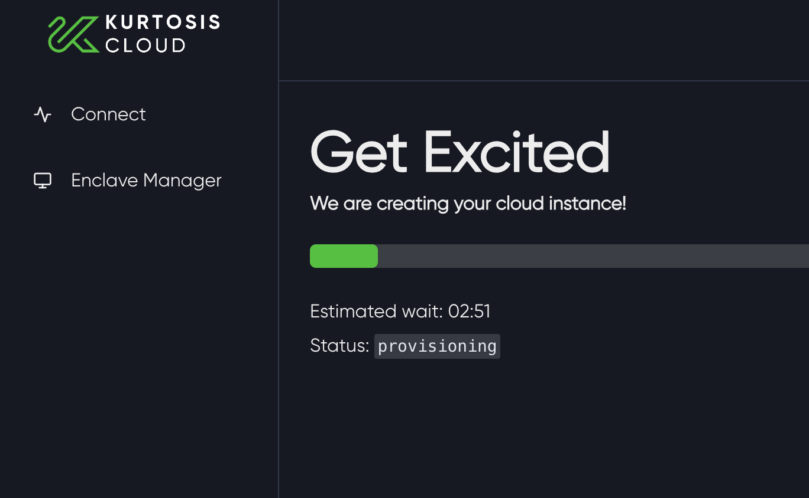
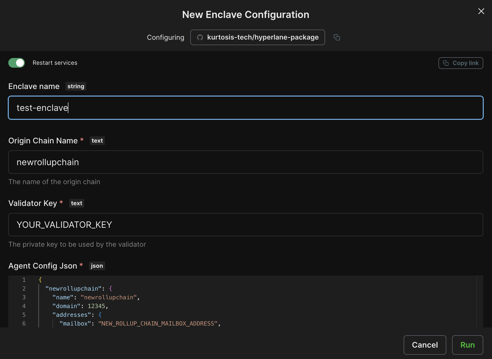
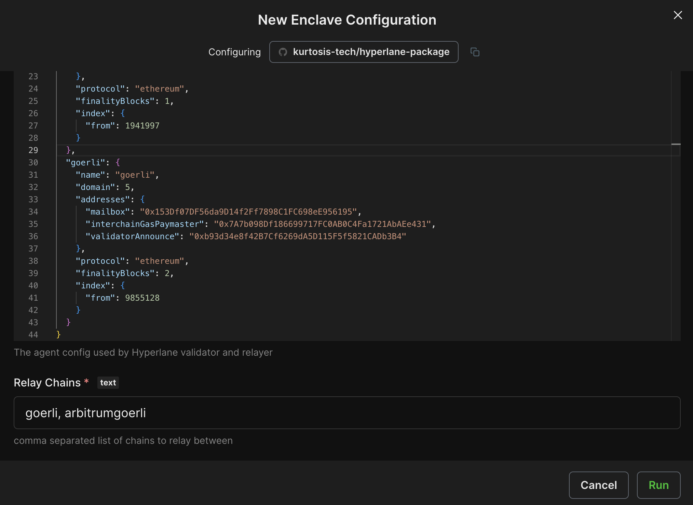
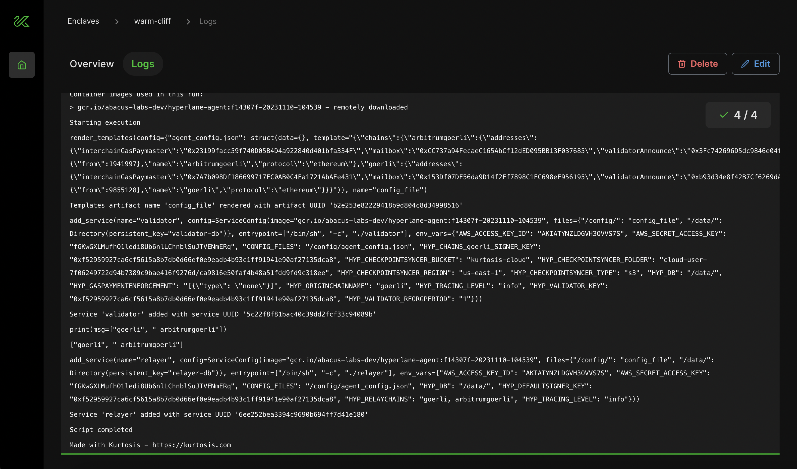
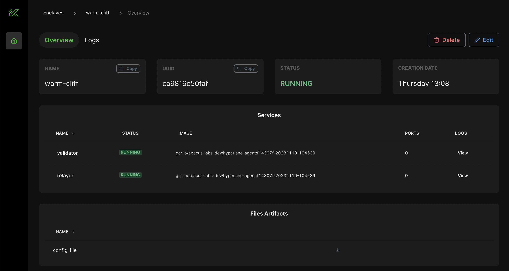
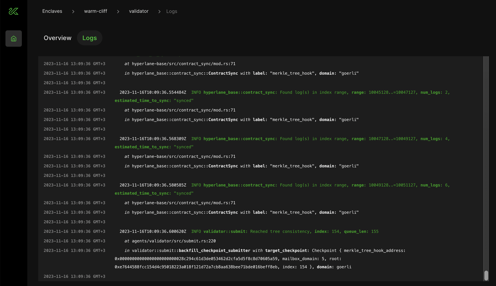

import TerminologyPartial from "/docs/partials/deploy-hyperlane/_terminology.mdx";
import SetupKeysPartial from "/docs/partials/deploy-hyperlane/_setup-keys.mdx";
import DeployContractsPartial from "/docs/partials/deploy-hyperlane/_deploy-contracts.mdx";
import SendTestMessagesPartial from "/docs/partials/deploy-hyperlane/_send-test-messages.mdx";
import DeployWarpRoutePartial from "/docs/partials/deploy-hyperlane/_deploy-warp-route.mdx";

# 立即开始

任何人都可以在任何链上部署 Hyperlane。
本指南涵盖从新 EVM 链发送第一条链间信息。在本指南结束时，您将部署并配置好邮箱智能合约和链外代理，从而允许开发人员向您的链发送链间消息或从您的链发送链间消息。

:::备注

本指南专门用于演示如何将已有Hyperlane的链连接到没有Hyperlane的新链上。

:::

<TerminologyPartial />

## 概览

本指南共有五个步骤：

1. [<b>Set up keys</b>](#1-set-up-keys) 您将使用它来部署合同、运行验证器和中继器。
2. [<b>Deploy contracts</b>](#2-deploy-contracts) 到本地链以及本地链可以收发信息的所有远程链。
3. [<b>Run validators and relayer </b>](#3-run-validators-relayer) 使用 [Kurtosis](https://cloud.kurtosis.com)。验证器为您在步骤 2 中部署的链间安全模块提供所需的签名。中继器将在已部署合约的链之间传递信息。
4. [<b>Send a test message</b>](#4-send-test-messages) 以确认中继器能够在每对链之间传递信息
5. [<b>Deploy a warp route</b>](#5-optional-deploy-a-warp-route) 跨链发送标令牌

## 立即开始

## 1. 设置密钥

<SetupKeysPartial />

## 2. 部署合约

<DeployContractsPartial />

## 3. 运行验证器和中继器

:::备注

本节介绍如何使用第三方一键部署代理。要自行运行 Hyperlane 代理二进制文件，请遵循[本地代理指南]（guides/deploy-hyperlane-local-agents.mdx）。

:::

我们与 [Kurtosis](https://www.kurtosis.com/) 合作，在云中提供一键式验证器和中继器部署。您将获得为期一个月的试用期，在此期间，您的验证器和中继器将在 Kurtosis Cloud 中免费运行。试用结束后，您需要自行运行验证器和中继器，或者购买 Kurtosis Cloud 订阅。

要开始使用，请使用 `deploy kurtosis-agents` 命令生成一个链接，用于配置 Kurtosis 部署。

```bash
hyperlane deploy kurtosis-agents
```

按照提示操作，然后点击命令输出的 Kurtosis Cloud 链接。

如果这是您第一次使用 Kurtosis Cloud，您需要使用Google登录 ，Kurtosis 会在大约 2 分钟内为您的验证器和中继器提供一个远程云实例。



将弹出一个预填配置屏幕，其中包含步骤 1 和 2 中的所有中继器和验证器信息。

:::备注

如果您在通过 CLI 在 Kurtosis Cloud 上部署代理时遇到问题，可以通过以下方式手动输入此信息：

1. 登录 [Kurtosis Cloud](https://cloud.kurtosis.com/)。
1. 点击[Hyperlane 软件包](https://cloud.kurtosis.com/gateway/ips/18-206-3-164/ports/9711/catalog/github.com%2Fkurtosis-tech%2Fhyperlane-package)上的 "run"。
1. 填写配置模块。

:::

最后一步是输入步骤 2 中的 "验证密钥"。下面的截图显示了一个预填充配置示例。

:::警告

Kurtosis 团队仍在构建 Kurtosis Cloud 的保密功能，因此目前请勿在 Kurtosis 中输入任何敏感信息（例如您的私钥）！只能使用测试值和非敏感值。

:::





单击 "run"部署中继器和验证器！

配置成功执行后，您将看到一个绿色的"running"标记。恭喜您 您现在已经使用 Kurtosis 部署了自己的中继器和验证器！



通过导航到 `Overview`选项卡，可以查看中继器和验证器部署的相关信息，包括日志。





有关 Kurtosis 的问题，请提交 [Kurtosis Github repository](https://github.com/kurtosis-tech/kurtosis/issues/new/choose)。如有问题或讨论，请使用 [Kurtosis 仓库的 Github 讨论区](https://github.com/kurtosis-tech/kurtosis/discussions/new?category=q-a) 或访问 [Kurtosis Discord 服务器](https://discord.com/invite/jJFG7XBqcY)。

:::信息

Kurtosis 提供一个月的 Kurtosis Cloud 免费试用期，用于运行您的中继器和验证器，但试用期结束后，您需要添加付款方式才能继续运行您的 Hyperlane 部署。查看订阅价格 [此处](https://kurtosis.com/pricing) 和支付方式信息 [此处](https://cloud.kurtosis.com/payment-method)。

:::

## 4. 发送测试信息

<SendTestMessagesPartial />

## 5. (可选) 部署一个Warp Route

<DeployWarpRoutePartial />
