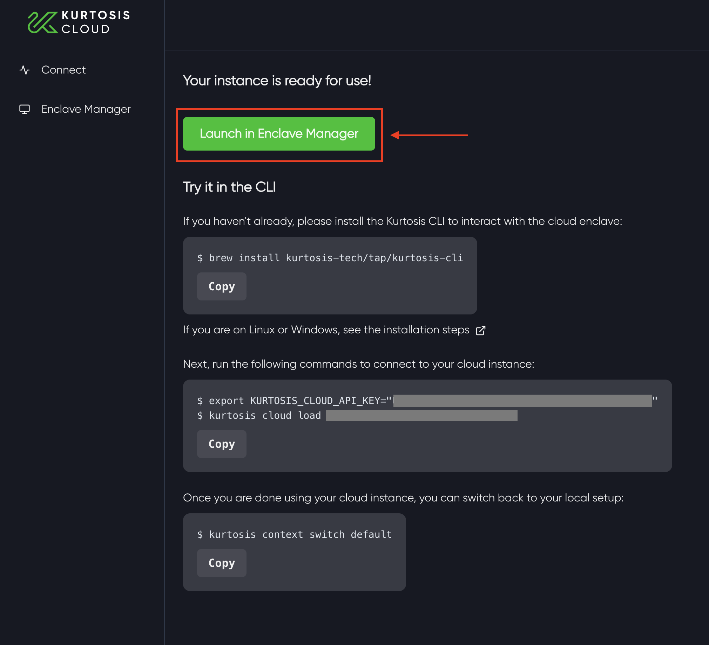
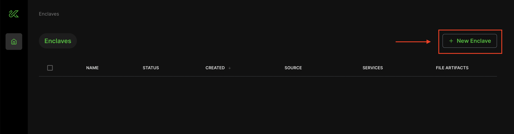
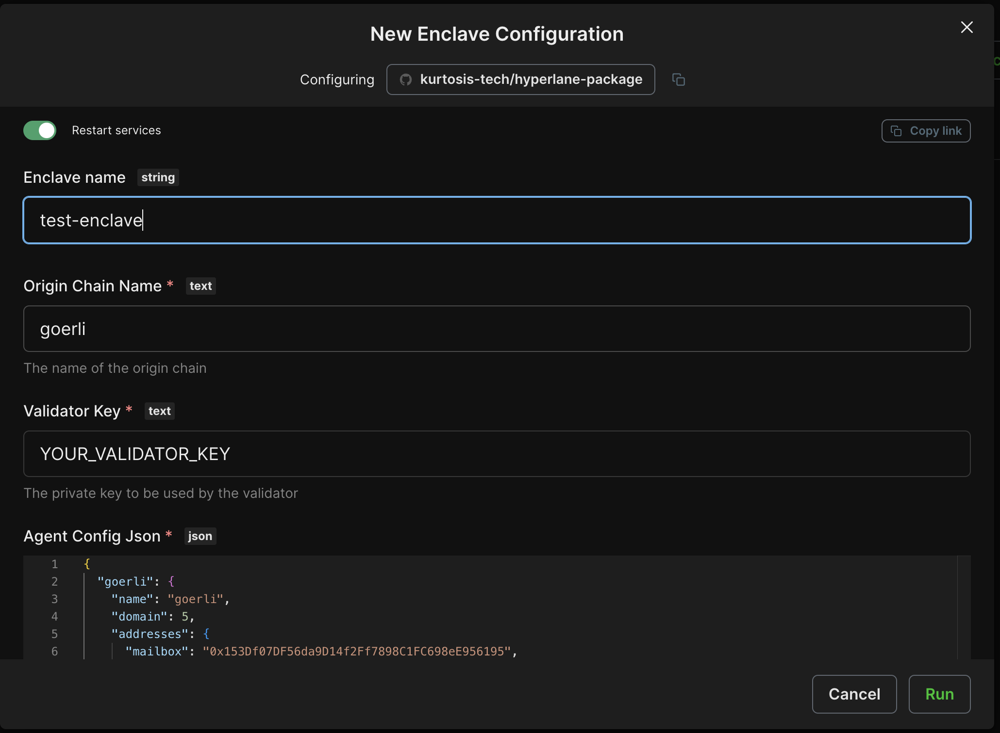
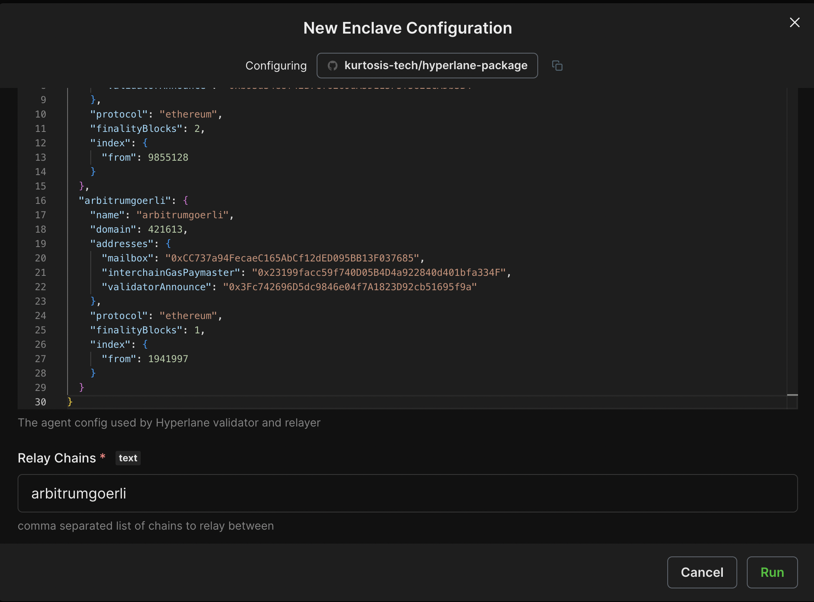

# Get Started

Hyperlane can be deployed by anyone to any chain. 
This guide covers sending your first interchain message from a new EVM chain. By the end of this guide you will have deployed and configured your mailbox and Hyperlane Messaging (./), allowing developers to send interchain messages to and from your chain.

## Overview
There are five steps in this guide:
1. [<b>Set up keys</b>](#1-set-up-keys) that you will use to deploy contracts and run validators and relayers
2. [<b>Deploy contracts</b>](#2-deploy-contracts) to the local chain and to every remote chain with which the local chain will be able to send and receive messages.
3. [<b>Run validators and relayers </b>](#3-run-validators-relayers) using [Kurtosis](https://cloud.kurtosis.com). Validators provide the signatures needed for the interchain Security Modules you deployed in step 2 and relayers send and receive messages between chains you deployed contracts to in step 2.
4. [<b>Send a test message</b>](#5-send-test-messages) to confirm that your relayer is able to deliver messages to and from each pair of chains

## Getting Started

## 1. Set up keys

There are three keys you must set up and fund. To get started, you can simplify by using the same hexadecimal key for all three roles.

<table>
<thead><tr><th>Key Type</th><th>Description</th><th>Funding Needs</th></tr></thead>
<tbody><tr><td>Contract Deployer</td><td>32 byte hexadecimal private key</td><td>Funded on all the chains on which we need to deploy contracts.</td></tr>
<tr><td>Validator Accounts</td><td>A list of validator addresses to configure a Multisig ISM, or just one to get started quickly</td><td>A small amount to do announce the location of the validator signatures</td></tr>
<tr><td>Relayer Accounts</td><td>The relayer client(s) use one account on the local chain and an additional account for each of the remote chains</td><td>Each relayer instance must be configured with a key that has a balance on all the other chains.</td></tr></tbody>
</table>

For instructions on how to generate keys, see the [agent keys](./operate/set-up-agent-keys.mdx) section. Your deployer key **must** be a hexadecimal key, while validator and relayer keys can be hexadecimal or AWS KMS.

If deploying on a local network using [Foundry's Anvil](https://github.com/foundry-rs/foundry/tree/master/anvil), use the following command to fund your newly-generated account. It uses one of the pre-funded private keys to transfer 1 ETH to the address in the `$YOUR_PUBLIC_KEY` variable.

```
cast send $YOUR_PUBLIC_KEY \
--private-key 0xac0974bec39a17e36ba4a6b4d238ff944bacb478cbed5efcae784d7bf4f2ff80 \
--value $(cast tw 1)
```

## 2. Deploy contracts

Once you have set up deployer, validator, and relayer keys it's time to use the Hyperlane CLI to deploy smart contracts to the local and remote chains.

On the local chain, we will deploy:
- The core contracts, including a  that can be used to send and receive messages

On all chains, we will deploy:
- A Multisig ISM that can be used to verify inbound messages
- An `InterchainGasPaymaster`, which can be used to pay our relayer for delivering interchain messages
- A `TestRecipient`, which we will send messages to, in order to test that everything is working correctly

### Setup

First, install the [Hyperlane CLI](https://www.npmjs.com/package/@hyperlane-xyz/cli) from NPM. [Node 16](https://nodejs.org/en/download) or newer is required. The following command will install it globally on your machine. See the [package page](https://www.npmjs.com/package/@hyperlane-xyz/cli) for alternatives such as temporary install or building from source.

```bash
npm install -g @hyperlane-xyz/cli
```

Next, determine what custom chain configs you will need for your local and remote chains. Any chains that are already included in the Hyperlane SDK won't need a chain config (but can optionally have one if you want to override default settings).
Run the following to see the default SDK chains:

```bash
hyperlane chains list
```
For any chains that need custom configs, you can define them manually using JSON or YAML (see [example config](https://github.com/hyperlane-xyz/hyperlane-monorepo/blob/main/typescript/cli/examples/chain-config.yaml)), or create them with the following command:

```bash
hyperlane config create chain
```

Now the CLI will know how to interact with all your chains, but it will also need to know how to configure your Interchain Security Module (ISM). 

:::info

Note, currently only Multisig-based ISMs are supported by the CLI. More complex ISMs will require manual deployments.

:::

To create a multisig ISM configs, you can define it manually using JSON or YAML (see example config here), or create it with the following command:

```bash
hyperlane config create multisig
```

### Deploy
We're now ready to use the `deploy core` command to deploy the Hyperlane contracts. To pay for transactions, the command will need the contract deployer key from step 1, which can be provided via the `HYP_KEY` env variable or as a command argument.

```bash
hyperlane deploy core
```

### Verify

Deployment contract artifacts will be written to to the `artifacts/` folder by default. The deployer will create two timestamped files, `agent-config-{timestamp}.json` and `core-deployment-{timestamp}.json`
The `core-deployment` file contains the addresses of core contracts, organized by chain.
The `agent-config` file contains the data needed to run Hyperlane agents for the next step.

## 3. Run validators and relayers 

We've partnered with [Kurtosis](https://www.kurtosis.com/) to provide a single-click validator and relayer deployment in the cloud. You'll receive a one-month trial during which your validator and relayer run in Kurtosis Cloud for free. After your trial ends, you'll need to either run your validator and relayer yourself or purchase a Kurtosis Cloud subscription. 

To get started, visit the [Kurtosis Cloud website](https://cloud.kurtosis.com/) (direct link: https://cloud.kurtosis.com/) and sign in with Google. 

If this is your first time using Kurtosis Cloud, Kurtosis will provision a remote cloud instance for your validator and relayer in roughly 2 minutes.


Once completed, click `Launch in Enclave Manager`.



Next, click on `New Enclave` and enter ```github.com/kurtosis-tech/hyperlane-package``` in the Create Enclave pop up. The [Kurtosis Hyperlane package](https://github.com/kurtosis-tech/hyperlane-package/tree/main) defines the configuration for your validator and relayer deployment based on the provided parameters. Click `Configure` to start configuring your deployment.



A configuration screen will pop up where you'll enter your relayer and validator information created in Steps 1 and 2. Fields with a red asterik are required such as the `Origin Chain Name`, `Validator Key`, `Agent Config Json` and `Relay Chains`. The screenshot below shows an example configuration. 

:::warn

The Kurtosis team is still building the secrets functionality of Kurtosis Cloud, so for now do not enter any sensitive information (e.g. your private keys) into Kurtosis! Only testing and non-sensitive values should be used.

:::






Click `Run` to deploy your relayer and validator!

Once the configuration finishes executing successfully, you'll see a green check mark. Congratulations! You've now deployed your own relayer and validator with Kurtosis! 


You can see information about your relayer and validator deployment, including logs, by navigating to the `Overview` tab.


For issues with Kurtosis, please file an [issue on the Kurtosis Github repository](https://github.com/kurtosis-tech/kurtosis/issues/new/choose). For questions or discussion, use the [Github Discussions section of the Kurtosis repository](https://github.com/kurtosis-tech/kurtosis/discussions/new?category=q-a) or visit [the Kurtosis Discord server](https://discord.com/invite/jJFG7XBqcY).

:::info

Kurtosis offers a one-month free trial of Kurtosis Cloud for running your relayer and validator, but when your trial expires you'll need to add a payment method to continue running your Hyperlane deployment. Subscription prices and payment method information can be accessed [here](https://cloud.kurtosis.com/payment-method).

:::

## 4. Send test messages

You can check everything is working correctly by sending a test message between each pair of chains.
Use the Hyperlane CLI again to send the message:

```
hyperlane send message \
   --origin YOUR_ORIGIN 
   --destination YOUR_DEST 
   --core PATH_TO_STEP2_ARTIFACTS
```

The `send message` command will inform you when the message is dispatched. After a short wait, a confirmation of delivery will be displayed. If the message delivery times out, it is likely that there's an issue with the Validator or Relayer setup in steps 3 and 4 above.
To troubleshoot start by looking at the origin chain relayer logs. If you need further help, reach out on [Discord](https://discord.gg/hyperlane).