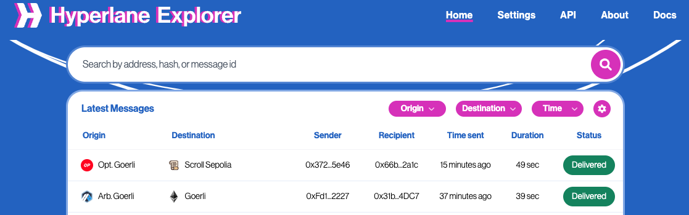

# Explorer

The [Hyperlane Explorer](https://explorer.hyperlane.xyz/) can be used to find messages on any network with a Hyperlane deployment. Drill down into messages for more details about their properties and status.

Messages to/from [core chains](./reference/domains.mdx) will searchable by transaction hash, message ID, or sender/recipient address. For other chains, the explorer can be configured to search for messages by providing it a chain config.

### Searching for messages

The [Hyperlane Explorer](https://explorer.hyperlane.xyz/) supports searching for messages using any of the following values:

- Hash of the transaction that initiated the message (origin tx)
- Hash of the transaction that delivered message (destination tx)
- Address of the account that sent the origin transaction
- Address of the account that sent the destination transaction
- Address of the message sender
- Address of the message recipient
- ID of the message

To search, enter your query into the top search bar. You can use the Origin Chain, Destination Chain, and Time filter options to narrow down your search.

:::info

Note, by default the explorer will only find message on [core Hyperlane chains](./reference/domains.mdx).

To view messages send to and/or from other chains, see [configuring PI Chains](./guides/developer-tips/explorer-debugging/configuring-pi-chains.mdx).

:::

### Permissionless Interoperability

The explorer UI and REST API can be configured to search for messages on any chain with a Hyperlane deployment. See [configuring PI Chains](./guides/developer-tips/explorer-debugging/configuring-pi-chains.mdx) for details.

### Debugging Messages

If you're trying to debug a problem with message delivery, the [explorer debugging](./guides/developer-tips/explorer-debugging.mdx) page has useful tips.

### API Reference

The explorer's data can be accessed programmatically via the [REST API](./guides/developer-tips/explorer-debugging/rest-api.mdx) or [GraphQL API](./guides/developer-tips/explorer-debugging/graphql-api.mdx). The REST API is recommended because it exposes a simpler interface for message data.
