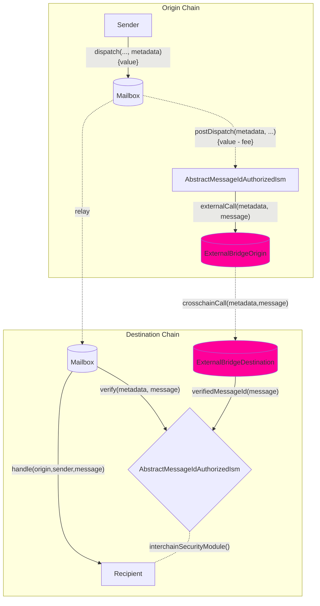

import Tabs from "@theme/Tabs";
import TabItem from "@theme/TabItem";

import { MultiLanguageExample } from "@site/src/components/InteractiveExample";

# 构建自己的钩子和自定义ISM（Building your own hooks and custom ISMs）

Hooks 和 ISM 之间具有互补关系：您可以从源头自定义行为，并且它们在目标上使用成对的 ISM 合约来验证您的自定义钩子行为。

您可以根据自己的需求实现和利用自己的钩子和 ISM 模式。您可以通过在源链上实现 `IPostDispatchHook` 接口，以及在目标链上实现 `IInterchainSecurityModule` 接口，来使用外部提供的桥接器，如 Wormhole 或 Chainlink 的 CCIP。

<details>
<summary>`IPostDispatchHook` Interface</summary>

<Tabs groupId="lang">
<TabItem value="sol" label="Solidity">

```solidity file=<rootDir>/node_modules/@hyperlane-xyz/core/contracts/interfaces/hooks/IPostDispatchHook.sol#L16-L63

```

</TabItem>

</Tabs>
</details>

<details>
<summary>`IInterchainSecurityModule` Interface</summary>

<Tabs groupId="lang">
<TabItem value="sol" label="Solidity">

```solidity file=<rootDir>/node_modules/@hyperlane-xyz/core/contracts/interfaces/IInterchainSecurityModule.sol#L4-L35

```

</TabItem>
</Tabs>
</details>

:::信息
Hooks 目前期望元数据采用 [`StandardHookMetadata` 库的格式](../reference/libraries/hookmetadata.mdx)。
:::

你也可以继承我们的 `AbstractMessageIdAuthorizedIsm`，它允许对中间的 `verifyMessageId` 函数调用进行访问控制，如果它是从授权的 `AbstractMessageIdAuthHook` 钩子接收到的，则将 messageId 设置为 true 并存储起来。这种模式目前在 [`OpStackHook`](https://github.com/hyperlane-xyz/hyperlane-monorepo/blob/ef2ece300e71a30e8f4f59e5b26e21eea012d43b/solidity/contracts/hooks/OPStackHook.sol#L33C8-L33C8) \<> [`OpStackIsm`](https://github.com/hyperlane-xyz/hyperlane-monorepo/blob/ef2ece300e71a30e8f4f59e5b26e21eea012d43b/solidity/contracts/isms/hook/OPStackIsm.sol#L31) 模式中使用。

### Workflow



### 接口

    在实现了上述接口之后，您可以通过使用我们邮箱中重载的 `dispatch` 调用来覆盖默认的钩子以及钩子元数据：

<Tabs groupId="lang">
<TabItem value="sol" label="Solidity">

```solidity file=<rootDir>/node_modules/@hyperlane-xyz/core/contracts/Mailbox.sol#L269-L275

```

### 示例

<MultiLanguageExample
  solidity={({
    mailbox,
    merkleTreeHook,
    originChain,
    destinationDomain,
    destinationChain,
    paddedRecipient,
    body,
  }) => `\
// send message from ${originChain} to ${destinationChain} TestRecipient
IMailbox mailbox = IMailbox("${mailbox}");
IPostDispatchHook merkleTree = IPostDispatchHook("${merkleTreeHook}");
mailbox.dispatch(
  ${destinationDomain},
  "${paddedRecipient}",
  bytes("${body}"),
  "0x", // empty metadata
  merkleTree
);
`}
/>

</TabItem>
</Tabs>

- 在源链上，

  - `mailbox.dispatch()` 通过 `AbstractMessageIdAuthHook.postDispatch()` 调用您的自定义钩子。
  - `_postDispatch` 检查 `latestDispatchedId` 是否是从钩子调用中分派的 id，以确保邮箱是调用钩子的合约（因为调用 `postDispatch` 没有访问控制）。
  - `_sendMessageId` 调用您的自定义外部桥接逻辑，例如调用 CCIP 路由合约。

- 在目标链上，
  - 外部桥将调用 `verifyMessageId` 函数（受访问控制）并将 `messageId` 设置为 `verifiedMessages` 映射中的 true。
  - 在接收到消息后，邮箱将调用您的 ISM 合约（在您的接收者地址中指定），该合约将检查 `verifiedMessages` 映射中的 messageId 是否为 true，并向邮箱返回 true，反之亦然。

:::警告
    `AbstractMessageIdAuthorizedIsm` 可以通过 `postDispatch` 调用发送 `msg.value`，我们利用 `verifiedMessages` 的小端 255 位来存储 `msg.value`，并使用顶部位来表示 messageId 传递的实际接收情况。因此，您可以从源链发送高达 2^255 数量的原生代币，并且目标 ISM 只能在目标链上接收 2^255 数量的原生代币。
:::

### 访问控制

    如果 `postDispatch` 必须只能使用刚刚发送的 `message` 调用，那么可以使用 Mailbox 上的 `latestDispatchedId` 函数来验证消息是否确实已经被发送。

:::信息
    这样做是为了支持**组合**，其中一个钩子可能会将 `message` 传递给另一个钩子，而不是使用 `require(mailbox == msg.sender)`。
:::

<Tabs groupId="lang">
<TabItem value="sol" label="Solidity">

    为了方便起见，以下实用程序在 [`MailboxClient` 库](../reference/libraries/mailboxclient.mdx) 中提供。

```solidity file=<rootDir>/node_modules/@hyperlane-xyz/core/contracts/client/MailboxClient.sol#L89-L91

```

</TabItem>
</Tabs>
