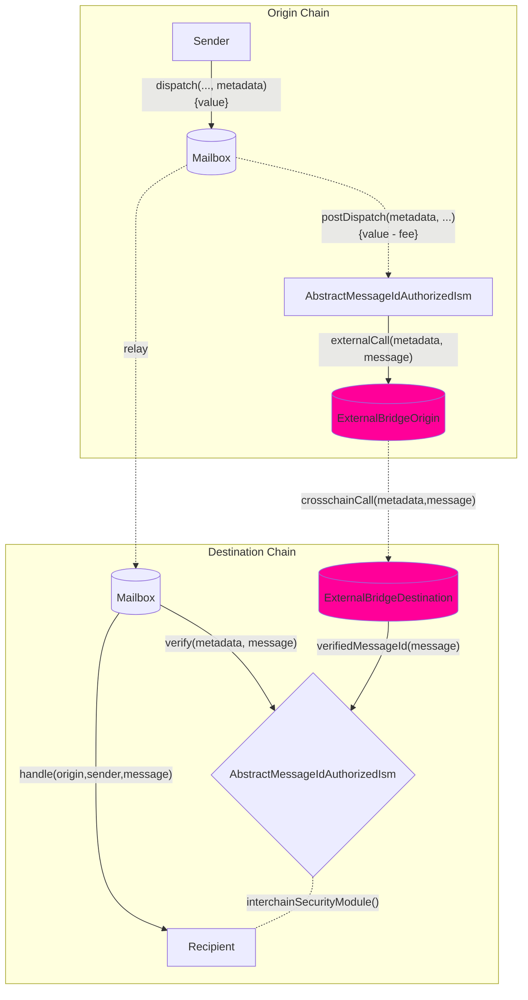

import Tabs from "@theme/Tabs";
import TabItem from "@theme/TabItem";

import { MultiLanguageExample } from "@site/src/components/InteractiveExample";

# Create your own Hook & ISM

Hooks and ISMs have a complementary relationship: you can customize your behavior from origin and they use a pairwise ISM contract on the destination to verify your custom hook behavior.

You can implement and utilize your own hook and ISM pattern as per your requirements. You can use an external bridge provider like Wormhole or Chainlink's CCIP by implementing the `IPostDispatchHook` interface on the source chain and `IInterchainSecurityModule` on the destination chain.

<details>
<summary>`IPostDispatchHook` Interface</summary>

<Tabs groupId="lang">
<TabItem value="sol" label="Solidity">

```solidity file=<rootDir>/node_modules/@hyperlane-xyz/core/contracts/interfaces/hooks/IPostDispatchHook.sol#L16-L63

```

</TabItem>

</Tabs>
</details>

<details>
<summary>`IInterchainSecurityModule` Interface</summary>

<Tabs groupId="lang">
<TabItem value="sol" label="Solidity">

```solidity file=<rootDir>/node_modules/@hyperlane-xyz/core/contracts/interfaces/IInterchainSecurityModule.sol#L4-L35

```

</TabItem>
</Tabs>
</details>

:::info
Hooks currently expect metadata to be formatted with the [`StandardHookMetadata` library](../reference/libraries/hookmetadata.mdx).
:::

You can also inherit from our `AbstractMessageIdAuthorizedIsm` which allows for access control for an intermediate `verifyMessageId` function call which sets in storage the messageId to true if received from the authorized `AbstractMessageIdAuthHook` hook. This pattern is used currently in the [`OpStackHook`](https://github.com/hyperlane-xyz/hyperlane-monorepo/blob/ef2ece300e71a30e8f4f59e5b26e21eea012d43b/solidity/contracts/hooks/OPStackHook.sol#L33C8-L33C8) \<> [`OpStackIsm`](https://github.com/hyperlane-xyz/hyperlane-monorepo/blob/ef2ece300e71a30e8f4f59e5b26e21eea012d43b/solidity/contracts/isms/hook/OPStackIsm.sol#L31) pattern.

### Workflow



### Interface

After implementing the above interfaces, you can override default hook along the hook metadata by using the overloaded `dispatch` call in our mailbox:

<Tabs groupId="lang">
<TabItem value="sol" label="Solidity">

```solidity file=<rootDir>/node_modules/@hyperlane-xyz/core/contracts/Mailbox.sol#L269-L275

```

### Examples

<MultiLanguageExample
  solidity={({
    mailbox,
    merkleTreeHook,
    originChain,
    destinationDomain,
    destinationChain,
    paddedRecipient,
    body,
  }) => `\
// send message from ${originChain} to ${destinationChain} TestRecipient
IMailbox mailbox = IMailbox("${mailbox}");
IPostDispatchHook merkleTree = IPostDispatchHook("${merkleTreeHook}");
mailbox.dispatch(
  ${destinationDomain},
  "${paddedRecipient}",
  bytes("${body}"),
  "0x", // empty metadata
  merkleTree
);
`}
/>

</TabItem>
</Tabs>

- On the source chain,

  - `mailbox.dispatch()` calls your custom hook via `AbstractMessageIdAuthHook.postDispatch()`.
  - `_postDispatch` checks whether `latestDispatchedId` is the id being dispatched from the hook to make the mailbox is the contract calling the hook (since calling `postDispatch` isn't access controlled)
  - `_sendMessageId` calls your custom external bridge logic like calling the CCIP router contract.

- On the destination chain,
  - the external bridge will call `verifyMessageId` function (which is access-controlled) and sets the `messageId` in the `verifiedMessages` mapping to true.
  - on receiving the message for the relayer, the mailbox will call your ISM contract (specified in your recipient address) which checks if the messageId in the `verifiedMessages` mapping is true and returns true to the mailbox and vice versa.

:::warning
`AbstractMessageIdAuthorizedIsm` can send `msg.value` through `postDispatch` calls and we utilize the `verifiedMessages`' little endian 255 bits for storing the `msg.value` and the top bit for the actual receipt of the messageId delivery. Therefore, you can send upto 2^255 amount of value of the native token from origin and the destination ISM can only receive 2^255 amount of value of native token on the destination chain.
:::

### Access Control

If `postDispatch` must only be called with a `message` that was _just_ dispatched, the `latestDispatchedId` function on the Mailbox can be used to verify the message was _actually_ dispatched.

:::info
This is used instead of some `require(mailbox == msg.sender)` to support **composition** where a hook may pass a `message` along to another hook.
:::

<Tabs groupId="lang">
<TabItem value="sol" label="Solidity">

The following utility is provided in the [`MailboxClient` library](../reference/libraries/mailboxclient.mdx) for convenience.

```solidity file=<rootDir>/node_modules/@hyperlane-xyz/core/contracts/client/MailboxClient.sol#L89-L91

```

</TabItem>
</Tabs>
