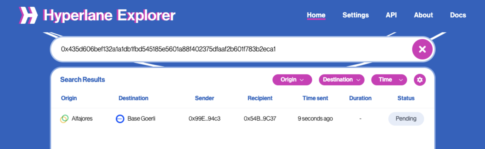
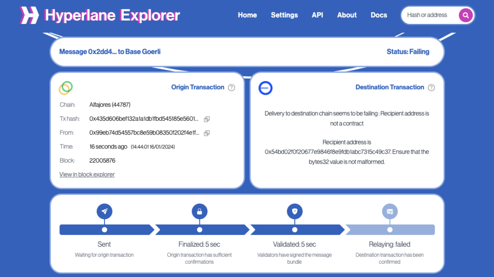
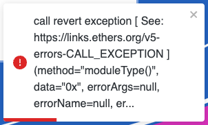

# 资源管理器调试（Explorer debugging）

请访问资源管理器 [https://explorer.hyperlane.xyz](https://explorer.hyperlane.xyz/)

然后将发送者/接收者地址或交易哈希粘贴到顶部搜索框中。所有匹配的消息将显示在结果列表中。单击行以获取更多详细信息。

<figure>

<figcaption>Retrieving a transaction in the Hyperlane Explorer.</figcaption>
</figure>

## 调试失败信息（Debugging failed messages）

您将会知道消息处理失败，因为页面顶部的消息状态将显示为”Error“，页面右上角的部分将指定消息无法处理的原因。

<figure>

<figcaption>Failed transaction from Alfajores to Base Goerli.</figcaption>
</figure>

如果您的消息未被传递，可能有几个因素造成了这种情况。

### 目标域无效（Invalid destination）

如果目标域标识符（`uint32`）对于中继客户端来说是未知的，它们将无法传递您的消息。请参考[domains](../../reference/domains.mdx)以了解已知域和发送消息到这些目的地时要使用的规范标识符。

### 接收地址无效（Invalid recipient）

如果接收方地址（`bytes32`）不是实现了 `IMessageRecipient` 接口的合约地址，则中继器将无法传递您的消息。

```solidity file=<rootDir>/node_modules/@hyperlane-xyz/core/contracts/interfaces/IMessageRecipient.sol
```

:::警告
EVM 地址（`address`）必须左填充零以符合规范。请参考 [TypeCasts 库](../../reference/libraries/typecasts.mdx) 中的 `pure addressToBytes32` 实用函数，以及消息 [dispatch](../../reference/messaging/send.mdx#dispatch) 部分获取其他详细信息。
:::

### 无法处理（Unprocessable）

如果消息接收者的 IMessageRecipient.handle() 函数的燃气估算失败，中继者 将无法传递该消息。中继者将继续为消息传递估算燃气，因为状态变化可能导致先前无法传递的消息成功传递。

<figure>

<figcaption>Example exception of a transaction signed by validators but unprocessable by the relayer.</figcaption>
</figure>

:::信息
如果您的用例错误不属于以上的类别，请**通过 Discord** [联系我们](https://discord.com/invite/KBD3aD78Bb)。
:::

### 资金不足（Underfunded）

资金不足的消息意味着用于传递此消息的[跨链燃气支付](../../reference/hooks/interchain-gas.mdx)不足。

中继器使用目标链上的 [`eth_estimateGas`](https://ethereum.github.io/execution-apis/api-documentation/) RPC 来确定中继消息的绝对成本。 如果这个金额超过了在源链上支付的总燃气量，中继器通常会拒绝传递消息。

您可以[手动支付跨链燃气费用](../../reference/hooks/interchain-gas.mdx#retrying)来解决此问题。

## 使用 Etherscan（Using Etherscan）

您还可以查看目标链上收件人的 Etherscan 页面，但请注意，处理事务不会显示在交易列表中，就像您通常想象的那样。这是因为中继器实际上调用了邮箱合约，然后调用收件人的 ‘handle’ 函数。因此，您将在“Internal Txns”选项卡下找到处理的证据。
