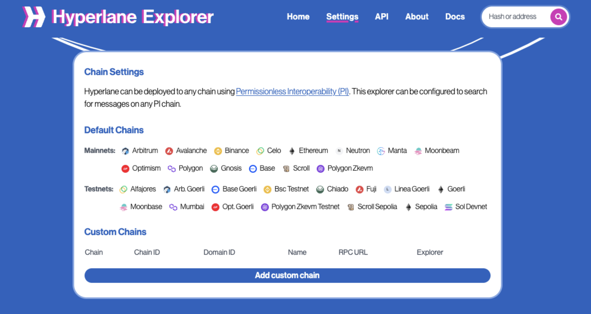
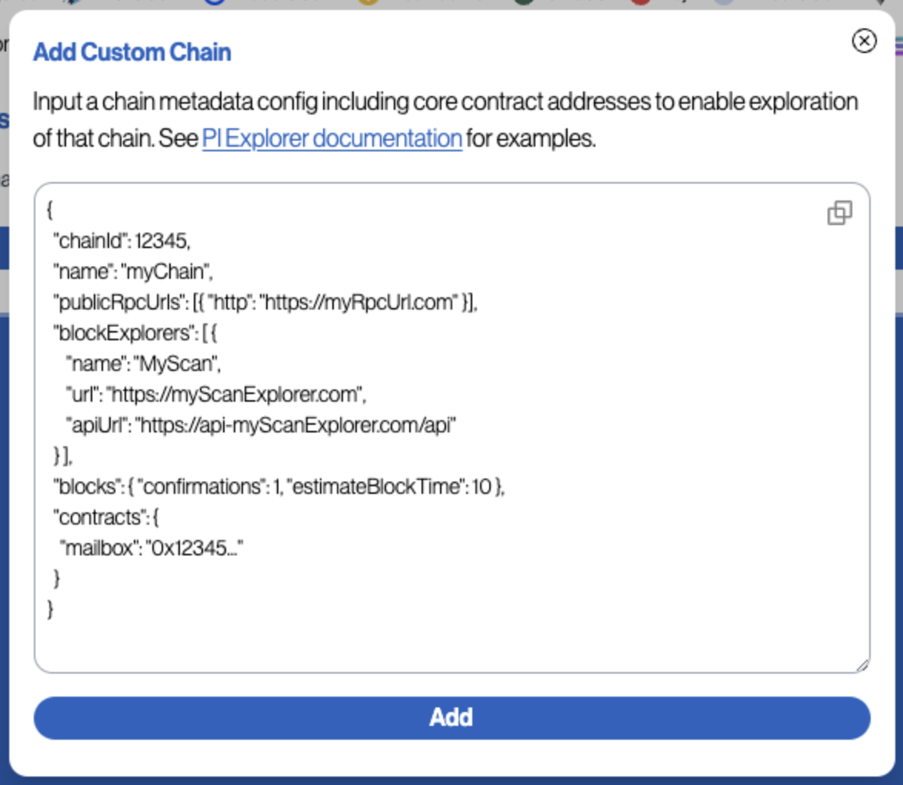

# 配置 PI 链

Hyperlane 可以[permissionlessly deployed](../../../deploy-hyperlane.mdx)部署到任何链上，但PI链上的报文无法通过默认的Hyperlane代理识别。要查看PI链上消息的详细信息，首先要用该链的元数据配置资源管理器。

首先，进入[explorer's settings page](https://explorer.hyperlane.xyz/settings)。



然后点击添加自定义链按钮。此时会出现一个模态窗口。输入PI链的配置。

链配置模式是Hyperlane SDK [ChainMetadata schema](https://github.com/hyperlane-xyz/hyperlane-monorepo/blob/main/typescript/sdk/src/consts/chainMetadata.ts#L21)的扩展，但增加了一个`contracts`对象。目前只要求提供`mailbox`合约地址，但如果提供了更多地址，将来可能会启用更多功能。

如果提供了有效的基于Etherscan的区块资源管理器配置，Hyperlane Explorer将利用它来查找所需的信息。如果没有，则会使用RPC URL。请注意，使用api密钥（甚至只是免费的密钥）的资源管理器运行速度更快、更可靠。



### 链配置示例

**A minimal chain config:**

```js
{
  "chainId": 5,
  "name": "goerli",
  "protocol": "ethereum",
  "rpcUrls": [{ "http": "https://foobar.com" }]
}
```

**带有区块资源管理器和区块计时的链配置包括:**

```js
{
  "chainId": 5,
  "domainId": 5,
  "name": "goerli",
  "protocol": "ethereum",
  "displayName": "Goerli",
  "nativeToken": {
    "name": "Ether",
    "symbol": "ETH",
    "decimals": 18
  },
  "rpcUrls": [
    {
      "http": "https://rpc.ankr.com/eth_goerli"
    },
    {
      "http": "https://eth-goerli.public.blastapi.io"
    }
  ],
  "blockExplorers": [
    {
      "name": "Etherscan",
      "url": "https://goerli.etherscan.io",
      "apiUrl": "https://api-goerli.etherscan.io/api",
      "family": "etherscan"
    }
  ],
  "blocks": {
    "confirmations": 1,
    "reorgPeriod": 2,
    "estimateBlockTime": 13
  },
  "isTestnet": true,
  "mailbox": "0x123...",
  "interchainGasPaymaster": "0x123..."
}
```

:::info
如果消息中链的来源或目的地`domainId`与其`chainId`不匹配，则必须在链配置中包含`domainId`字段。
:::
