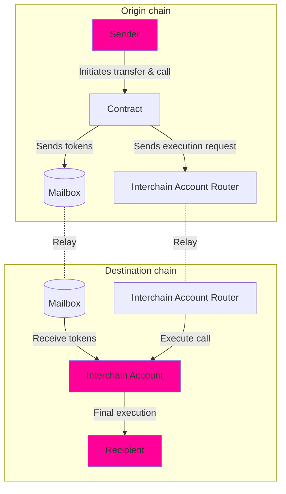

# Transfer and Call Pattern

## Overview

The **Transfer and Call Pattern** enables a contract to both bridge assets via [Hyperlane Warp Routes](/docs/protocol/warp-routes/warp-routes-overview) and execute an action on the destination chain after the assets arrive. This pattern is useful for cases where an action depends on token balances after bridging.

While Warp Routes handle cross-chain token transfers, this pattern extends their capabilities by using [Interchain Accounts (ICA)](/docs/reference/applications/interchain-account) to execute arbitrary logic on the destination chain.

### Use Cases

Some scenarios include:

- **Cross-chain governance**: A user must hold a specific NFT to vote on a proposal. The system bridges the NFT to the governance chain and ensures the vote call executes after the transfer completes.
- **Bridging collateral**: A protocol sends assets from an L2 to an L1 vault for collateralization before interacting with the vault.
- **Faster rollup withdrawals**: A user can claim liquidity instantly while waiting for the final bridge settlement.

## High-level Diagram



:::note

- Currently, Interchain Accounts (ICA) are only supported on EVM-compatible chains. If broader VM support is needed, this pattern can be extended with other environments and may require additional design considerations.

:::

## How It Works

1. Tokens are transferred from the sender to the contract.
2. An [Interchain Account (ICA)](/docs/reference/applications/interchain-account) is derived for the contract on the destination chain.
3. The Warp Route transfer is initiated, sending the tokens crosschain to the interchain account.
4. A remote contract call is executed on the destination chain from the interchain account after the tokens arrive.

The Solidity function below demonstrates this pattern:

```solidity
function transferAndCall(
    uint32 destination,
    uint256 amount,
    IERC20 asset, // Tokens to transfer (not derivable from TokenRouter)
    TokenRouter warpRoute,
    CallLib.Call[] calldata calls // Array of calls to execute on the destination chain
) external payable {

    // Transfer the specified amount of tokens from the sender to this contract
    asset.transferFrom(msg.sender, address(this), amount);

    // Get the interchain account address for the contract on the destination chain
    bytes32 self = interchainAccountRouter
        .getRemoteInterchainAccount(destination, address(this))
        .addressToBytes32();

    // Quote the gas fee for the warp route payment
    uint256 warpFee = warpRoute.quoteGasPayment(destination);

    // Initiate the warp route transfer to send tokens cross-chain
    warpRoute.transferRemote{value: warpFee}(destination, self, amount);

    // Execute the specified interchain calls using the remaining gas funds
    interchainAccountRouter.callRemote{value: msg.value - warpFee}(
        destination,
        calls
    );
}
```

:::note

- **Execution Ordering Consideration**: The contract must ensure that the token transfer is fully completed before executing any follow-up action. If the remote call depends on a token balance (e.g., staking, governance, deposits), it may fail if executed before the tokens arrive. The relayer retries with backoff to ensure successful ICA call execution.
- The ICA may also need to perform an ERC20 approval call before executing a deposit.
- If the contract executing the action is not permissioned, anyone could call it (depending on its implementation).

:::
