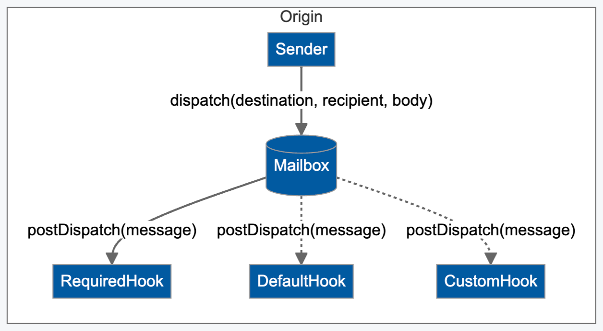
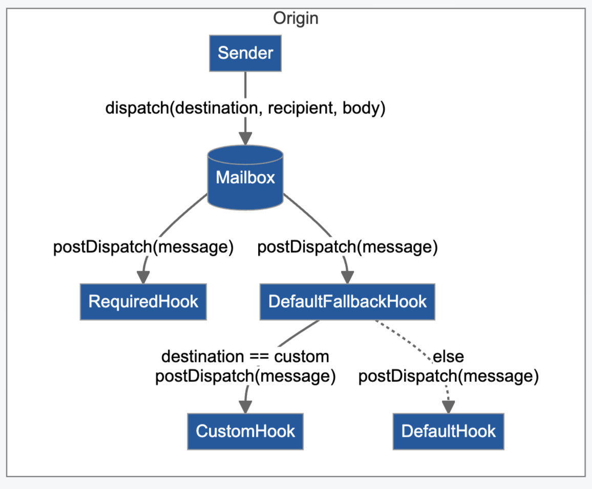

# Hyperlane v2 到 v3 迁移指南

现在在v3中，我们改进了邮箱以解锁消息传输的模块化方式，同时简化了界面。

:::caution

**Note:** v3 对 v2 进行了重大变更。

:::

### Mailbox 接口

Mailbox 的重大版本变更 v3 已经推出，并带来了以下改进：

1. 特定域传输层和安全层的模块化
2. 将 Hyperlane API 简化为单一调用（和地址）
3. 可配置的分发时间要求，如费用支付

v3 将跨链燃料支付、协议费用和任何消息派发时间行为统一到一个简化的接口中。

```solidity
interface IMailbox {
    function quoteDispatch(
        uint32 destination,
	bytes32 recipient,
	bytes body
    ) external returns (uint256 fee);
    function dispatch(
        uint32 destination,
	bytes32 recipient,
	bytes body
    ) external payable; // will revert if msg.value < quoted fee
}
```

这与现有的[跨链燃料支付](../reference/hooks/interchain-gas.mdx)和[钩子](../reference/hooks/overview.mdx)接口有所不同，但几乎完全向后兼容。与[跨链安全模块](../reference/ISM/specify-your-ISM.mdx)的预处理生命周期钩子相呼应，这种架构变更引入了后处理生命周期钩子，它们从邮箱中接收经过身份验证的消息内容，并执行一些额外的任务，比如向中继器支付跨链燃料或使用不同的传输层。



邮箱将具有协议所需的必需钩子和可以被消息发送方覆盖的默认钩子，进一步将邮箱接口模块化。我们预计必需的钩子将包括执行协议费用。这些钩子将是可管理的，使邮箱操作员能够逐步添加消息特定的功能作为默认或必需的行为，而不会改变消息内容。这与默认ISM的治理相呼应，后处理钩子的行为应反映消息目的地的ISM的要求，无论是默认的还是其他。

### Post Dispatch Hook Interface

后处理钩子接口旨在实现最大的通用性和可扩展性（与ISM验证接口非常相似）。除了整个消息内容外，调度器还可以提供元数据以进一步表达偏好。对于收费使用的钩子，需要一个报价接口来告知消息发送者必须传递多少价值给邮箱派发调用。

```solidity
interface IPostDispatchHook {
    function postDispatch(
        bytes metadata,
        bytes message
    ) external payable;
    function quoteDispatch(
        bytes metadata,
        bytes message
    ) external returns (uint256 fee);
}
```

### Usage Patterns

这个新接口极大地简化了集成体验，并消除了初次使用者的困惑。

**Before**

```solidity
// lookup gas amount, igp, and hook for destination
uint256 gasAmount = ...;
IInterchainGasPaymaster igp = ...;
IMessageHook hook = ...;

uint256 quote = igp.quoteGasPayment(destination, gasAmount);
bytes32 messageId = mailbox.dispatch(destination, recipient, body);
igp.payForGas{value: quote}(messageId, destination, gasAmount, msg.sender);
hook.postDispatch(destination, messageId); // old interface that does not allow for behavior dynamic with message content
```

**After**

```solidity
uint256 quote = mailbox.quoteDispatch(destination, recipient, body);
mailbox.dispatch{value: quote}(destination, recipient, body);
```

或者，任何超额支付都将退款，因此报价并不是绝对必要的，但如果支付不足，派发可能会回滚。

```solidity
mailbox.dispatch{value: msg.value}(destination, recipient, body);
```

如果您想要在非默认链上执行后处理行为，例如在从以太坊出站的消息上使用OpStack桥接，只需传递相应的钩子。

```solidity
// overrides default hook with opStackHook
mailbox.dispatch{value: msg.value}(destination, recipient, body, opStackHook);
```

#### Permissionless Interoperability Composition



## Implementation Guide

我们已经为Hyperlane的EVM实现[实施了这些更改](https://github.com/hyperlane-xyz/hyperlane-monorepo/tree/v3)，并将它们发送给审计，目标是在9月中旬启动主网。以下是逻辑变更的总结（伪代码形式），供其他执行环境参考。

:::info

**`param?`** 表示可选参数


**`optional ?? fallback`** 如果指定了某个值，则解析为 **`optional`**，如果没有指定，则解析为 **`fallback`**

:::

### Mailbox Implementation

增量 Merkle 树已从邮箱中迁移出来，并由 `nonce` 和 `latestDispatchedId` 存储变量替换。nonce 对于保持消息的唯一性是必要的。最新派发的消息 ID 对于需要独立于调用者 (`msg.sender`) 地址认证消息内容的钩子非常有用。

```solidity
contract Mailbox {
    // monotonically increasing outbound message nonce
    uint256 nonce;

    // commits to latest dispatched message content
    bytes32 latestDispatchedId;

    // implements defaults that can be overridden (overhead IGP, etc)
    IPostDispatchHook public defaultHook;

    // enforces protocol fees or any future required hooks
    IPostDispatchHook public requiredHook;

    function dispatch(
        uint32 destination,
        bytes32 recipient,
        bytes calldata body,
        IPostDispatchHook customHook?, // optional
        bytes calldata hookMetadata?   // optional
    ) external payable returns (bytes32 messageId) {
        ...
        // effects
        nonce += 1;
        bytes32 messageId = message.id();
        latestDispatchedId = messageId;
        emit Dispatch(message);
        emit DispatchId(messageId);

        // interactions
        requiredHook.postDispatch{value: msg.value}(hookMetadata, message);
        (customHook ?? defaultHook).postDispatch{value: msg.value}(hookMetadata, message);

        return messageId;
    }

    function quoteDispatch(
        uint32 destination,
        bytes32 recipient,
        bytes calldata body,
        IPostDispatchHook customHook?, // optional
        bytes calldata hookMetadata?   // optional
    ) external view returns (uint256 fee) {
        fee = (customHook ?? defaultHook).quoteDispatch(hookMetadata ?? "", message)
                    + requiredHook.quoteDispatch(hookMetadata ?? "", message);
    }
}
```

### Interchain Gas Paymaster Hook Implementation

举个例子，默认钩子可能包含一个链间燃料支付钩子，其中默认的燃料限额和退款地址可通过元数据覆盖。

```solidity
contract IgpHook is InterchainGasPaymaster {
    uint256 immutable DEFAULT_GAS_LIMIT;

    function postDispatch(
        bytes metadata,
        bytes message
    ) external payable {
        uint256 gasLimit = metadata.gasLimit() ?? DEFAULT_GAS_LIMIT;
        address refundAddress = metadata.refundAddress() ?? message.sender();
        payGasFor(
            message.id(),
            message.destination(),
            gasLimit,
    refundAddress
        );
    }
}
```