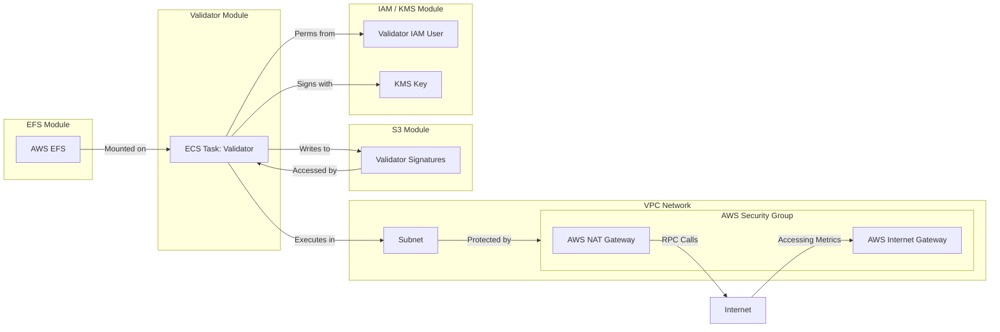
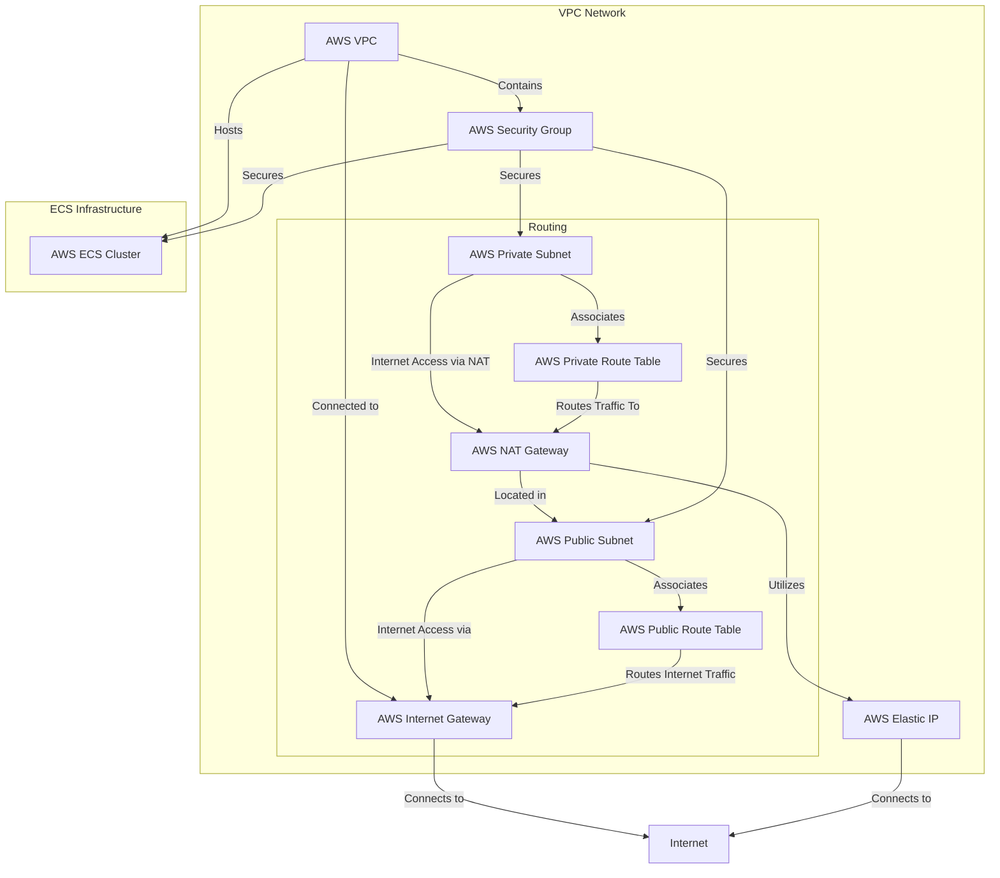

# 使用 Terraform 进行部署

对于那些更熟悉通过基础设施即代码工具（如Terraform）部署到AWS的人来说，我们在Github上提供了一个示例配置，旨在为在AWS上设置Hyperlane验证器所需的基础设施。它自动创建了诸如ECS集群、VPC、子网和安全组等资源，这些资源对于运行验证器代理是必需的。

:::caution

提供的配置仅用作在核心支持的网络上运行验证器的示例。您可能需要修改验证器模块以支持更高级的配置。建议在将此设置用于生产环境之前进行彻底测试。

:::

## 概览

提供的 Terraform 有几个关键部分：

- IAM/KMS 模块：自动为您完成 [Agent Keys](set-up-agent-keys.mdx)配置。
- S3 模块：自动为您完成 [AWS Signatures Bucket](validators/validator-signatures-aws.mdx) 配置。
- EFS 模块：设置可挂载到验证器的持久卷。
- 验证器模块：使用上述模块运行验证器实例。
- `global.tf`: Validators可以运行在其中的集群的顶层网络配置。
- `main.tf`: 配置验证器以进行部署。

下面的图表显示了它们如何相互配合。



## 使用方法

作为前提条件，您需要安装 Terraform，并使用您的凭据配置 AWS CLI。

初始化 Terraform 状态：

```bash
terraform init
```

制定基础设施变更计划：

```bash
terraform plan
```

预览和应用基础架构变更：

```bash
terraform apply
```

要列出 KMS、IAM 或 S3 信息等输出，必须解析 JSON 输出：

```bash
terraform output -json
```

## 模块

Terraform 提供多个模块，您可以选择希望由 terraform 管理验证器设置的哪些部分。

### IAM / KMS

iam_kms "模块会创建一个 IAM 用户和一个 KMS 密钥，用于安全签名操作。它还会设置 IAM 策略和附件，以授予使用 KMS 密钥和其他 AWS 服务（如 S3、EFS 和 ECS）所需的权限。

### S3

s3 "模块创建一个 S3 bucket，用于存储签名等与验证程序相关的数据。它还设置了管理访问和权限的存储策略，包括公共访问限制和版本管理。

### EFS

efs 模块定义了 EFS 文件系统和访问点，允许 Validator 应用程序存储和访问 EFS 上的数据。它还设置了一个挂载目标，用于将 EFS 文件系统连接到网络。

:::note
只有在使用 `validator` 模块时才需要该模块。
:::

### Validator

`validator`模块使用上述所有功能整合 EFS、IAM/KMS 和 S3 配置。

此外，还有：
- 创建新的 IAM 用户和相关角色以运行验证器。
- 创建验证器可写入签名的 S3 bucket。
- 创建 EFS 卷，以便在服务中持久保存数据。

本模块还包括：
- 定义一个运行验证器应用程序的ECS任务定义，包括容器定义、卷配置和日志记录。
- 创建一个ECS服务来管理验证器任务的部署和扩展。

## 主要配置

根级配置为网络基础设施设置了 VPC、子网、互联网网关、NAT 网关、路由表和安全组。它还提供了使用 "验证器 "模块的示例。

```terraform
module "your_validator_name" {
  source = "./modules/validator"

  validator_name    = "your-validator-name"
  origin_chain_name = "originChainName"

  aws_region               = var.aws_region
  validator_cluster_id     = aws_ecs_cluster.validator_cluster.id
  validator_subnet_id      = aws_subnet.validator_subnet.id
  validator_sg_id          = aws_security_group.validator_sg.id
  validator_nat_gateway_id = aws_nat_gateway.validator_nat_gateway.id

  # Disabling the Validator task allows you to set up all the required infrastructure
  # without running the actual Validator yet. This is useful when setting up a Validator for
  # the first time, so that you can find out the Validator's address and fund it before it
  # performs the announcement transaction.
  # validator_task_disabled = true
}
```

### 输出

根级别的 `outputs.tf` 从 `main.tf` 中配置的验证器中传递所有输出。**随着您添加、修改或删除验证器，您将需要更新此内容。**

### 结构示例

下图显示了 Validator ECS 集群如何融入顶级网络基础设施。



## 已知问题

### PI 配置

为 PI 链（如您自己部署的 Hyperlane）设置自定义配置值并非易事。
目前，您可能只需传递一长串环境变量或命令行参数。

### 单个代理日志

目前，所有代理都登录到同一个日志组 - `DefaultLogGroup`。要按代理将它们分开，可能需要调整日志组名称，并用新的组名称更新代理的日志策略。

### 中继器模块

Docker镜像支持运行两种类型的代理。因此，如果您选择这样做，您可以将验证器模块作为新中继模块的起点。
