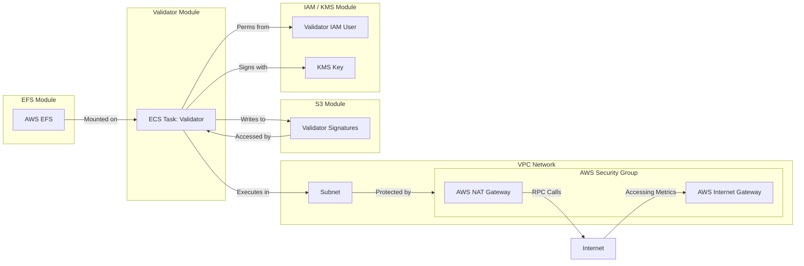
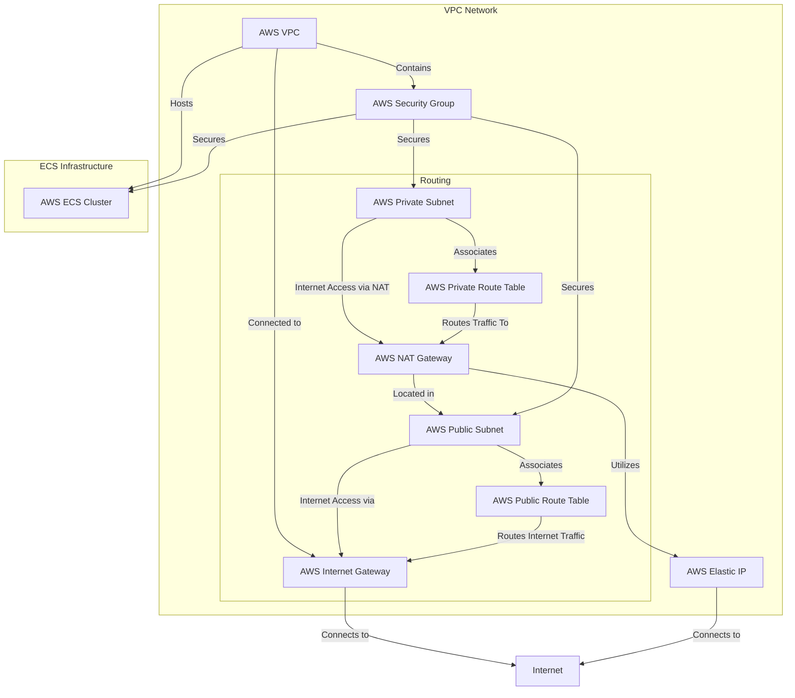

# Deploy with Terraform

For those more familiar with deploying to AWS through infrastructure-as-code tools such as Terraform, we provide an example configuration designed to set up the necessary infrastructure for a Hyperlane validator on AWS. It automates the creation of resources such as ECS clusters, VPCs, subnets, and security groups required for running a validator node.

[**Click here to navigate to the example Terraform configuration.**](https://github.com/hyperlane-xyz/hyperlane-monorepo/tree/feat/tf-validator/rust/terraform)

:::warning

The configuration provided is intended to only be an _example_ of running a validator for a core supported network. You may have to modify the validator module to support more advanced configurations. It is recommended to test thoroughly before using this setup in a production environment.

:::

## Overview

The provided terraform has a few key parts:

- IAM/KMS module: automatically completes [Agent Keys](set-up-agent-keys.mdx) configuration for you.
- S3 module: automatically completes [AWS Signatures Bucket](validators/validator-signatures-aws.mdx) configuration for you.
- EFS module: sets up a persistent volume that can be mounted to the validator.
- Validator module: uses the above modules to run an instance of a validator.
- Root-level `main.tf`: top-level networking configuration for a cluster that validators can run in.

The diagram below shows how it fits together.



## Usage

As a prerequisite, you need to have Terraform installed and the AWS CLI configured with your credentials.

To initialise the terraform state:

```bash
terraform init
```

To generate the plan of infrastructure changes:

```bash
terraform plan
```

To preview and apply the infrastructure changes:

```bash
terraform apply
```

To list the outputs such as KMS, IAM or S3 information:

```bash
terraform output
```

Which should show up as:

```bash
your_validator_name_aws_access_key_id = "SOME_ACCESS_KEY_ID"
your_validator_name_aws_kms_alias = "alias/your-validator-name"
your_validator_name_aws_region = "us-east-1"
your_validator_name_aws_s3_bucket_id = "your-validator-name-signatures"
your_validator_name_aws_secret_access_key = <sensitive>
```

To view the secret key, you will have to parse the JSON output:

```bash
terraform output -json
```

## Modules

Several modules exist so you can choose which parts of the validator setup you would like managed by terraform.

### IAM / KMS

The `iam_kms` module creates an IAM user and a KMS key for secure signing operations. It also sets up IAM policies and attachments to grant the necessary permissions for using the KMS key and other AWS services, such as S3, EFS and ECS later on.

### S3

The `s3` module creates an S3 bucket for storing validator-related data, such as signatures. It also sets bucket policies to manage access and permissions, including public access restrictions and versioning.

### EFS

The `efs` module defines an EFS file system and access point, allowing the validator application to store and access data on EFS. It also sets up a mount target for connecting the EFS file system to the network.

:::note
This module is only required when using the validator module.
:::

### Validator

The `validator` module uses all of the above to integrate the EFS, IAM/KMS, and S3 configurations.

In addition to:
- Creating a new IAM user and relevant roles to run a validator.
- Creating an S3 bucket that a validator can write signatures to.
- Creating an EFS volume to persist data in the service.

This module also:
- Defines an ECS task definition for running the validator application, including container definitions, volume configurations, and logging.
- Creates an ECS service to manage the deployment and scaling of the validator tasks.

## Main Configuration

The root level configuration sets up a VPC, subnets, internet gateway, NAT gateway, route tables, and security groups for network infrastructure. It also provides example usage of the validator module.

```terraform
module "your_validator_name" {
  source = "./modules/validator"

  validator_name    = "your-validator-name"
  origin_chain_name = "originChainName"

  aws_region               = var.aws_region
  validator_cluster_id     = aws_ecs_cluster.validator_cluster.id
  validator_subnet_id      = aws_subnet.validator_subnet.id
  validator_sg_id          = aws_security_group.validator_sg.id
  validator_nat_gateway_id = aws_nat_gateway.validator_nat_gateway.id

  # Disabling the validator task allows you to set up all the required infrastructure
  # without running the actual validator yet. This is useful when setting up a validator for
  # the first time, so that you can find out the validator address and fund it before it
  # performs the announcement transaction.
  # validator_task_disabled = true
}
```

### Outputs

The `outputs.tf` file is generated automatically by running the `generate-outputs.py` script. This script extracts output variables from the validator module and creates corresponding output definitions in `outputs.tf`.

To generate `outputs.tf`, run:

```bash
./generate-outputs.py
```

The output will look something like:

```terraform
# THIS FILE IS AUTOMATICALLY GENERATED BY RUNNING
# ./generate-outputs.py

output "your_validator_name_aws_access_key_id" {
  value = module.your_validator_name.aws_access_key_id
}

output "your_validator_name_aws_secret_access_key" {
  value = module.your_validator_name.aws_secret_access_key
  sensitive = true
}

output "your_validator_name_aws_kms_alias" {
  value = module.your_validator_name.aws_kms_alias
}

output "your_validator_name_aws_s3_bucket_id" {
  value = module.your_validator_name.aws_s3_bucket_id
}

output "your_validator_name_aws_region" {
  value = module.your_validator_name.aws_region
}
```

### Example architecture

The diagram below shows how the validator ECS cluster fits into the top-level network infrastructure.


