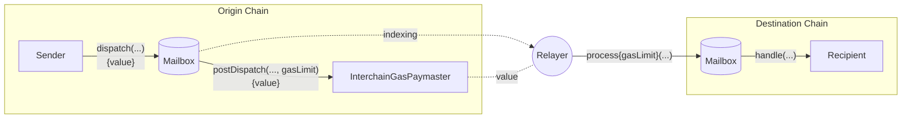

# Overview

The Hyperlane protocol decouples the transport layer from the security layer of cross-chain message passing. To run a deployment, it relies on offchain agents that observe onchain activity and carry out either the transport or security aspects of the protocol.

1. Hyperlane [Validators](#validator) are light offchain agents responsible for security - they observe messages on an origin chain's [Mailbox](docs/protocol/mailbox.mdx) and if needed sign a merkle root that attests the current state of the mailbox.
2. [Relayers](#relayer) fulfil the message transport requirement of the protocol. They aggregate off-chain security metadata for the [`IInterchainSecurityModule` interface](/docs/protocol/ISM/modular-security.mdx) and deliver messages to their recipients.

## Validators {#validators}

[Validators](docs/protocol/agents/validators.mdx) fulfil the security requirement of the protocol, as part of the [Multisig ISM](docs/protocol/ISM/multisig-ISM.mdx) or the [Hyperlane AVS](docs/protocol/economic-security/hyperlane-avs.mdx), by attesting to the validity of [Mailbox](docs/protocol/mailbox.mdx) messages and making their signatures available to a Relayer.

This signature is stored and made publicly available (e.g. in an S3 bucket), which is then used by the offchain Relayer and Interchain Security Modules onchain. Validators are _not_ networked together and do not need to reach consensus; they also do not regularly submit onchain transactions.

This is the agent community operators run if looking to help secure an origin chain, and it's the most important duty one can perform to help decentralize message passing on Hyperlane. **Note that just running a Validator doesn't mean it's actively contributing to securing messages:** a Multisig ISM on the destination chain must have enrolled the Validator's checkpoint-signing key, and that ISM must be used by message recipients.

These agents are implemented in Rust and distributed as Docker images and binaries.

👉 Learn more about Validators [here](docs/protocol/agents/validators.mdx).

## Relayer {#relayer}

A Hyperlane [Relayer](docs/protocol/agents/relayer.mdx) delivers interchain messages to their recipients.

Relaying is permissionless, and one honest Relayer running between a chain pair is sufficient for ensuring liveness. Running a Relayer is: 1) much more operationally complex than a Validator; 2) not required for securing the network; and 3) only recommended for permissionless deployments of Hyperlane.

Hyperlane Relayers are configured to relay messages between one or more origin chains and destination chains.
Every Hyperlane message involves two transactions:

1. To [`dispatch`](docs/reference/messaging/send.mdx) and send a message on the origin chain.
2. To [`process`](docs/reference/messaging/receive.mdx) and deliver the message on destination chain.

A Relayer's job is to deliver the message on the destination chain. To fulfil this responsibility:

- The Relayer keeps track of new messages as they come in on the origin chain.
- It checks the [Interchain Security Module (ISM)](/docs/protocol/ISM/modular-security.mdx) specified by the recipient to gather the necessary metadata to secure the message. For example, it may retrieve Multisig ISM signatures from Validator checkpoint storage.
- After assembling the security metadata, the Relayer then sends the message to the recipient on the destination chain.

If the message delivery fails (e.g. due to a lack of liquidity to transfer out of a Warp Route contract), the Relayer retries the delivery with an exponential backoff mechanism until successful.

A Relayer has no special permissions in Hyperlane. If Relayer keys are compromised, only the tokens held by those keys are at risk.

👉 Learn more about Relayers [here](docs/protocol/agents/relayer.mdx).
