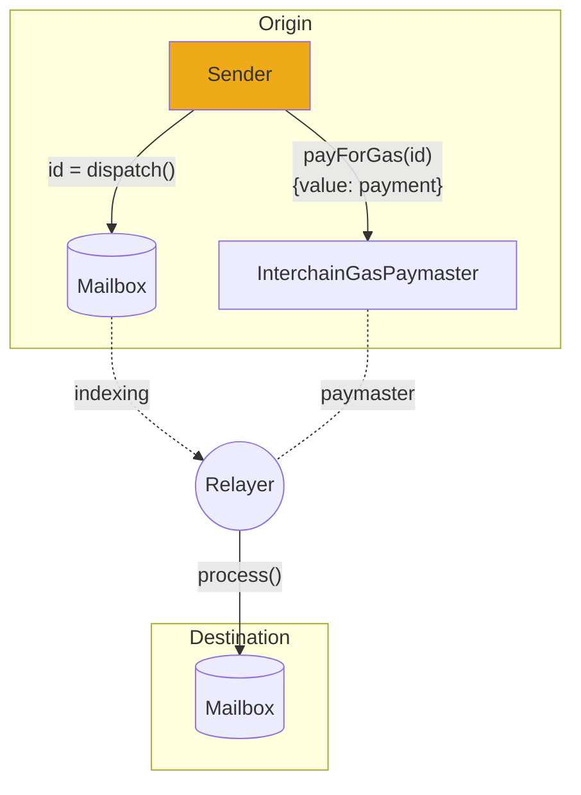

# Overview

The Hyperlane protocol decouples the transport layer from the security layer of cross-chain message passing. To run a deployment, it relies on offchain agents that observe onchain activity and carry out either the transport or security aspects of the protocol.

1. [Relayers](docs/protocol/agents/relayer.mdx) fulfil the message transport requirement of the protocol. They aggregate off-chain security metadata for the [`IInterchainSecurityModule` interface](../reference/ISM/specify-your-ISM) and deliver messages to their recipients.
1. [Validators](docs/protocol/agents/validators.mdx) fulfil the security requirement of the protocol, as part of the [Multisig ISM](docs/protocol/ISM/multisig-ISM.mdx) or the [Hyperlane AVS](docs/protocol/economic-security/hyperlane-avs.mdx), by attestting to the validity of [Mailbox](docs/protocol/mailbox.mdx) messages and making their signatures available to a relayer.

These agents are implemented in Rust and distributed as Docker images and binaries.

## Validators

Hyperlane validators are light offchain agents responsible for security - they observe messages on an origin chain's [Mailbox](docs/protocol/mailbox.mdx) and if needed sign a merkle root that attests the current state of the mailbox.

This signature is stored and made publicly available (e.g. in a S3 bucket), which is then used by the offchain Relayer and Interchain Security Modules onchain. Validators are _not_ networked together and do not need to reach consensus; they also do not regularly submit onchain transactions.

# Relayer

A Hyperlane [Relayer](docs/protocol/agents/relayer.mdx) delivers interchain messages to their recipients.

Every Hyperlane message requires two transactions to be delivered,on the origin chain to [send](docs/reference/messaging/send.mdx) the message, and on the destination chain to [receive](docs/reference/messaging/receive.mdx) the message

A Relayer is responsible for sending the second transaction.

Hyperlane Relayers are configured to relay messages between one or more origin chains and destination chains. A Relayer has no special permissions in Hyperlane. If Relayer keys are compromised, only the tokens held by those keys are at risk.
