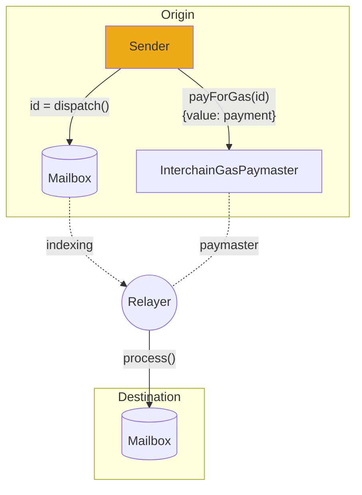

# 运行中继器

一个Hyperlane[Relayer](../../protocol/agents/relayer.mdx)将跨链消息传递给它们的接收方。

:::tip

在尝试在生产环境中运行继器之前，我们建议您阅读[**Deploy Hyperlane Local Agents**](../../guides/deploy-hyperlane-local-agents.mdx)指南以及[**Run Validators**](../validators/run-validators.mdx)文档。

:::

每个Hyperlane消息需要两个交易来传递，一个在原始链上用于[send](../../reference/messaging/send.mdx)消息，另一个在目标链上用于[receive](../../reference/messaging/receive.mdx)消息。中继器负责发送第二个交易。



Hyperlane中继器被配置为在一个或多个原始链和目标链之间中继消息。在Hyperlane中，中继器没有特殊权限。如果中继器密钥被泄露，那么只有由这些密钥持有的代币处于风险之中。

运行中继器需要以下步骤：

- RPC 节点
  - 中继器使用RPC节点来读取原始链，并将消息传递到目标链。中继器必须配置所有原始链和目标链的RPC节点。
- 一个或者多个签名秘钥
  - 为了传递消息，中继器必须配置一个签名密钥，在每个目标链上提交交易（因此需要在这些链上有资金）。
  - 中继器使用这个密钥来签署 `Mailbox.process()` 交易。Hyperlane中继器代理目前支持通过API密钥/secrets密钥或原始十六进制私钥访问的AWS KMS密钥进行配置。
- 一台运行机器
  - 中继器操作者可以自己编译Rust二进制文件，也可以运行Abacus Works提供的Docker镜像。该二进制文件可以使用您喜欢的云服务运行。

## 指南

我们强烈建议您查看[local agents guide](../../guides/deploy-hyperlane-local-agents.mdx) 以了解如何在本地配置和运行中继器。

:::info
本地代理设置展示了如何在您的**本地计算机**上运行中继器，这仅用于**测试和开发目的**。
:::

import Tabs from "@theme/Tabs";
import TabItem from "@theme/TabItem";

### 密钥

中继器需要能够向许多目标链提交交易，因此需要访问用于签署交易的密钥。支持两种密钥类型：十六进制私钥（用于内存中签名）和基于 AWS KMS 的密钥（用于生产环境的最佳实践）。

#### 十六进制密钥

用于内存签名的十六进制私钥可以被您的中继器用于签署交易。这是测试或开发目的的推荐设置。

#### AWS KMS 密钥

AWS KMS密钥可以被您的中继器用于签署交易。这是生产中继器的推荐设置。

:::tip
请查看[Agent Keys](../set-up-agent-keys.mdx) 页面以设置您的十六进制或 AWS KMS 密钥。
:::

### 配置

像本地设置一样，配置Relayer时应提供一些基本参数。

| 参数                             | 说明                                                                                                                                                                                                                              |
| ------------------------------- | -------------------------------------------------------------------------------------------------------------------------------------------------------------------------------------------------------------------------------- |
| `--relayChains`                 | 这里指定了要在其间中继消息的源链和目标链的逗号分隔名称。例如：`ethereum,polygon,avalanche`。                                                                                                                                                 |
| `--db`                          | Relayer应该将持久数据写入磁盘的路径。在使用云设置时，请确保该路径是持久的。使用Docker时，请确保将持久路径/卷挂载到容器中。有关更多信息，请参阅[配置参考](../config-reference.mdx#db)。                                                                     |
| `--allowLocalCheckpointSyncers` | 如果设置为 `true`，Relayer将允许在其本地文件系统上查找验证器签名。在生产环境中，应将此设置为 `false`。如果您按照验证器本地设置说明在同一台计算机上运行验证器，则将其设置为 `true`，以便您的Relayer可以访问本地验证器签名。 |

:::info

您的 Relayer 既可以通过命令行参数，也可以通过环境变量进行配置。请查看[agent configuration](../agent-config.mdx)页面和[configuration reference](../config-reference.mdx)获取完整的配置可能性列表。

:::

当然，您还可以使用 [`CONFIG_FILES` 环境变量](../config-reference.mdx#config_files) 提供额外配置文件的路径，这些路径应该以逗号分隔。如果您选择在 Docker 中运行，请参阅[agent configuration](../agent-config.mdx)的 Docker 部分，了解如何将您的配置文件挂载到 Docker 容器中的提示。

### Setup-specific配置

这些配置要求根据您遵循的密钥设置说明而有所不同。

<Tabs groupId="keys">
  <TabItem value="hexadecimal" label="Hexidecimal Key">
如果您创建了一个[hexadecimal key](../set-up-agent-keys.mdx)，请像这样配置默认签名者：

| 参数                   | 描述                                                                                               |
| --------------------- | -------------------------------------------------------------------------------------------------- |
| `--defaultSigner.key` | 用于为所有链签名交易的十六进制私钥。例如：`1b3dead...beef`。                                               |

  </TabItem>
  <TabItem value="aws-kms" label="AWS KMS Key">
      如果您创建了一个[使用 AWS KMS 密钥](../set-up-agent-keys.mdx)的配置，请像下面这样配置默认签名者：

| 参数                      | 描述                                                                                                        |
| ------------------------ | ----------------------------------------------------------------------------------------------------------- |
| `--defaultSigner.type`   | 设置为 `aws`。                                                                                                |
| `--defaultSigner.id`     | 您的 Relayer 的 AWS KMS 密钥的别名，前缀为 `alias/`。例如：`alias/hyperlane-relayer-1`。                           |
| `--defaultSigner.region` | 您的 AWS KMS 密钥的地区。例如：`us-east-1`。                                                                     |

  </TabItem>
</Tabs>

对于特定链的签名者（即自定义要为每个链使用的密钥），请参阅[configuration reference](../config-reference.mdx)。

## 部署中继

### 安装

在生产环境中推荐的安装方法是使用Docker镜像。

<Tabs groupId="docker">
  <TabItem value="docker" label="Docker image">

首先下载docker映像：

```bash
docker pull gcr.io/abacus-labs-dev/hyperlane-agent:3bb4d87-20240129-164519
```

  </TabItem>
  <TabItem value="from-source" label="Building from source">

**克隆和安装**

首先克隆Hyperlane monorepo：

```sh
git clone git@github.com:hyperlane-xyz/hyperlane-monorepo.git
```

然后按照`rust`目录中的[设置说明](https://github.com/hyperlane-xyz/hyperlane-monorepo/blob/main/rust/README.md)进行操作。这将设置`rustup`，如果您使用的是 Apple Silicon，则还需要安装 Rosetta 2。

```sh
# 安装 rustup
curl --proto '=https' --tlsv1.2 -sSf https://sh.rustup.rs | sh

# (仅apple silicon) 安装 rosetta 2
softwareupdate --install-rosetta --agree-to-license
```

构建中继器

```sh
cargo build --release bin relayer
```

  </TabItem>
</Tabs>

### 运行代理

如果中继器的密钥是通过 AWS KMS 配置的，则必须将 AWS 访问密钥和秘密作为环境变量提供。

| 环境变量                  | 描述                                                  |
| ----------------------- | ----------------------------------------------------- |
| `AWS_ACCESS_KEY_ID`     | 中继器的 AWS IAM 用户的访问密钥 ID。                      |
| `AWS_SECRET_ACCESS_KEY` | 中继器 AWS IAM 用户的访问密钥。                           |

如需再次进行了解，请查阅[Agent Keys](../set-up-agent-keys.mdx)指南。

<Tabs groupId="docker">
  <TabItem value="docker" label="Using Docker">

然后使用相关参数启动容器。例如，您的AWS配置如下所示：

```sh
docker run \
  -it \
  -e AWS_ACCESS_KEY_ID=ABCDEFGHIJKLMNOP \
  -e AWS_SECRET_ACCESS_KEY=xX-haha-nice-try-Xx \
  --mount ... \
  gcr.io/abacus-labs-dev/hyperlane-agent:3bb4d87-20240129-164519 \
  ./relayer \
  --db /hyperlane_db \
  --relayChains <chain_1_name>,<chain_2_name> \
  --defaultSigner.type aws \
  --defaultSigner.id alias/hyperlane-relayer-1 \
  --defaultSigner.region us-east-1 \
```

:::tip

如果您正在同一台机器上使用本地设置运行验证器，并且正在运行一个本地中继以访问这些验证器签名，请确保将您本地验证器的签名目录[mount](https://docs.docker.com/storage/bind-mounts/)（挂载）到您的中继中，路径应与您在 [announce Validator](../validators/run-validators.mdx#Announcing-your-validator) 时使用的路径相同。

例如，如果您的本地验证器正在将签名写入`/tmp/hyperlane-validator-signatures-ethereum`，您应该为Docker容器挂载一个目录：

```sh
docker run \
  -it \
  -e CONFIG_FILES=/config/agent-config.json \
  --mount type=bind,source=$CONFIG_FILES,target=/config/agent-config.json,readonly \
  --mount type=bind,source="$(pwd)"/hyperlane-validator-signatures-ethereum,target=/tmp/hyperlane-validator-signatures-ethereum,readonly \
  --mount type=bind,source="$(pwd)"/hyperlane_db,target=/hyperlane_db \
  gcr.io/abacus-labs-dev/hyperlane-agent:3bb4d87-20240129-164519 \
  ./relayer \
  --db /hyperlane_db \
  --relayChains ethereum,polygon,avalanche \
  --allowLocalCheckpointSyncers true \
  --defaultSigner.key <your_relayer_key> \
```

:::

  </TabItem>

  <TabItem value="from-source" label="Building from source">
查看这些说明以了解如何在没有Docker的情况下从源代码构建。

我们可以从`hyperlane-monorepo/rust`目录中运行构建好的二进制文件。

```sh
# 设置 AWS 环境变量
export AWS_ACCESS_KEY_ID=ABCDEFGHIJKLMNOP
export AWS_SECRET_ACCESS_KEY=xX-haha-nice-try-Xx

# 运行中继器
./target/release/relayer \
  --db /hyperlane_db \
  --relayChains <chain_1_name>,<chain_2_name> \
  --defaultSigner.type aws \
  --defaultSigner.id alias/hyperlane-relayer-1 \
  --defaultSigner.region us-east-1 \
```

  </TabItem>
</Tabs>

## 索引

Relayer需要索引所有原始链的历史消息。这些信息存储在本地磁盘上的数据库中（在配置中设置为`db`）。这意味着首次运行Relayer可能需要一些额外的时间来与当前状态同步。
