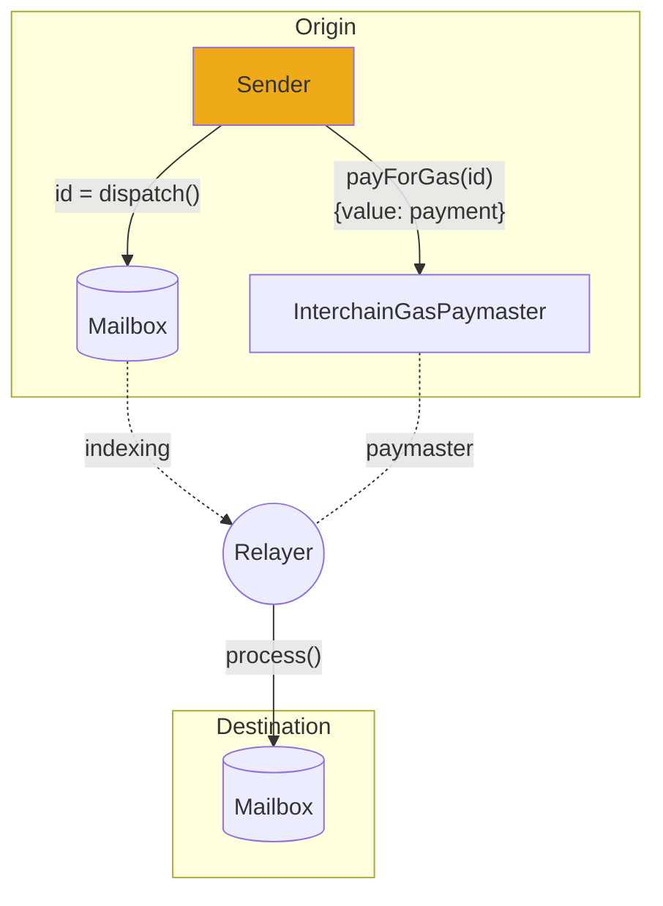

# Run a Relayer

A Hyperlane [relayer](../../protocol/agents/relayer.mdx) deliver interchain messages to their recipients.

Every Hyperlane message requires two transactions to be delivered, one on the origin chain to [send](../../reference/messaging/send.mdx) the message, and one on the destination chain to [receive](../../reference/messaging/receive.mdx) the messages. Relayers are responsible for sending the second transaction.



Hyperlane relayers are configured to relay messages between one or more origin chains and destination chains. Relayers have no special permissions in Hyperlane. If relayer keys are compromised, only the tokens held by those keys are at risk.

Running a relayer requires the following:

- RPC nodes
  - Relayers use RPC nodes to read the origin chain(s), and deliver messages to the destination chain(s). Relayers must be configured with an RPC node for all origin and destination chains.
- One or more signing keys
  - In order to deliver messages, relayers must be configured with a signing key to submit transactions on each destination chain (thus need funds on those chains).
  - The relayer uses this key to sign `Mailbox.process()` transactions. The Hyperlane relayer agent currently supports configuration with AWS KMS keys that are accessed via API keys/secrets or raw hexadecimal private keys.
- A machine to run on
  - Relayers can compile the Rust binary themselves, or run a Docker image provided by Abacus Works. The binary can be run using your favorite cloud service.

## Guide

import Tabs from '@theme/Tabs';
import TabItem from '@theme/TabItem';

### Keys

The relayer needs to be able to submit transactions to many destination chains, and therefore requires access to a key for signing transactions. There are two supported key types: hexadecimal private keys (for in-memory signing), and AWS KMS based keys (best practice for production environments).

#### Hexadecimal keys

A hexadecimal private key used for in-memory signing can be used by your relayer to sign transactions. This is the recommended setup for testing or development purposes.

#### AWS KMS keys

An AWS KMS key can be used by your relayer to sign transactions. This is the recommended setup for production relayers.

> See the [Agent Keys](../set-up-agent-keys.mdx) page to set up your Hexadecimal or AWS KMS keys

### Configuration

Also take a look at the [agent configuration](../agent-config.mdx) page and the [configuration reference](../config-reference.mdx) for a full list of configuration possibilities. **The list below is not complete,** however it should be enough to get started.

Your relayer takes as configuration the following:

| Argument                               | Description                                                                                                                                                                                                                                                                                                                                                                                                                                                            |
| -------------------------------------- | ---------------------------------------------------------------------------------------------------------------------------------------------------------------------------------------------------------------------------------------------------------------------------------------------------------------------------------------------------------------------------------------------------------------------------------------------------------------------- |
| `--relayChains`                        | Comma separated names of the origin and destination chains to relay messages between. _Example:_ `ethereum,polygon,avalanche`                                                                                                                 |
| `--db`                                 | The path to where the relayer should write persistent data to disk. Ensure this path to be persistent when using cloud setups. When using Docker, make sure to mount the persistent path/volume into the container.See `config-reference` for more info                                                                                                           |
| `--allowLocalCheckpointSyncers`        | If `true`, this will allow the relayer to look for validator signatures on the relayer's local filesystem. In a production environment, this should be `false`. If you're running a validator on the same machine by following the validator local setup instructions, set this to `true` so that your relayer can access the local validator signatures. |

| Environment variable | Description                                                                                                                                                                                                                                                                                                                                                                               |
| -------------------- | ----------------------------------------------------------------------------------------------------------------------------------------------------------------------------------------------------------------------------------------------------------------------------------------------------------------------------------------------------------------------------------------- |
| `CONFIG_FILES`       | If you want to add additional configuration files you can add additional paths here as a comma separated list. These files must be accessible within the filesystem your agent has access to. If you're running in Docker, see the docker section of [agent configuration](../agent-config.mdx) for tips on mounting your config files into your Docker container. |

### Setup-specific configuration

These configurations requirements differ depending on which key setup instructions you followed.

<Tabs groupId="keys">
  <TabItem value="hexadecimal" label="Hexidecimal Key">
If you created a [hexadecimal key](../set-up-agent-keys.mdx), use these configs.

| Argument              | Description                                                                                                                                    |
| --------------------- | ---------------------------------------------------------------------------------------------------------------------------------------------- |
| `--defaultSigner.key` | A hexadecimal private key used to sign transactions for all chains. _Example:_ `--defaultSigner.key=123...def` |
  </TabItem>
  <TabItem value="aws-kms" label="AWS KMS Key">
If you created an [AWS KMS key](../set-up-agent-keys.mdx), use these configs.

| Argument                 | Description                                                                                                                                                                               |
| ------------------------ | ----------------------------------------------------------------------------------------------------------------------------------------------------------------------------------------- |
| `--defaultSigner.type`   | Set to `aws`. _Example:_ `--defaultSigner.type=aws`                                                                                         |
| `--defaultSigner.id`     | The alias of your validator's AWS KMS key, prefixed with `alias/`. _Example:_ `--defaultSigner.id=alias/hyperlane-validator-signer-polygon` |
| `--defaultSigner.region` | The region of your AWS KMS key. `--defaultSigner.region=us-east-1`                                                                                               |

| Environment variable    | Description                                           |
| ----------------------- | ----------------------------------------------------- |
| `AWS_ACCESS_KEY_ID`     | The access key ID of your relayer's AWS IAM user.     |
| `AWS_SECRET_ACCESS_KEY` | The secret access key of your relayer's AWS IAM user. |
  </TabItem>
</Tabs>


For chain-specific signers (i.e. to customize the key to use for each chain) take a look at the [configuration reference](../config-reference.mdx)

### Installation

The recommended installation method for a production environment is using a Docker image.

<Tabs groupId="docker">
  <TabItem value="docker" label="Docker image">

To download the docker image, run:

```bash
docker pull gcr.io/abacus-labs-dev/hyperlane-agent:f44589e-20231130-114734
```
  </TabItem>
  <TabItem value="from-source" label="Building from source">

First, clone the repo

```sh
git clone git@github.com:hyperlane-xyz/hyperlane-monorepo.git
```

And then follow the [setup instructions](https://github.com/hyperlane-xyz/hyperlane-monorepo/blob/main/rust/README.md#setup) in the `rust` directory
  </TabItem>
</Tabs>

### Start Relaying

To run the relayer binary with the environment variables specified in `relayer.env`:

<Tabs groupId="docker">
  <TabItem value="docker" label="Using Docker">
Find the latest docker image and set it to the environment variable `$DOCKER_IMAGE`.

```sh
docker run \
  -it \
  --mount type=bind,source="$(pwd)"/hyperlane_db,target=/hyperlane_db \
  $DOCKER_IMAGE \
  ./relayer --db /hyperlane_db --relayChains ethereum,polygon,avalanche
```

:::info

If you have followed the instructions to [deploy hyperlane](../../deploy-hyperlane.mdx) and are specifying a path to your own config file in the `CONFIG_FILES` environment variable, check out the config files with docker section of [agent configuration](../agent-config.mdx).

:::

:::tip

If you're running validators with a local setup on the same machine and want the relayer to access these validator signatures, be sure to [mount](https://docs.docker.com/storage/bind-mounts/) your local validator's signature directory into your relayer at the same path that you used when [announcing your validator](../validators/run-validators.mdx#Announcing-your-validator)

For example, if your local validator is writing signatures to `/tmp/hyperlane-validator-signatures-ethereum`, you should mount a directory for the Docker container:

```sh
docker run \
  -it \
  -e CONFIG_FILES=/path/to/file/inside/container
  --mount type=bind,source="$(pwd)"/hyperlane-validator-signatures-ethereum,target=/tmp/hyperlane-validator-signatures-ethereum,readonly \
  --mount type=bind,source="$(pwd)"/hyperlane_db,target=/hyperlane_db \
  $DOCKER_IMAGE \
  ./relayer --db /hyperlane_db --relayChains ethereum,polygon,avalanche
```
:::
  </TabItem>

  <TabItem value="from-source" label="Building from source">
See these instructions for building from source without Docker.

We can run the built binary from within the `hyperlane-monorepo/rust` directory:

```sh
./target/release/relayer --db /hyperlane_db --relayChains ethereum,polygon,avalanche
```
  </TabItem>
</Tabs>

Relayers needs to index all historic messages for the origin chain(s). This information is stored in a local database on disk (set with `db` in the config). This means running a relayer for the first time may take some extra time to catch up with the current state.
