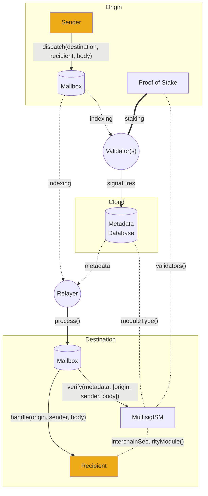

# Validators

Everything you need to start running a validator.

Hyperlane [validators](../../protocol/agents/validators.mdx) are not networked with other validators and do not regularly submit transactions. Hyperlane validators are run on a per-origin-chain basis, and these instructions are written for a single chain.

Running a validator simply requires the following:

#### An RPC node

Validators make simple view calls to read merkle roots from the [Mailbox](../../protocol/mailbox.mdx) contract on the chain they are validating for.

:::caution

Operating a validator for Polygon mainnet requires access to an archive node. This is because validators should only sign roots once they've been finalized, and Polygon requires 256 block confirmations to achieve finality.

:::

#### A secure signing key

Validators use this key to sign the `Mailbox's` latest merkle root. Securing this key is important. If it is compromised, attackers can attempt to falsify messages, causing the validator to be slashed.

The Hyperlane validator agent currently supports signing with AWS KMS keys that are accessed via API keys/secrets as well as hexadecimal plaintext keys for testing. See more under [agent keys](../set-up-agent-keys.mdx).

#### Publicly readable storage

Validators write their signatures off-chain to publicly accessible, highly available, storage, so that they can be aggregated by the [relayer](../../protocol/agents/relayer.mdx).

The Hyperlane validator agent currently supports storing signatures on AWS S3 using the same AWS API key above, as well as storing signatures in the local filesystem for testing.

#### A machine to run on

Validators can compile the Rust binary themselves or run a Docker image provided by Abacus Works. The binary can be run using your favorite cloud service. You can even run multiple instances of them in different regions for high availability, as Hyperlane has no notion of "double signing".
