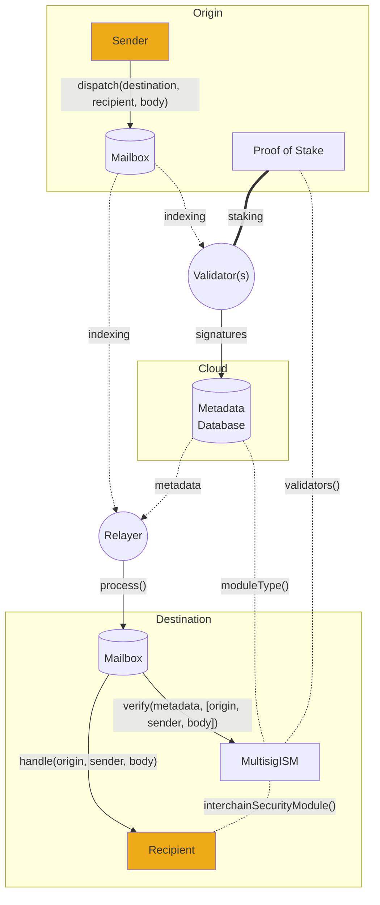

# 验证器

运行验证器所需的一切。

:::tip

有经验的操作员可能更喜欢使用terraform部署代理。此过程将自动创建代理密钥、Validator buckets、权限以及在AWS上运行Validator集群所需的任何其他辅助设置。

:::

Hyperlane[Validators](../../protocol/agents/validators.mdx)与其他验证器没有网络连接，也不会定期提交事务。Hyperlane验证器是基于每个源链运行的，这些说明是针对单个链编写的。



运行验证器需要满足以下条件：

- 一个RPC节点
  - 验证器通过对其正在验证的链上的[Mailbox](../../protocol/mailbox.mdx) 合约进行简单的视图调用来读取默克尔根。

:::caution

在Polygon主网上操作验证器需要访问存档节点。这是因为验证器应仅在区块已经被最终确定后才签署根，而Polygon需要256个区块确认才能实现最终性。

:::

- 安全签名密钥

  - 验证器使用此密钥对`Mailbox`的最新默克尔根进行签名。保护此密钥非常重要。如果密钥被泄露，攻击者可以尝试伪造消息，导致验证器被减持。
  - Hyperlane验证器代理当前支持使用通过API keys/secrets访问的AWS KMS密钥进行签名，以及用于测试的十六进制明文密钥。更多详情请参阅[agent keys](../set-up-agent-keys.mdx)。

- 公共可读存储

  - 验证器将它们的签名离线写入公开访问且高可用的存储中，以便由[Relayer](../../protocol/agents/relayer.mdx)进行聚合。
  - Hyperlane验证器代理当前支持使用上述相同的AWS API密钥将签名存储在AWS S3上，同时也支持将签名存储在本地文件系统中以进行测试。

- 可运行的机器
  - 验证者可以自己编译Rust二进制文件，也可以运行Abacus Works提供的Docker镜像。二进制文件可以使用你喜欢的云服务运行。由于Hyperlane没有"双重签名"的概念，你甚至可以在不同区域运行多个实例，以实现高可用性。

import Tabs from "@theme/Tabs";
import TabItem from "@theme/TabItem";

## 指南

我们强烈建议您按照[local agents guide](../../guides/deploy-hyperlane-local-agents.mdx)了解如何在本地配置和运行验证器。

:::info

本地代理设置显示了如何在本地机器上运行验证器，这**仅用于测试和开发目的**。这也意味着本地验证器的签名只能由本地运行的中继器访问。

对于生产环境，您应该将签名发布到一个公开访问的存储中。请参阅[**AWS bucket setup guide**](validator-signatures-aws.mdx)。

:::

一般而言，在运行生产型验证器之前，您需要确保您具备以下条件：

1. 创建一个密钥供验证器签名，请参阅[Agent Keys](../set-up-agent-keys.mdx) 文档。
1. 设置您的验证器签名发布存储的位置，请参阅 [AWS Signatures Bucket Setup](validator-signatures-aws.mdx)指南。

## 配置

与本地设置一样，在配置Validator时也需要提供一些基本参数。

| 参数                                        | 说明                                                                                                     |
| ------------------------------------------ | ------------------------------------------------------------------------------------------------------- |
| `--db`                                     | 将持久数据写入磁盘的路径。                                                                                   |
| `--originChainName`                        | 正在验证的链的名称。例如：`ethereum`。                                                                       |
| `--chains.[originChainName].customRpcUrls` | 覆盖验证器对您的原始链使用的默认RPC URL。                                                                     |
| `--reorgPeriod`                            | 验证器在签署`Mailbox`默克尔根之前需要等待的区块确认数量。                                                            |

:::info

您的验证器可以使用命令行参数和环境变量进行配置。请查看[agent configuration](../agent-config.mdx) 页面和[configuration reference](../config-reference.mdx)以获取完整的配置可能性列表。

:::

当然，您还可以通过使用逗号分隔的方式将附加配置文件的路径提供给[`CONFIG_FILES` environment variable](../config-reference.mdx#config_files)。如果您选择在Docker运行，请查看[agent configuration](../agent-config.mdx)中的Docker部分，了解如何将配置文件挂载到您的Docker容器中的提示。

### 设置特定的配置

这些配置要求因您设置的环境而异。

**验证器基本配置**

<Tabs groupId="production-setup">
<TabItem value="local-setup" label="Local Setup">

| 参数                                     | 说明                                                                                                                                          |
| --------------------------------------- | -------------------------------------------------------------------------------------------------------------------------------------------- |
| `--validator.key`                       | 验证器的私人密钥，用于签署梅克尔根。                                                                                                                |
| `--chains.${localChainName}.signer.key` | 您的验证器的私钥，将用于在链上提交交易，公开宣布您的验证器的检查点同步器。                                                                                 |

</TabItem>
<TabItem value="production-setup" label="Production Setup (AWS)">

| 参数                                       | 说明                                                                                                                                    |
| ----------------------------------------- | -------------------------------------------------------------------------------------------------------------------------------------- |
| `--validator.region`                      | AWS KMS 密钥的地区。例如：`us-east-1`。                                                                                                    |
| `--validator.type`                        | Set to the `aws` literal.                                                                                                              |
| `--validator.id`                          | 验证器 AWS KMS 密钥的别名，前缀为 "alias/"。例如：`alias/hyperlane-validator-signer-${originChainName}`。                                     |
| `--chains.${originChainName}.signer.type` | Set to the `aws` literal.                                                                                                              |
| `--chains.${originChainName}.signer.id`   | 验证器 AWS KMS 密钥的别名，前缀为 "alias/"。例如：`alias/hyperlane-validator-signer-${originChainName}`。                                     |

</TabItem>
</Tabs>

**检查点同步器配置**

<Tabs groupId="production-setup">
<TabItem value="local-setup" label="Local Setup">

| 参数                       | 说明                                                                                                                                                                                                                                                        |
| ------------------------- | ---------------------------------------------------------------------------------------------------------------------------------------------------------------------------------------------------------------------------------------------------------- |
| `--checkpointSyncer.type` | 设置为 `localStorage`。                                                                                                                                                                                                                                     |
| `--checkpointSyncer.path` | 写入 Validator 签名的本地目录路径。这应该是本地设置中 `$MY_VALIDATOR_SIGNATURES_DIRECTORY` 的值。例如：`--checkpointSyncer.path='/tmp/hyperlane-validator-signatures-ethereum'`。                                                                                    |

:::warning

请注意，中继器**必须**配置为`--allowLocalCheckpointSyncers`，才能从该验证器读取签名。

:::

</TabItem>
<TabItem value="production-setup" label="Production Setup (AWS)">

| 参数                         | 说明                                                         |
| --------------------------- | ----------------------------------------------------------- |
| `--checkpointSyncer.type`   | 设置为 `s3`。                                                 |
| `--checkpointSyncer.bucket` | AWS S3 存储名称。                                             |
| `--checkpointSyncer.region` | AWS S3 存储的区域。例如：`us-east-1`。                          |

</TabItem>
</Tabs>

## 开始验证

### 安装

生产环境的推荐安装方法是使用Docker映像。

<Tabs groupId="docker">
  <TabItem value="docker" label="Docker image">

首先下载 docker 映像：

```bash
docker pull gcr.io/abacus-labs-dev/hyperlane-agent:3bb4d87-20240129-164519
```

  </TabItem>
  <TabItem value="from-source" label="Building from source">

**克隆并安装**

首先，克隆Hyperlane monorepo：

```sh
git clone git@github.com:hyperlane-xyz/hyperlane-monorepo.git
```

然后按照`rust`目录中的[setup instructions](https://github.com/hyperlane-xyz/hyperlane-monorepo/blob/main/rust/README.md)进行操作。这将设置`rustup`，如果你使用的是苹果芯片，则需要安装Rosetta 2。

```sh
# 安装rustup
curl --proto '=https' --tlsv1.2 -sSf https://sh.rustup.rs | sh

# (仅apple silicon需要)安装rosetta 2
softwareupdate --install-rosetta --agree-to-license
```

构建Validator:

```sh
cargo build --release bin validator
```

  </TabItem>
</Tabs>

### 运行源代码

对于将其签名写入S3存储并配置了AWS KMS密钥的生产验证器，您需要提供AWS访问密钥和密钥作为环境变量。

| 环境变量                  | 说明                                                    |
| ----------------------- | ------------------------------------------------------- |
| `AWS_ACCESS_KEY_ID`     | 您的验证器的 AWS IAM 用户的访问密钥 ID。                     |
| `AWS_SECRET_ACCESS_KEY` | 验证器的 AWS IAM 用户的访问密钥。                           |

如果是新手，请查看[Agent Keys](../set-up-agent-keys.mdx)指南。

<Tabs groupId="docker">
  <TabItem value="docker" label="Using Docker">

然后使用相关参数启动容器。例如，您的AWS配置：

```sh
docker run \
  -it \
  -e AWS_ACCESS_KEY_ID=ABCDEFGHIJKLMNOP \
  -e AWS_SECRET_ACCESS_KEY=xX-haha-nice-try-Xx \
  --mount ... \
  gcr.io/abacus-labs-dev/hyperlane-agent:3bb4d87-20240129-164519 \
  ./validator \
  --db /hyperlane_db \
  --originChainName <your_chain_name> \
  --reorgPeriod 1 \
  --validator.region us-east-1 \
  --checkpointSyncer.region us-east-1 \
  --validator.type aws \
  --chains.<your_chain_name>.signer.type aws \
  --validator.id alias/hyperlane-validator-signer-<your_chain_name> \
  --chains.<your_chain_name>.signer.id alias/hyperlane-validator-signer-<your_chain_name> \
  --checkpointSyncer.type s3 \
  --checkpointSyncer.bucket hyperlane-validator-signatures-<your_chain_name> \
```

  </TabItem>

  <TabItem value="from-source" label="Building from source">
请参阅这些说明，了解如何在不使用Docker的情况下从源代码构建。

我们可以在`hyperlane-monorepo/rust`目录下运行构建的二进制文件：

```sh
# 设置AWS环境变量
export AWS_ACCESS_KEY_ID=ABCDEFGHIJKLMNOP
export AWS_SECRET_ACCESS_KEY=xX-haha-nice-try-Xx

# 运行验证器
./target/release/validator \
  --mount ... \
  gcr.io/abacus-labs-dev/hyperlane-agent:3bb4d87-20240129-164519 \
  ./validator \
  --db /hyperlane_db \
  --originChainName <your_chain_name> \
  --reorgPeriod 1 \
  --validator.region us-east-1 \
  --checkpointSyncer.region us-east-1 \
  --validator.type aws \
  --chains.<your_chain_name>.signer.type aws \
  --validator.id alias/hyperlane-validator-signer-<your_chain_name> \
  --chains.<your_chain_name>.signer.id alias/hyperlane-validator-signer-<your_chain_name> \
  --checkpointSyncer.type s3 \
  --checkpointSyncer.bucket hyperlane-validator-signatures-<your_chain_name> \
```

  </TabItem>
</Tabs>

## 公布您的验证器

[Relayer](../relayer/run-relayer.mdx)需要知道在哪里可以找到验证器的签名。您的验证器将自动尝试通过写入您正在验证的链上的`ValidatorAnnounce`合约来公布自己。

为此，您的验证器必须有少量代币来支付此次交易的燃料费。

如果您的验证器尚未公布自己，并且没有足够的代币来支付燃气费，它将记录一条信息，说明需要多少代币。

## 成功

验证器将索引原始Mailbox的消息。如果消息已发送，则应该看到验证器已对其进行签名的日志消息。如果一切都配置正确，你应该看到JSON文件被写入你的S3存储（如果你按照AWS设置进行了配置），或者写入你的本地签名目录（如果你按照本地设置进行了配置）。每次插入新的出站消息时都会写入新的JSON文件。

## 运行多个验证器

我们鼓励人们在他们有兴趣支持的尽可能多的链上进行验证。我们建议不要在验证器实例之间共享资源。
