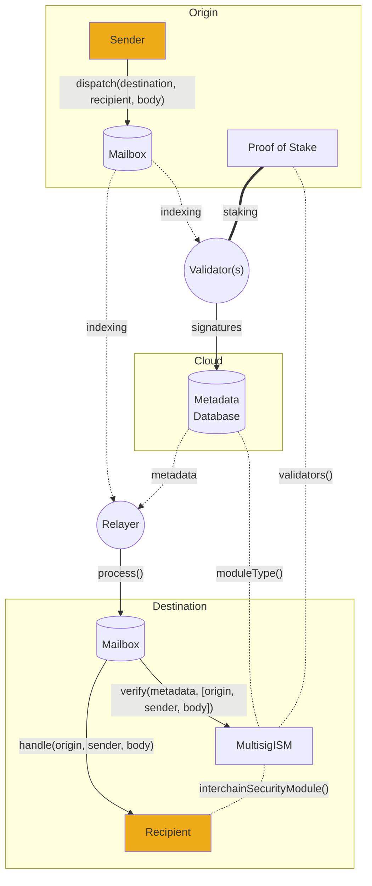

# Validators

Everything you need to start running a Validator.

:::tip

Experienced operators may prefer to deploy agents with terraform instead. This process will automatically create agent keys, Validator buckets, permissions and any other auxiliary setup required to run a Validator cluster on AWS.

:::

Hyperlane [Validators](../../protocol/agents/validators.mdx) are not networked with other Validators and do not regularly submit transactions. Hyperlane Validators are run on a per-origin-chain basis, and these instructions are written for a single chain.



Running a Validator requires the following:

- An RPC node
  - Validators make simple view calls to read merkle roots from the [Mailbox](../../protocol/mailbox.mdx) contract on the chain they are validating for.

:::caution

Operating a Validator for Polygon mainnet requires access to an archive node. This is because Validators should only sign roots once they've been finalized, and Polygon requires 256 block confirmations to achieve finality.

:::

- A secure signing key

  - Validators use this key to sign the `Mailbox`'s latest merkle root. Securing this key is important. If it is compromised, attackers can attempt to falsify messages, causing the Validator to be slashed.
  - The Hyperlane Validator agent currently supports signing with AWS KMS keys that are accessed via API keys/secrets as well as hexadecimal plaintext keys for testing. 

- Publicly readable storage

  - Validators write their signatures off-chain to publicly accessible, highly available, storage, so that they can be aggregated by the [Relayer](../../protocol/agents/relayer.mdx).
  - The Hyperlane Validator agent currently supports storing signatures on AWS S3 using the same AWS API key above, as well as storing signatures in the local filesystem for testing.

- A machine to run on
  - Validators can compile the Rust binary themselves or run a Docker image provided by Abacus Works. The binary can be run using your favorite cloud service. You can even run multiple instances of them in different regions for high availability, as Hyperlane has no notion of "double signing".

import Tabs from "@theme/Tabs";
import TabItem from "@theme/TabItem";

## Guide

:::info


If you're an deploying Hyperlane to a new chain, follow the [local agents guide](../../guides/deploy-hyperlane-local-agents.mdx) to understand how to configure and run a Validator locally. This is not necessary if you're only operating a validator.

The local agent setup shows how you can run a Validator on your _local machine_, which is **only for testing and development purposes**. This also means that signatures from local Validators are only able to be accessed by a locally run Relayer.

For a production environment, you should post signatures to a publicly accessible bucket. See the [**AWS bucket setup guide**](validator-signatures-aws.mdx).

:::

As a recap - before running a production Validator you need to ensure you have:

1. Created a key for your Validator to sign with, see the [Agent Keys](../set-up-agent-keys.mdx) documentation.
1. Set up the destination for your Validator signatures to be posted, see the [AWS Signatures Bucket Setup](validator-signatures-aws.mdx) guide.

## Configuration

Like the local setup, there are a few base arguments you should provide when configuring your Validator.

| Parameter                                       | Description                                                                                             |
| ----------------------------------------------- | ------------------------------------------------------------------------------------------------------- |
| `--db`                                          | Path for writing persistent data to disk.                                                               |
| `--originChainName`                             | Name of the chain being validated. For example: `ethereum`.                                             |
| `--chains.[originChainName].customRpcUrls`      | Override the default RPC URLs used by the Validator for your origin chain.                              |
| `--chains.[originChainName].blocks.reorgPeriod` | Number of block confirmations the Validator needs to wait for before signing the `Mailbox` merkle root. |

:::info

Your Validator takes both command line arguments and environment variables as configuration. Take a look at the [agent configuration](../agent-config.mdx) page and the [configuration reference](../config-reference.mdx) for a full list of configuration possibilities.

:::

Of course, you can also provide the path to additional configuration files as a comma separated list with the [`CONFIG_FILES` environment variable](../config-reference.mdx#config_files). If you choose to run in Docker, see the docker section of [agent configuration](../agent-config.mdx) for tips on mounting your config files into your Docker container.

### Setup-specific configuration

These configurations requirements differ depending on which environment you are setting up.

**Checkpoint signer configuration**

<Tabs groupId="production-setup">
<TabItem value="local-setup" label="Local Setup">

| Argument                                | Description                                                                                                                                  |
| --------------------------------------- | -------------------------------------------------------------------------------------------------------------------------------------------- |
| `--validator.key`                       | Your Validator's private key, which is used to sign merkle roots.                                                                            |
| `--chains.${localChainName}.signer.key` | Your Validator's private key, which will be used to submit a transaction onchain that publicly announces your Validator's checkpoint syncer. |

</TabItem>
<TabItem value="production-setup" label="Production Setup (AWS)">

| Argument                                  | Description                                                                                                                            |
| ----------------------------------------- | -------------------------------------------------------------------------------------------------------------------------------------- |
| `--validator.region`                      | The region of your AWS KMS key. For example: `us-east-1`.                                                                              |
| `--validator.type`                        | Set to the `aws` literal.                                                                                                              |
| `--validator.id`                          | The alias of your Validator's AWS KMS key, prefixed with `alias/`. For example: `alias/hyperlane-validator-signer-${originChainName}`. |

</TabItem>
</Tabs>

**Transaction signer configuration**

The key configured in this step needs a small amount of funds to send the initial announcement transaction.

<Tabs groupId="signer-setup">
<TabItem value="local-setup" label="Local Setup (EVM)">
This is the same as the local configuration for the checkpoint signer.

| Argument                                | Description                                                                                                                                  |
| --------------------------------------- | -------------------------------------------------------------------------------------------------------------------------------------------- |
| `--chains.${localChainName}.signer.key` | Your Validator's private key, which will be used to submit a transaction onchain that publicly announces your Validator's checkpoint syncer. |

</TabItem>
<TabItem value="production-setup" label="Production Setup (EVM)">

| Argument                                  | Description                                                                                                                            |
| ----------------------------------------- | -------------------------------------------------------------------------------------------------------------------------------------- |
| `--chains.${originChainName}.signer.type` | Set to the `aws` literal.                                                                                                       |
| `--chains.${originChainName}.signer.id`   | The alias of your Validator's AWS KMS key, prefixed with `alias/`. For example: `alias/hyperlane-validator-signer-${originChainName}`. |

</TabItem>
<TabItem value="production-setup-cosmos" label="Signer Setup (Cosmos)">

| Argument                                    | Description                                                                                                                            |
| -----------------------------------------   | -------------------------------------------------------------------------------------------------------------------------------------- |
| `--chains.${originChainName}.signer.type`   | Set to the `cosmosKey` literal.                                                                                                              |
| `--chains.${originChainName}.signer.prefix` | Set to the prefix literal associated with the chain's address format. Example: `osmo`.                                                                                                              |
| `--chains.${originChainName}.key`           | Your Validator's hex private key, which will be used to submit a transaction onchain that publicly announces your Validator's checkpoint syncer. |

</TabItem>
</Tabs>

**Checkpoint syncer configuration**

<Tabs groupId="production-setup">
<TabItem value="local-setup" label="Local Setup">

| Argument                  | Description                                                                                                                                                                                                                                                |
| ------------------------- | ---------------------------------------------------------------------------------------------------------------------------------------------------------------------------------------------------------------------------------------------------------- |
| `--checkpointSyncer.type` | Set to `localStorage`.                                                                                                                                                                                                                                     |
| `--checkpointSyncer.path` | The path to your local directory where Validator signatures will be written. This should be the value of `$MY_VALIDATOR_SIGNATURES_DIRECTORY` from the local setup. For example: `--checkpointSyncer.path='/tmp/hyperlane-validator-signatures-ethereum'`. |

:::warning

Note that the Relayer **must** be configured with `--allowLocalCheckpointSyncers` to be able to read signatures from this Validator.

:::

</TabItem>
<TabItem value="production-setup" label="Production Setup (AWS)">

| Argument                    | Description                                                           |
| --------------------------- | --------------------------------------------------------------------- |
| `--checkpointSyncer.type`   | Set to `s3`.                                                          |
| `--checkpointSyncer.bucket` | The AWS S3 bucket name.                                               |
| `--checkpointSyncer.region` | The region of your AWS S3 bucket. For example: `us-east-1`.           |
| `--checkpointSyncer.folder` | A folder name to use for this validator, can be the name of the chain |

</TabItem>
</Tabs>

## Start Validating

### Setup

The recommended installation method for a production environment is using a Docker image.

<Tabs groupId="docker">
  <TabItem value="docker" label="Docker image">

First download the docker image:

```bash
docker pull --platform linux/amd64 gcr.io/abacus-labs-dev/hyperlane-agent:3bb9d0a-20240619-130157
```

  </TabItem>
  <TabItem value="from-source" label="Building from source">

**Clone and setup**

First, clone the Hyperlane monorepo:

```sh
git clone git@github.com:hyperlane-xyz/hyperlane-monorepo.git
```

Then follow the [setup instructions](https://github.com/hyperlane-xyz/hyperlane-monorepo/blob/main/rust/README.md) in the `rust` directory. This should setup `rustup` as well as Rosetta 2 if you are on Apple Silicon.

```sh
# install rustup
curl --proto '=https' --tlsv1.2 -sSf https://sh.rustup.rs | sh

# (apple silicon only) install rosetta 2
softwareupdate --install-rosetta --agree-to-license
```

Build the Validator:

```sh
cargo build --release bin validator
```

  </TabItem>
</Tabs>

### Running the binary

For production Validators that write their signatures to an S3 bucket and have their keys configured with AWS KMS, you will have to provide the AWS access key and secret as environment variables.

| Environment variable    | Description                                             |
| ----------------------- | ------------------------------------------------------- |
| `AWS_ACCESS_KEY_ID`     | The access key ID of your Validator's AWS IAM user.     |
| `AWS_SECRET_ACCESS_KEY` | The secret access key of your Validator's AWS IAM user. |

For a refresher, check out the [Agent Keys](../set-up-agent-keys.mdx) guide.

<Tabs groupId="docker">
  <TabItem value="docker" label="Using Docker">

Then start the container with the relevant arguments. For example, your configuration for AWS:

```sh
docker run \
  -it \
  -e AWS_ACCESS_KEY_ID=ABCDEFGHIJKLMNOP \
  -e AWS_SECRET_ACCESS_KEY=xX-haha-nice-try-Xx \
  --mount ... \
  gcr.io/abacus-labs-dev/hyperlane-agent:3bb9d0a-20240619-130157 \
  ./validator \
  --db /hyperlane_db \
  --originChainName <your_chain_name> \
  --reorgPeriod 1 \
  --validator.region us-east-1 \
  --checkpointSyncer.region us-east-1 \
  --validator.type aws \
  --chains.<your_chain_name>.signer.type aws \
  --validator.id alias/hyperlane-validator-signer-<your_chain_name> \
  --chains.<your_chain_name>.signer.id alias/hyperlane-validator-signer-<your_chain_name> \
  --checkpointSyncer.type s3 \
  --checkpointSyncer.bucket hyperlane-validator-signatures-<your_name> \
  --checkpointSyncer.folder <your_chain_name> \
```

  </TabItem>

  <TabItem value="from-source" label="Building from source">
See these instructions for building from source without Docker.

We can run the built binary from within the `hyperlane-monorepo/rust` directory:

```sh
# set AWS environment variables
export AWS_ACCESS_KEY_ID=ABCDEFGHIJKLMNOP
export AWS_SECRET_ACCESS_KEY=xX-haha-nice-try-Xx

# run the Validator
./target/release/validator \
  --db /hyperlane_db \
  --originChainName <your_chain_name> \
  --reorgPeriod 1 \
  --validator.region us-east-1 \
  --checkpointSyncer.region us-east-1 \
  --validator.type aws \
  --chains.<your_chain_name>.signer.type aws \
  --validator.id alias/hyperlane-validator-signer-<your_chain_name> \
  --chains.<your_chain_name>.signer.id alias/hyperlane-validator-signer-<your_chain_name> \
  --checkpointSyncer.type s3 \
  --checkpointSyncer.bucket hyperlane-validator-signatures-<your_chain_name>
```

  </TabItem>
</Tabs>

## Announcing your Validator

The [Relayer](../relayer/run-relayer.mdx) needs to know where to find your Validator's signatures. Your Validator will automatically attempt to announce itself by writing to the `ValidatorAnnounce` contract on the chain that you're validating.

To do this, your Validator must have a small amount of tokens to pay for the gas for this transaction.

If your Validator has not yet announced itself, and does not have enough tokens to pay for gas, it will log a message specifying how many tokens are needed.

## Success!

The Validator will index the origin Mailbox contract for messages. If a message has been sent, you should see log messages that the Validator has signed them. If everything is configured correctly, you should see json files being written to your S3 bucket (if you followed the AWS setup) or to your local signatures directory if you followed the local setup. New json files get written every time a new outbound message is inserted into the mailbox.

## Running multiple Validators

We encourage folks to validate on as many chains as they are interested in supporting. We recommend that resources are not shared between Validator instances.
