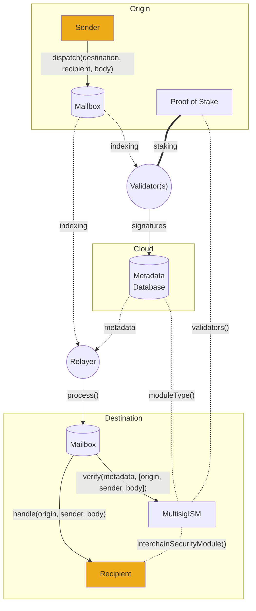

# Validators

Everything you need to start running a validator.

Hyperlane [validators](../../protocol/agents/validators.mdx) are not networked with other validators and do not regularly submit transactions. Hyperlane validators are run on a per-origin-chain basis, and these instructions are written for a single chain.



Running a validator simply requires the following:

- An RPC node
  - Validators make simple view calls to read merkle roots from the [Mailbox](../../protocol/mailbox.mdx) contract on the chain they are validating for.

:::caution

Operating a validator for Polygon mainnet requires access to an archive node. This is because validators should only sign roots once they've been finalized, and Polygon requires 256 block confirmations to achieve finality.

:::

- A secure signing key
  - Validators use this key to sign the `Mailbox`'s latest merkle root. Securing this key is important. If it is compromised, attackers can attempt to falsify messages, causing the validator to be slashed.
  - The Hyperlane validator agent currently supports signing with AWS KMS keys that are accessed via API keys/secrets as well as hexadecimal plaintext keys for testing. See more under [agent keys](../set-up-agent-keys.mdx).

- Publicly readable storage
  - Validators write their signatures off-chain to publicly accessible, highly available, storage, so that they can be aggregated by the [relayer](../../protocol/agents/relayer.mdx).
  - The Hyperlane validator agent currently supports storing signatures on AWS S3 using the same AWS API key above, as well as storing signatures in the local filesystem for testing.

- A machine to run on
  - Validators can compile the Rust binary themselves or run a Docker image provided by Abacus Works. The binary can be run using your favorite cloud service. You can even run multiple instances of them in different regions for high availability, as Hyperlane has no notion of "double signing".

import Tabs from '@theme/Tabs';
import TabItem from '@theme/TabItem';

# Guide

:::info

**The local setup is only intended for testing or development purposes.**

This is intended to show how you can run a validator on your _local machine_, which is only for testing and development purposes. This also means that signatures from local validators are only able to be accessed by locally ran relayers.

For running a validator in a production environment, see the [**AWS setup guide**](validator-aws.mdx).

:::

### Create a hexadecimal key for your validator to sign with

See the [agent key](../set-up-agent-keys.mdx) guide.

### Create a local directory for your validator's signatures

When running a validator locally, your validator will write its signatures to a local directory. This directory can be named whatever you like, just remember to use this directory when setting your configuration.

```sh
# Pick an informative name specific to the chain you're validating
MY_VALIDATOR_SIGNATURES_DIRECTORY=/tmp/hyperlane-validator-signatures-ethereum

# Create the directory
mkdir -p $MY_VALIDATOR_SIGNATURES_DIRECTORY
```


## Configuration

:::info

Take a look at the [agent configuration](../agent-config.mdx) page and the [configuration reference](../config-reference.mdx) for a full list of configuration possibilities. **The list below is not complete,** however it should be enough to get started.

:::

Your validator takes arguments and environment variables as configuration. See below for both the general configurations and those that are specific to the setup instructions you followed.

| Argument                                      | Description                                                                                                                                                                                                                                                                                                                                                  |
| --------------------------------------------- | ------------------------------------------------------------------------------------------------------------------------------------------------------------------------------------------------------------------------------------------------------------------------------------------------------------------------------------------------------------ |
| `--reorgPeriod`                               | The number of block confirmations a validator should wait before signing the `Mailbox` merkle root. Note that signing a root that is later invalidated (i.e. due to a re-org) is considered fraudulent behavior and will eventually be slashable.                                                                                              |
| `--originChainName`                           | The name of the chain being validated (e.g. `ethereum`)                                                                                                                                                                                                                                                                                                      |
| `--chains.[origin chain name].customrpcurls`  | The RPC URLs of the node for the chain you are validating. Note Polygon mainnet requires an RPC URL of an archive node. (e.g. `--chains.ethereum.customrpcurls` or `--chains.polygon.customrpcurls`)                                                                                                                          |
| `--db`                                        | The path to where the validator should write persistent data to disk. Ensure this path to be persistent when using cloud setups. When using Docker, make sure to mount the persistent path/volume into the container.                                                                                                                                 |

| Environment variable | Description                                                                                                                                                                                                                                                                                                                                                                               |
| -------------------- | ----------------------------------------------------------------------------------------------------------------------------------------------------------------------------------------------------------------------------------------------------------------------------------------------------------------------------------------------------------------------------------------- |
| `CONFIG_FILES`       | If you want to add additional configuration files you can add additional paths here as a comma separated list. These files must be accessible within the filesystem your agent has access to. If you're running in Docker, see the docker section of [agent configuration](../agent-config.mdx) for tips on mounting your config files into your Docker container. |

### Setup-specific configuration

These **required** environment variables differ based on which of the environments you set up.

<Tabs>
  <TabItem value="local-setup" label="Local Setup">
These are required for the local setup.

| Argument                                | Description                                                                                                                                                                                                                                                                                                                               |
| --------------------------------------- | ----------------------------------------------------------------------------------------------------------------------------------------------------------------------------------------------------------------------------------------------------------------------------------------------------------------------------------------- |
| `--validator.key`                       | Your validator's private key, which is used to sign merkle roots.                                                                                                                                                                                                                                                                         |
| `--chains.${localchainname}.signer.key` | Your validator's private key, which will be used to submit a transaction on chain that publicly announce your validator's checkpoint syncer.                                                                                                                                                                                              |
| `--checkpointSyncer.type`               | Set to `localStorage`.                                                                                                                                                                                                                                                                                                                    |
| `--checkpointSyncer.path`               | The path to your local directory where validator signatures will be written. This should be the value of `$MY_VALIDATOR_SIGNATURES_DIRECTORY` from the local setup.Example: `--checkpointSyncer.path='/tmp/hyperlane-validator-signatures-ethereum'` |

:::warning

Note that relayers **must** be configured with `--allowLocalCheckpointSyncers` to be able to read signatures from this validator.

:::

  </TabItem>
  <TabItem value="production-setup" label="Production Setup (AWS)">

These are required variables that are specific to the [AWS setup](./validator-aws.mdx).

| Argument                                 | Description                                                                                                                                                           |
| ---------------------------------------- | --------------------------------------------------------------------------------------------------------------------------------------------------------------------- |
| `--validator.type`                       | Set to the `aws` literal.                                                                                                                                             |
| `--validator.id`                         | The alias of your validator's AWS KMS key, prefixed with `alias/`.<em>Example:</em> `alias/hyperlane-validator-signer-${chain_name}`                       |
| `--chains.${localchainname}.signer.type` | Set to the `aws` literal.                                                                                                                                             |
| `--chains.${localchainname}.signer.id`   | The alias of your validator's AWS KMS key, prefixed with `alias/`.<em>Example:</em> `alias/hyperlane-validator-signer-${chain_name}`                       |
| `--validator.region`                     | The region of your AWS KMS key.<em>Example:</em> `us-east-1`.                                                                                              |
| `--checkpointSyncer.type`                | Set to `s3`.                                                                                                                                                          |
| `--checkpointSyncer.bucket`              | The AWS S3 bucket name.                                                                                                                                               |
| `--checkpointSyncer.region`              | The region of your AWS S3 bucket.<em>Example:</em> `us-east-1`.                                                                                            |

| Environment variable    | Description                                             |
| ----------------------- | ------------------------------------------------------- |
| `AWS_ACCESS_KEY_ID`     | The access key ID of your validator's AWS IAM user.     |
| `AWS_SECRET_ACCESS_KEY` | The secret access key of your validator's AWS IAM user. |

    </TabItem>
</Tabs>

## Installation

The recommended installation method for a production environment is using a Docker image.

<Tabs groupId="docker">
  <TabItem value="docker" label="Docker image">

To download the docker image, run:

```bash
docker pull gcr.io/abacus-labs-dev/hyperlane-agent:f44589e-20231130-114734
```

    </TabItem>
  <TabItem value="from-source" label="Building from source">

First, clone the repo

```sh
git clone git@github.com:hyperlane-xyz/hyperlane-monorepo.git
```

And then follow the [setup instructions](https://github.com/hyperlane-xyz/hyperlane-monorepo/blob/main/rust/README.md#setup) in the `rust` directory

    </TabItem>
</Tabs>

## Start Validating


### Running the binary


<Tabs groupId="docker">
  <TabItem value="docker" label="Using Docker">
Find the latest docker image and set it to the environment variable `$DOCKER_IMAGE`.

```sh
docker run \
  -it \
  --mount type=bind,source="$(pwd)"/hyperlane_db,target=/hyperlane_db \
  $DOCKER_IMAGE \
  --db /hyperlane_db --originChainName ethereum --reorgPeriod 20 --checkpointSyncer.type localStorage --checkpointSyncer.path /tmp/hyperlane-validator-signatures-ethereum
```

:::info

If you have followed the instructions to [deploy hyperlane](../../deploy-hyperlane.mdx) and are specifying a path to your own config file in the `CONFIG_FILES` environment variable, check out the config files with docker section of [agent configuration](../agent-config.mdx).

:::

:::tip

If you're running validators with a local setup on the same machine and want the relayer to access these validator signatures, be sure to [mount](https://docs.docker.com/storage/bind-mounts/) your local validator's signature directory into your relayer at the same path that you used when [announcing your validator](#Announcing-your-validator)

For example, if your local validator is writing signatures to `/tmp/hyperlane-validator-signatures-ethereum`, you should mount a directory for the Docker container:

```sh
docker run \
  -it \
  -e CONFIG_FILES=/path/to/file/inside/container
  --mount type=bind,source="$(pwd)"/hyperlane-validator-signatures-ethereum,target=/tmp/hyperlane-validator-signatures-ethereum,readonly \
  --mount type=bind,source="$(pwd)"/hyperlane_db,target=/hyperlane_db \
  $DOCKER_IMAGE \
  ./validator --db /hyperlane_db --originChainName ethereum --reorgPeriod 20 --checkpointSyncer.type localStorage --checkpointSyncer.path /tmp/hyperlane-validator-signatures-ethereum
```
:::
  </TabItem>

  <TabItem value="from-source" label="Building from source">
See these instructions for building from source without Docker.

We can run the built binary from within the `hyperlane-monorepo/rust` directory:

```sh
./target/release/validator --db /hyperlane_db --originChainName ethereum --reorgPeriod 20 --checkpointSyncer.type localStorage --checkpointSyncer.path /tmp/hyperlane-validator-signatures-ethereum
```
  </TabItem>
</Tabs>

## Announcing your validator

The [relayer](../relayer/run-relayer.mdx) needs to know where to find your validator's signatures. Your validator will automatically attempt to announce itself by writing to the `ValidatorAnnounce` contract on the chain that you're validating.&#x20;

To do this, your validator must have a small amount of tokens to pay for the gas for this transaction.

If your validator has not yet announced itself, and does not have enough tokens to pay for gas, it will log a message specifying how many tokens are needed.

## Success!

The validator will index the origin Mailbox contract for messages. If a message has been sent, you should see log messages that the validator has signed them. If everything is configured correctly, you should see json files being written to your S3 bucket (if you followed the AWS setup) or to your local signatures directory if you followed the local setup. New json files get written every time a new outbound message is inserted into the mailbox.

## Running multiple validators

We encourage folks to validate on as many chains as they are interested in supporting. We recommend that resources are not shared between validator instances.
