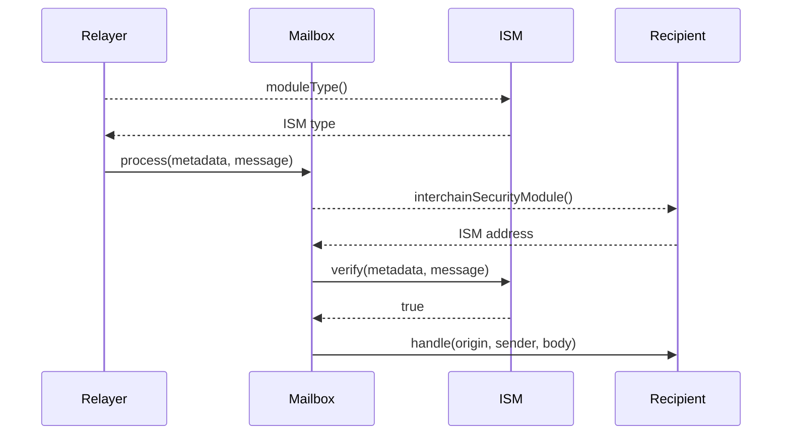

# Modular Security

Hyperlane is secured by **Interchain Security Modules** (ISMs). ISMs are smart contracts that are responsible for verifying that interchain messages being delivered on the destination chain were _actually sent_ on the origin chain.

Hyperlane developers can **optionally** **override** the [Mailbox's](../mailbox.mdx)'s default ISM by specifying an application-specific ISM, which they can configure, compose, and customize according to the needs of their application.

### Configure

Hyperlane defines a set of pre-built ISMs. Developers can deploy any of these contracts "off-the-shelf" and configure them with their own parameters.

For example, application developers that want increased sovereignty over interchain security could deploy a [Multisig ISM](multisig-ISM.mdx) configured with validators sourced from their own community.

### Compose

ISMs act as "security [legos](https://en.wikipedia.org/wiki/Lego)". Developers can mix and match different ISMs together to encode a security model that best fits their needs.

For example, application developers that want additional security could deploy an [Aggregation ISM](aggregation-ISM.mdx) that requires verification by both a [Multisig ISM](multisig-ISM.mdx) configured with validators from the Hyperlane community, **and** a [Wormhole ISM](./third-party-ISMs/wormhole-ISM.mdx) that verifies that a quorum of the [Wormhole](https://wormhole.com/) validator set verified the message.

### Customize

ISMs are fully customizable. Developers can write their own ISMs, tailoring them to the needs of their application.

For example, application developers can build ISMs that adjust security models based on message content. High value and infrequent messages (e.g. governance) could be verified by a security model that prioritizes safety over latency and gas costs. Lower value and more frequent messages could be verified by a security model that prioritizes latency and gas costs over safety.

## Overriding the default ISM

Application developers can override the default ISM by implementing the `ISpecifiesInterchainSecurityModule` interface in their application.

Specifically, this interface must be implemented in the same smart contract that implements `handle()`.

```solidity
// SPDX-License-Identifier: MIT OR Apache-2.0
pragma solidity >=0.6.11;

interface ISpecifiesInterchainSecurityModule {
    function interchainSecurityModule()
        external
        view
        returns (IInterchainSecurityModule);
}
```

# General Interface

ISMs must implement the `IInterchainSecurityModel()` interface. This interface consists of two functions.

```solidity
// SPDX-License-Identifier: MIT OR Apache-2.0
pragma solidity >=0.6.11;

interface IInterchainSecurityModule {
    /**
     * @notice Returns an enum that represents the type of security model
     * encoded by this ISM.
     * @dev Relayers infer how to fetch and format metadata.
     */
    function moduleType() external view returns (uint8);

    /**
     * @notice Defines a security model responsible for verifying interchain
     * messages based on the provided metadata.
     * @param _metadata Off-chain metadata provided by a relayer, specific to
     * the security model encoded by the module (e.g. validator signatures)
     * @param _message Hyperlane encoded interchain message
     * @return True if the message was verified
     */
    function verify(bytes calldata _metadata, bytes calldata _message)
        external
        returns (bool);
}
```

### Verify

The primary function that ISMs must implement is `verify()`. The [Mailbox](../mailbox.mdx) will call `IInterchainSecurityModule.verify()` before delivering a message to its recipient. If `verify()` reverts or returns `false`, the message will not be delivered.

The `verify()` function takes two parameters.

The first, `_metadata`, consists of arbitrary bytes provided by [Relayer](../agents/relayer.mdx). Typically, these bytes are specific to the ISM. For example, for a [Multisig ISM](multisig-ISM.mdx), `_metadata` must include validator signatures.

The second, `_message`, consists of the Hyperlane message being verified. ISMs can use this to inspect details about the message being verified. For example, a [Multisig ISM](multisig-ISM.mdx) could change validator sets based on the origin chain of the message.

:::warning
See the [`Message.sol`](https://github.com/hyperlane-xyz/hyperlane-monorepo/blob/main/solidity/contracts/libs/Message.sol) library for more information on the format of the Hyperlane message passed to `verify()`
:::

### Module type

The secondary function that ISMs must implement is `moduleType()`. This is used to signal to the [Relayer](../agents/relayer.mdx) what to include in `_metadata`. ISMs **must** return one of the supported module types.

:::tip

For more information on the available module types and their respective metadata, please visit the ISM docs outlined in this section, e.g. [Multisig ISM](./multisig-ISM.mdx).

:::

## Sequence diagram

The following shows a simplified sequence diagram of an interchain message being verified and delivered on the destination chain.

:::info
If the recipient does not implement `ISpecifiesInterchainSecurityModule` or `recipient.interchainSecurityModule()` returns `address(0)`, the default ISM configured on the [Mailbox](../mailbox.mdx) will be used to verify the message.

This is omitted from the sequence diagram for clarity.
:::


