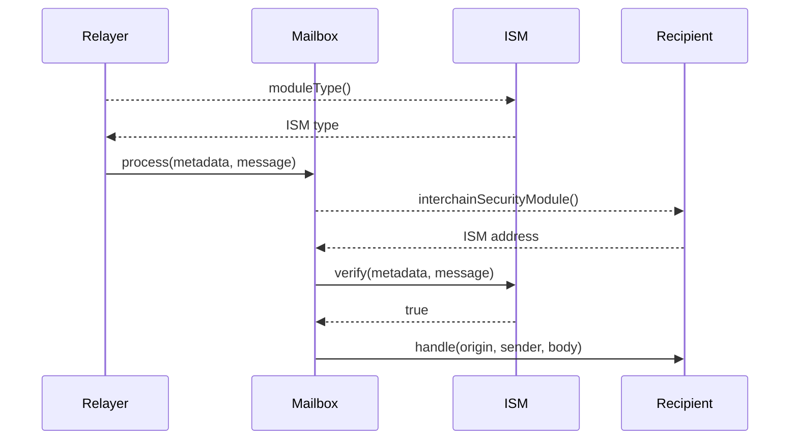

# 模块化的安全

Hyperlane由**Interchain Security Modules** (ISMs)保护。ISMs是一种智能合约，负责验证在目标链上传递的链间消息是否**实际发送**在原始链上。

Hyperlane开发人员可以通过指定一个应用专用的ISM，**optionally** **override**[Mailbox's](../mailbox.mdx)的默认ISM，他们可以根据自己的应用程序的需求来配置、组合和定制。

### 配置

Hyperlane定义了一套预先构建的ISMs。开发人员可以部署任何这些“现成的”合约，并使用自己的参数配置它们。

例如，希望增加链间安全主权的应用程序开发人员可以部署一个[Multisig ISM](multisig-ISM.mdx)，其中配置了来自他们自己社区的验证器。

### 组合

ISMs就像“security[legos](https://en.wikipedia.org/wiki/Lego)”。开发人员可以混合和匹配不同的ISMs，以编码最适合他们需求的安全模型。

例如，希望获得额外安全性的应用程序开发人员可以部署一个[Aggregation ISM](aggregation-ISM.mdx)，它需要由配置了Hyperlane社区验证器的[Multisig ISM](multisig-ISM.mdx) 和一个[Wormhole ISM](wormhole-ISM.mdx)进行验证，后者验证了[Wormhole](https://wormhole.com/)验证器集的quorum验证了消息。

### 自定义

ISMs是完全可定制的。开发人员可以编写自己的ISMs，根据应用程序的需要进行调整。

例如，应用程序开发人员可以构建基于消息内容调整安全模型的ISMs。高价值和不频繁的消息(例如治理)可以通过安全模型进行验证，该模型将安全性优先于延迟和gas成本。更低的值和更频繁的消息可以通过将延迟和gas成本置于安全性之上的安全模型进行验证。

## 覆盖默认ISM

应用程序开发者可以通过在应用程序中实现`isspecificesinterchainsecuritymodule`接口来覆盖默认的ISM。

具体来说，这个接口必须在实现`handle()`的智能合约中实现。

```solidity
// SPDX-License-Identifier: MIT OR Apache-2.0
pragma solidity >=0.6.11;

interface ISpecifiesInterchainSecurityModule {
    function interchainSecurityModule()
        external
        view
        returns (IInterchainSecurityModule);
}
```

# 通用接口

ISMs必须实现`IInterchainSecurityModel()`接口。该接口由两个函数组成。

```solidity
// SPDX-License-Identifier: MIT OR Apache-2.0
pragma solidity >=0.6.11;

interface IInterchainSecurityModule {
    /**
     * @notice Returns an enum that represents the type of security model
     * encoded by this ISM.
     * @dev Relayers infer how to fetch and format metadata.
     */
    function moduleType() external view returns (uint8);

    /**
     * @notice Defines a security model responsible for verifying interchain
     * messages based on the provided metadata.
     * @param _metadata Off-chain metadata provided by a relayer, specific to
     * the security model encoded by the module (e.g. validator signatures)
     * @param _message Hyperlane encoded interchain message
     * @return True if the message was verified
     */
    function verify(bytes calldata _metadata, bytes calldata _message)
        external
        returns (bool);
}
```

### 验证

ISMs必须实现的主要功能是`verify()`。[Mailbox](../mailbox.mdx)将在将消息传递给收件人之前调用`IInterchainSecurityModule.verify()`。如果`verify()`恢复或返回`false`，消息将不会被传递。

`verify()`函数接受两个参数。

第一个是`_metadata`，由[Relayer](../agents/relayer.mdx)提供的任意字节组成。通常，这些字节是特定于ISM的。例如，对于[Multisig ISM](multisig-ISM.mdx)， `_metadata`必须包含验证者签名。

第二个是`_message`，由正在验证的Hyperlane消息组成。ISMs可以使用它来检查正在验证的消息的详细信息。例如，[Multisig ISM](multisig-ISM.mdx)可以根据消息的原始链更改验证器集。

:::warning
有关传递给`verify()`的Hyperlane消息格式的更多信息，请参阅[` message .sol`](https://github.com/hyperlane-xyz/hyperlane-monorepo/blob/main/solidity/contracts/libs/Message.sol)库。
:::

### 模块类型

ISMs必须实现的第二个函数是`moduleType()`。这是用来通知[Relayer](../agents/relayer.mdx) 在`_metadata`中包含什么。ISMs **必须**返回支持的一种模块类型。

## 序列图

下面展示了在目标链上验证和交付链间消息的简化顺序图。

:::info
如果收件人没有实现`isspecificesinterchainsecuritymodule`或者`recipient.interchainSecurityModule()`返回`address(0)`，将使用[Mailbox](../mailbox.mdx)上配置的默认ISM来验证消息。

为了清晰起见，在序列图中省略了这一点。
:::


