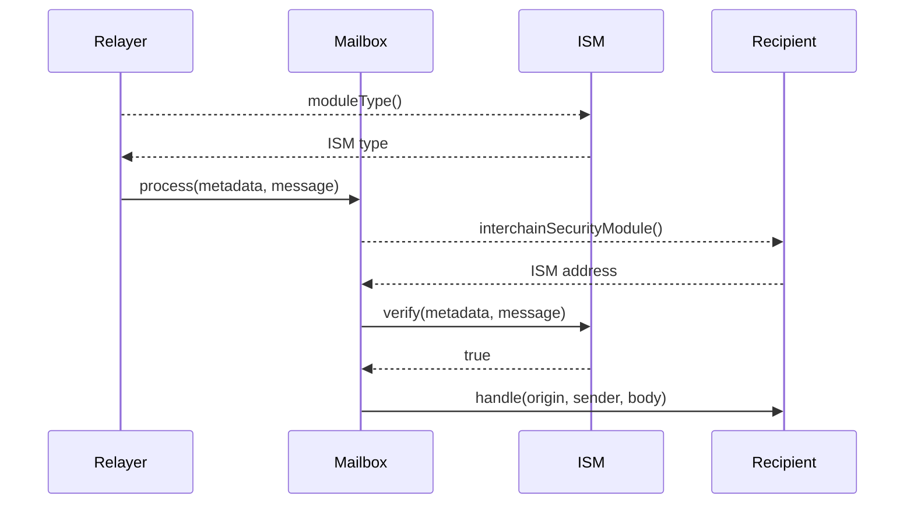

# Sequence diagram

The following shows a simplified sequence diagram of an interchain message being verified and delivered on the destination chain.

:::info

- If the recipient does not implement `ISpecifiesInterchainSecurityModule` or `recipient.interchainSecurityModule()` returns `address(0)`, the default ISM configured on the [Mailbox](../mailbox.mdx) will be used to verify the message.
- This is omitted from the sequence diagram for clarity.

:::

