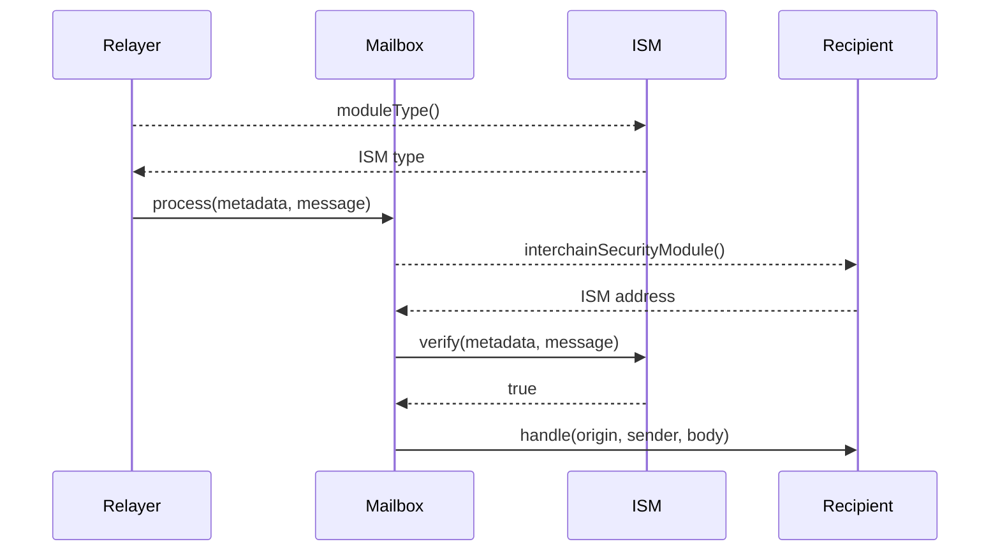

# Message Verification Flow

When a message is sent between chains, it goes through a verification process to ensure its authenticity. This page explains how that process works.

## Overview

The verification process involves three key components:

1. The **Mailbox contract** - The main entry point for message processing
2. The **ISM (Interchain Security Module)** - The security verification contract
3. The **Recipient contract** - The application that receives the message

## Sequence Diagram

:::info

- If the recipient does not implement `ISpecifiesInterchainSecurityModule` or `recipient.interchainSecurityModule()` returns `address(0)`, the default ISM configured on the [Mailbox](../mailbox.mdx) will be used to verify the message.
- This is omitted from the sequence diagram for clarity.

:::

## How It Works

1. **Type Identification**

   - The Relayer calls `moduleType()` on the ISM to determine its category
   - Based on this type (e.g., `MULTISIG`, `ROUTING`, `AGGREGATION`), the Relayer knows what verification proof to collect
   - For Multisig ISMs, this means gathering cryptographic signatures from validators

2. **Message Submission**

   - The Relayer calls `Mailbox.process()` providing both:
     - The original message
     - The collected verification metadata

3. **Verification Process**

   - Mailbox queries the recipient contract via `interchainSecurityModule()`
   - If no ISM is specified, Mailbox uses the default ISM
   - Mailbox then forwards the message and metadata to the ISM's `verify()` function
   - The ISM executes its security logic (e.g., signature verification, threshold checking)

4. **Message Delivery**

   - Upon successful verification (when `verify()` returns `true`), Mailbox calls `recipient.handle()`
   - If verification fails, the transaction reverts and the message is rejected
