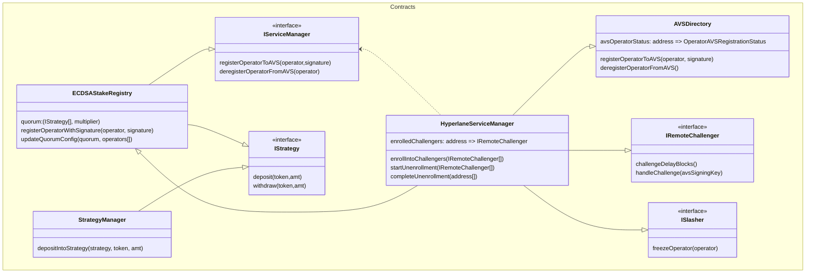
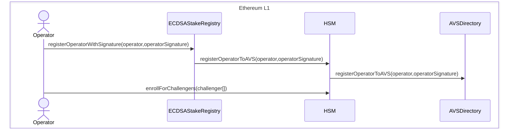
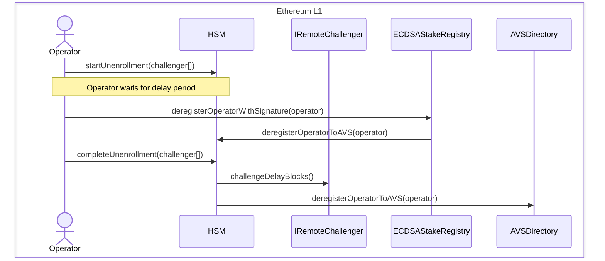
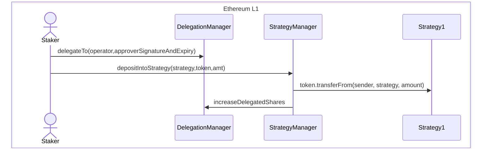
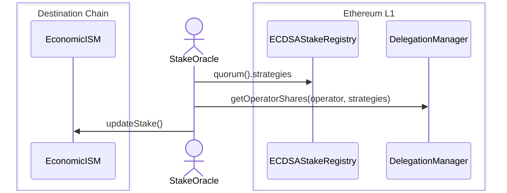
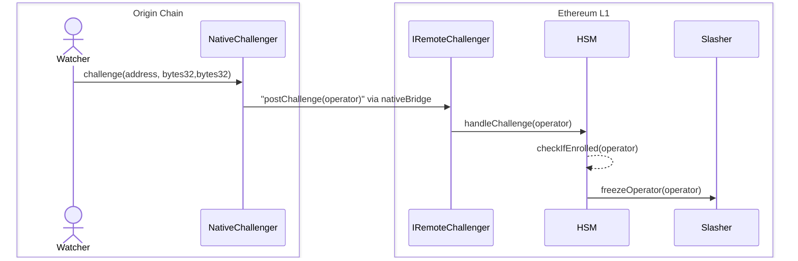

# Hyperlane AVS

### Overview

Welcome to the Hyperlane AVS documentation. This guide will help you understand the Hyperlane's AVS (Active Validator Service) module built on top of Eigenlayer, the ethereum restaking protocol.

The AVS module uniquely enables economic security within the Hyperlane protocol with minimum cost to bootstrap a new validator network for each chain it supports. This is achieved by leveraging the shared pool of stake that can secure outbound messages from and between rollups. The main stakeholders in this process are:

- **Operators** - Eigenlayer operators who opt into the Hyperlane AVS service and start validating outbound messages from the chain(s) specified.
- **Stakers** - Eigenlayer stakers who delegate their stake to the operators to secure the network.
- **Hyperlane applications** - Applications that want to economically secure their messages across chains and are willing to pay for the service.

### Architecture



The above class diagram describes the architecture of the current AVS module contracts. Crucially, it describes the *"metaAVS"* design pattern which we support with the `IRemoteChallenger` interface.

### IRemoteChallenger

Operators on Hyperlane have the flexibility to operate on their chosen chain(s), making the AVS module adaptable to any chain or challenger. However, this flexibility may result in the absence of a universally accepted 'canonical' source of truth for slashing on the Mainnet. Embracing the ethos of permissionless interoperability, we believe that application developers should have the ability to define their own source of truth and establish guarantees for their application's economic security. This includes the ability to program challenge conditions and slashing windows. To facilitate this level of customization, we have introduced the `IRemoteChallenger` interface.

```solidity
interface IRemoteChallenger {
    /// @notice Returns the number of blocks that must be mined before a challenge can be handled
    /// @return The number of blocks that must be mined before a challenge can be handled
    function challengeDelayBlocks() external view returns (uint256);

    /// @notice Handles a challenge for an operator
    /// @param operator The address of the operator
    function handleChallenge(address operator) external;
}
```

This configuration should be immutable and accessible for any AVS operator to view and opt into. The `handleChallenge` function explicitly encodes how you expect the challenge from the source chain (say Arbitrum) is delivered to Ethereum Mainnet where the AVS contracts and the `IRemoteChallenger` live.

For Arbitrum, it can be the rollup's native bridge and for another L1, it can be a committee-based solution. Our interface is challenger implementation agnostic to allow for flexibility in this design area. A reasonable `challengeDelayBlocks` would be slightly longer than a week, in the case of using a rollup's native bridge.

As an operator, you are expected to review the different `IRemoteChallenger` contracts and assess their risk and rewards. If interested, you can enroll into one or multiple challengers directly from the `HyperlaneServiceManager` contract.

:::note

The IRemoteChallenger implementations are not yet live in production.

:::

### Workflow for registering

Prerequisite: operator has to be registered as an Eigenlayer Operator (through their CLI)



We need operators to enroll into specific challengers to allow for permissionless slashing by any ISM deployers. As an operator, you can inspect every remote challenger and choose for yourself which ones you want to opt into depending on risk vs reward. This also means Abacus Works won't be the bottleneck for adding challengers for different rollup stacks. The operators will be able to unenroll after the unenrollment delay blocks has passed.

### Workflow for deregistering



Operators can only deregister themselves after unenrolling from all challengers they are enrolled in, each of which can have its own delay period. This is to ensure that the operator is not able to withdraw their stake before the challenge period has passed for any of the challengers.

### Workflow for staking



In Eigenlayer's design, staker funds are safeguarded as they are not made accessible to the AVS until slashing is activated. This ensures that no funds are at risk prematurely. Additionally, this design does not allow users to selectively opt into the Hyperlane AVS alone, as staking is managed through the StrategyManager and directed towards a specific operator.

### Workflow for reading stake from an ISM



Stake weight given to different operators will be determined by the aggregate stake delegated to them on the L1. There's several ways of obtaining this but the most straightforward way will be to use the native L1->L2 bridge if the destination chain is a rollup.

:::note

The EconomicISM is not yet live in production and the above sequence diagram can change based on the final implementation.

:::

### Workflow for slashing



The slashing mechanism is designed to be permissionless and flexible. The `IRemoteChallenger` interface allows for different implementations of the slashing mechanism. As an example, the `postChallenge` function is called by the native challenger on the origin chain, which then calls the `handleChallenge` function on the `HyperlaneServiceManager` contract. The `HyperlaneServiceManager` contract then checks if the operator is enrolled in the challenger and calls the `freezeOperator` function on the `Slasher` contract to freeze the operator's stake.

:::note

Both the challenger and slasher contracts are not yet live in production. This sequence diagram can change based on the final implementation.

:::

### Protocol SLA

Anyone can join Hyperlane as a validator, i.e., there's no defacto validator set. You can start attesting to messages from your chain but you'll only be rewarded if you are picked by an [ISM](./ISM/modular-security.mdx) deployer for verification. Similarily, you can only get slashed by the said ISM deployer if you enroll into their Challenger.

Because of the permissionless nature of the protocol, Hyperlane wouldn't be slashing for liveness but you can still be penalized by not being selected in an ISM's validator set and losing out on rewards.

Hence, the protocol SLA may vary from challenger to challenger.

### Contracts deployment

| Name                                                                                                                                                                              | Proxy                                                                                                                           | Implementation                                                                                                                  |
| --------------------------------------------------------------------------------------------------------------------------------------------------------------------------------- | ------------------------------------------------------------------------------------------------------------------------------- | ------------------------------------------------------------------------------------------------------------------------------- |
| [`AVSDirectory`](https://github.com/Layr-Labs/eigenlayer-contracts/blob/testnet-holesky/src/contracts/core/AVSDirectory.sol)                                                      | [`0x055733000064333CaDDbC92763c58BF0192fFeBf`](https://holesky.etherscan.io/address/0x055733000064333CaDDbC92763c58BF0192fFeBf) | [`0xEF5BA995Bc7722fd1e163edF8Dc09375de3d3e3a`](https://holesky.etherscan.io/address/0xEF5BA995Bc7722fd1e163edF8Dc09375de3d3e3a) |
| [`ProxyAdmin`](https://github.com/OpenZeppelin/openzeppelin-contracts/blob/master/contracts/proxy/transparent/ProxyAdmin.sol)                                                     |                                                                                                                                 | [`0x11918DC33E067C5DA83EEF58E50F856398b8Df4C`](https://holesky.etherscan.io/address/0x11918DC33E067C5DA83EEF58E50F856398b8Df4C) |
| [`ECDSAStakeRegistry`](https://github.com/hyperlane-xyz/hyperlane-monorepo/blob/f0df1a4cd1a9a6ec2e01b106941a2d4e42e5ba18/solidity/contracts/avs/ECDSAStakeRegistry.sol)           | [`0xFCc63b537e70652A280c4E7883C5BB5a1700e897`](https://holesky.etherscan.io/address/0xFCc63b537e70652A280c4E7883C5BB5a1700e897) | [`0x04438ef7622f5412f82915f59cad4f704c61ea48`](https://holesky.etherscan.io/address/0x04438ef7622f5412f82915f59cad4f704c61ea48) |
| [`HyperlaneServiceManager`](https://github.com/hyperlane-xyz/hyperlane-monorepo/blob/f0df1a4cd1a9a6ec2e01b106941a2d4e42e5ba18/solidity/contracts/avs/HyperlaneServiceManager.sol) | [`0xb94F96D398eA5BAB5CA528EE9Fdc19afaA825818`](https://holesky.etherscan.io/address/0xb94F96D398eA5BAB5CA528EE9Fdc19afaA825818) | [`0xd5eb5fa3f470ebbb93a4a58c644c87031268a04a`](https://holesky.etherscan.io/address/0xd5eb5fa3f470ebbb93a4a58c644c87031268a04a) |
