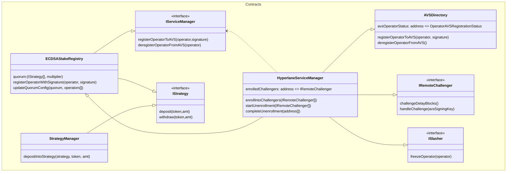
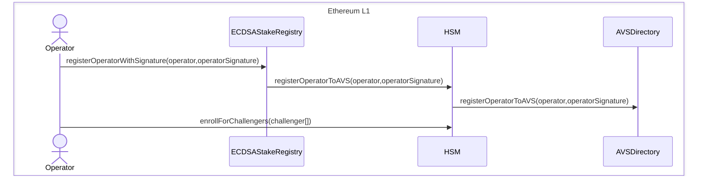
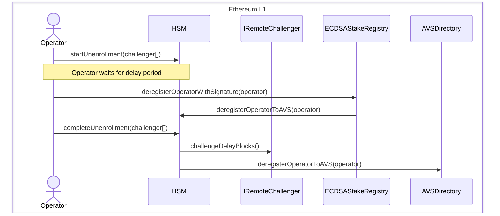
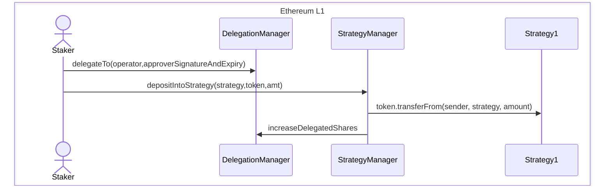
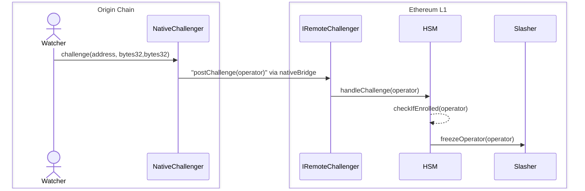

# Hyperlane AVS

### Overview

Welcome to the Hyperlane AVS documentation. This guide will help you understand the Hyperlane's AVS (Actively Validated Service) module built atop EigenLayer, the Ethereum restaking protocol.

Hyperlane currently employs a Proof of Authority model for security, in which a trusted group of validators are chosen to maintain [security](./ISM/multisig-ISM.mdx). However, if any validator signs erroneously or with malicious intent, there are no repercussions, as these validators have no economic stake. This is the gap that the AVS module is designed to address.

```mermaid
flowchart TB
    subgraph Ethereum
      Staker
      Operator
      EL[EigenLayer]
      H_AVS[Hyperlane AVS]
      CH1[Challenger1]
      CH2[Challenger2]
      CH3[Challenger3]

      Operator -- "(de)register()" --> H_AVS
      Staker -- "deposit(operator)" --> EL

      H_AVS <-..-> EL
      CH1 -. "handleChallenge(operator)" .-> H_AVS
      CH2 -. "handleChallenge(operator)" .-> H_AVS
      CH3 -. "handleChallenge(operator)" .-> H_AVS

      style H_AVS fill: #FF0099
      style EL fill: #1a0c6d
      style CH1 fill: #006400
      style CH2 fill: #006400
      style CH3 fill: #006400
    end
```



The AVS module uniquely enables [economic security](./ISM/economic-security.mdx) within the Hyperlane protocol with minimum cost to bootstrap a new validator network for each chain it supports. This is achieved by leveraging the shared pool of stake that can secure outbound messages from and between rollups. The main stakeholders in this process are:

- **Operators** - EigenLayer operators who opt into the Hyperlane AVS service and start validating outbound messages from the chain(s) specified
- **Stakers** - EigenLayer stakers who delegate their stake to the operators to secure the network
- **Applications** - Applications leveraging Hyperlane seeking to economically secure their messages across chains

:::caution

Slashing and reward payments are not enabled yet for EigenLayer. In addition to the AVS, signatures & validation must be set up in an [Interchain Security Module (ISM)](./ISM/modular-security.mdx).

:::

### Architecture



The above class diagram describes the architecture of the current AVS module contracts. Crucially, it describes the _"metaAVS"_ design pattern which we support with the `IRemoteChallenger` interface.

### `IRemoteChallenger`

Operators on Hyperlane have the flexibility to operate on their chosen chain(s), making the AVS module adaptable to any chain or challenger. However, this flexibility may result in the absence of a universally accepted 'canonical' source of truth for slashing on the Mainnet. This is due to the fact that fraud can only be proven on the origin chain, and so there needs to be a way to transmit that information to the chain on which the stake lives.

Embracing the ethos of permissionless interoperability, we believe that application developers should have the ability to define their own source of truth and establish guarantees for their application's economic security. This includes the ability to program challenge conditions and slashing windows. 

To enable this level of customization, we have introduced the `IRemoteChallenger` interface.  The `handleChallenge` function will only be invoked if `ism.verify()` successfully executes on the L1 originating from the chain where the fraudulent signature was detected. As mentioned above, it's critical to set up robust security measures for this underlying ISM.

```solidity
interface IRemoteChallenger {
    /// @notice Returns the number of blocks that must be mined before a challenge can be handled
    /// @return The number of blocks that must be mined before a challenge can be handled
    function challengeDelayBlocks() external view returns (uint256);

    /// @notice Handles a challenge for an operator
    /// @param operator The address of the operator
    function handleChallenge(address operator) external;
}
```

This configuration should be immutable and accessible for any AVS operator to view and opt into. The `handleChallenge` function explicitly encodes how you expect the challenge from the source chain (say Arbitrum) is delivered to Ethereum Mainnet where the AVS contracts and the `IRemoteChallenger` live.

For Arbitrum, it can be the rollup's native bridge and for another L1, it can be a committee-based solution. Our interface is challenger implementation agnostic to allow for flexibility in this design area. This allows for us to reuse the existing hook-ISMs setup by calling `handleChallenge()` once `ism.verify()` is successful on the L1. A reasonable `challengeDelayBlocks` would be slightly longer than a week in the case of using a rollup's native bridge.

As an operator, you are expected to review the different `IRemoteChallenger` contracts and assess their risk and rewards. If interested, you can enroll into one or multiple challengers directly from the `HyperlaneServiceManager` contract.

:::note

The IRemoteChallenger implementations are not yet live in production.

:::

### Workflow for registering

Prerequisite: operator has to be registered as an EigenLayer Operator (through their CLI)



Operators need to enroll into specific challengers to allow for economic security with permissionless slashing. As an operator, you can inspect every remote challenger and choose for yourself which ones you want to opt into depending on risk. This also means there is no centralized permissioning or whitelisting that would be the bottleneck for adding challengers for different rollup stacks. The operators will be able to unenroll after the unenrollment delay blocks has passed.

### Workflow for deregistering



Operators can only deregister themselves after unenrolling from all challengers they are enrolled in, each of which can have its own delay period. This is to ensure that the operator is not able to withdraw their stake before the challenge period has passed for any of the challengers.

### Workflow for staking



In EigenLayer's design, staker funds are safeguarded as they are not made accessible to the AVS until slashing is activated. This ensures that no funds are at risk prematurely. Additionally, this design does not allow users to selectively opt into the Hyperlane AVS alone, as staking is managed through the StrategyManager and directed towards a specific operator.

### Workflow for slashing



The slashing mechanism is designed to be permissionless and flexible. The `IRemoteChallenger` interface allows for different implementations of the slashing mechanism. As an example, the `postChallenge` function is called by the native challenger on the origin chain, which then calls the `handleChallenge` function on the `HyperlaneServiceManager` contract. The `HyperlaneServiceManager` contract then checks if the operator is enrolled in the challenger and calls the `freezeOperator` function on the `Slasher` contract to freeze the operator's stake.

:::note

Both the challenger and slasher contracts are not yet live in production. This sequence diagram may change based on the final implementation.

:::

### Contract deployment

| Name                                                                                                                                                                              | Proxy                                                                                                                           | Implementation                                                                                                                  |
| --------------------------------------------------------------------------------------------------------------------------------------------------------------------------------- | ------------------------------------------------------------------------------------------------------------------------------- | ------------------------------------------------------------------------------------------------------------------------------- |
| [`AVSDirectory`](https://github.com/Layr-Labs/eigenlayer-contracts/blob/testnet-holesky/src/contracts/core/AVSDirectory.sol)                                                      | [`0x055733000064333CaDDbC92763c58BF0192fFeBf`](https://holesky.etherscan.io/address/0x055733000064333CaDDbC92763c58BF0192fFeBf) | [`0xEF5BA995Bc7722fd1e163edF8Dc09375de3d3e3a`](https://holesky.etherscan.io/address/0xEF5BA995Bc7722fd1e163edF8Dc09375de3d3e3a) |
| [`ProxyAdmin`](https://github.com/OpenZeppelin/openzeppelin-contracts/blob/master/contracts/proxy/transparent/ProxyAdmin.sol)                                                     |                                                                                                                                 | [`0x33dB966328Ea213b0f76eF96CA368AB37779F065`](https://holesky.etherscan.io/address/0x33dB966328Ea213b0f76eF96CA368AB37779F065) |
| [`ECDSAStakeRegistry`](https://github.com/hyperlane-xyz/hyperlane-monorepo/blob/f0df1a4cd1a9a6ec2e01b106941a2d4e42e5ba18/solidity/contracts/avs/ECDSAStakeRegistry.sol)           | [`0xFfa913705484C9BAea32Ffe9945BeA099A1DFF72`](https://holesky.etherscan.io/address/0xFfa913705484C9BAea32Ffe9945BeA099A1DFF72) | [`0x628bc518ed1e0e8c6cbcd574eba0ee29e7f6943e`](https://holesky.etherscan.io/address/0x628bc518ed1e0e8c6cbcd574eba0ee29e7f6943e) |
| [`HyperlaneServiceManager`](https://github.com/hyperlane-xyz/hyperlane-monorepo/blob/f0df1a4cd1a9a6ec2e01b106941a2d4e42e5ba18/solidity/contracts/avs/HyperlaneServiceManager.sol) | [`0xc76E477437065093D353b7d56c81ff54D167B0Ab`](https://holesky.etherscan.io/address/0xc76E477437065093D353b7d56c81ff54D167B0Ab) | [`0xa3ab7e6ce24e6293bd5320a53329ef2f4de73fca`](https://holesky.etherscan.io/address/0xa3ab7e6ce24e6293bd5320a53329ef2f4de73fca) |
