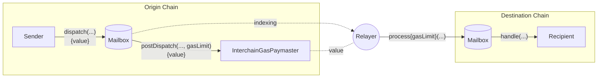

# 链间燃料费支付

成功的链间消息需要两个事务;一个在源链上发送消息，另一个在目的链上传递消息。

为了方便起见，Hyperlane在原始链上提供了一个onchain接口，允许消息发送者向[relayer](./agents/relayer.mdx)支付费用，以便在目的链上传递消息。这种付款称为链间燃料费付款。



## InterchainGasPaymasters

区块链间的燃料费支付由`InterchainGasPaymaster` (IGP)智能合约实现。

这些合约公开了[InterchainGasPaymaster接口](./ reference/hooks/interchain-gas.mdx)，它允许用户使用原始链上的本地令牌向[relayer](./agents/relayer.mdx)支付在目的链上传递消息的成本。

每个`interchainingaspaymaster`合约只对应一个中继器。您可以在[addresses](../reference/contract-addresses.mdx)下找到Abacus Works中继器的地址。

### Gas limit

gas限制是为给定消息在目标链上调用`handle`的成本。这取决于消息内容和处理程序的逻辑。

### Gas overhead

gas开销与 `gasOracle`一起被设置为目标gas配置的一部分:

```solidity
struct DomainGasConfig {
    IGasOracle gasOracle;
    uint96 gasOverhead;
}
```

这对应于在目标链上处理消息的操作成本。

:::note
您应该确保`gasOverhead` 足够覆盖目标链上的ISMs范围。

由于您可以为不同的消息类型配置不同的ISMs，因此对于每个ISM的`verify`功能，您可能有不同的燃料开销。
:::

### Gas oracles

为了支持[interchingaspaymaster接口](../reference/hooks/interchain-gas.mdx)， IGP合约可以配置gas oracle，该oracle负责跟踪远程令牌燃料价格和汇率。

这允许`quoteGasPayment`函数为远程链上的燃料价格提供准确的报价，以本地链的本地令牌计价。

:::tip
`quoteGasPayment` 函数在计算发送消息的报价时，会考虑目标链的 `gasOverhead` 。
:::

最终，中继器将能够自动更新他们的燃料费预言机，以确保他们的IGP实现远程燃料报价公平。

## Trust assumptions

链间燃料支付基于消息发送者和中继者之间的共识。

换句话说，中继器可能在不传送相应消息的情况下收到链间燃料费付款。

因此，在进行链间燃料费支付时，建议使用与已知和信誉良好的中继器相关的IGP合同。

一个诚实的中继器实现将尊重任何成功支付给IGP的燃料费款项，无论实际支付了多少代币。通过保持[gas oracles](../reference/hooks/interchain-gas.mdx)的最新状态，中继器可以确保只有在支付了“公平”的价格时，燃料费支付才会成功。

Hyperlane协议中没有关于中继的共识，在任何情况下，恶意中继都不能审查或伪造消息。中继器能做的最糟糕的事情是接受付款而不传递消息。
