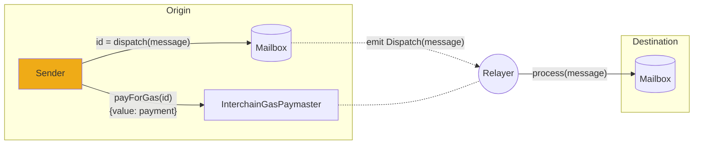

# 链间燃料费支付

:::caution

本协议概述来自我们的v2合约版本。

v3现在包含了[post-dispatch hooks](../reference/hooks/overview.mdx)，其中[interchain gas payments (IGP)](../reference/hooks/interchain-gas.mdx)是必需的钩子之一。

我们正在努力尽快更新相关内容。与此同时，请参阅完整的[**updated v3 Reference**](../reference/messaging/messaging-interface.mdx)选项卡以获取最新的合约接口。

:::

成功的链间消息需要两次交易;一个在源链上，用于发送消息，另一个在目标链上，用于传递消息。

为了方便起见，Hyperlane在原始链上提供了一个onchain接口，允许消息发送者向[relayer](./agents/relayer.mdx)支付费用，以便在目的链上传递消息。这种付款称为链间燃料费付款。

## InterchainGasPaymasters

`InterchainGasPaymaster`（IGP）智能合约为链间天然气支付提供了便利。

这些合约公开了[InterchainGasPaymaster interface](../reference/hooks/interchain-gas.mdx)，它允许用户用原始链上的本地令牌向 [relayer](./agents/relayer.mdx) 支付在目标链上传递消息的成本。

每个` interchainingaspaymaster `合约只对应一个中继器。您可以在[addresses](../reference/contract-addresses.mdx)下找到Abacus Works中继器的地址。

### Gas oracles

为了支持[interchingaspaymaster接口](../reference/hooks/interchain-gas.mdx)， IGP合约可以配置gas oracle，该oracle负责跟踪远程令牌燃料价格和汇率。

这允许`quoteGasPayment`函数为远程链上的燃料价格提供准确的报价，以本地链的本地令牌计价。

最终，中继将能够自动更新他们的燃料费oracle，以确保他们的IGP始终为远程天然气报价公平。

## Trust assumptions

链间燃料支付基于消息发送者和中继者之间的共识。

换句话说，中继器可能在不传送相应消息的情况下收到链间燃料费付款。

因此，在进行链间燃料费支付时，建议使用与已知和信誉良好的中继器相关的IGP合同。

一个诚实的中继器实现将尊重任何成功支付给IGP的燃料费款项，无论实际支付了多少代币。通过保持[gas oracles](../reference/hooks/interchain-gas.mdx)的最新状态，中继器可以确保只有在支付了“公平”的价格时，燃料费支付才会成功。

Hyperlane协议中没有关于中继的共识，在任何情况下，恶意中继都不能审查或伪造消息。中继器能做的最糟糕的事情是接受付款而不传递消息。
