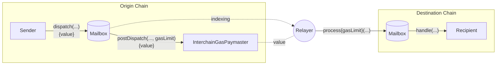

# Interchain gas payments

Successful interchain messages require two transactions; one on the origin chain to send the message, and one on the destination chain to deliver the message.

For convenience, Hyperlane provides an onchain interface on the origin chain that allows message senders to pay [fees](#interchain-gas-payment-calculation) to the [relayer](./agents/relayer.mdx) to deliver a message on the destination chain. This payment is called an interchain gas payment.



## InterchainGasPaymasters

Interchain gas payments are facilitated by `InterchainGasPaymaster` (IGP) smart contracts.

These contracts expose the [InterchainGasPaymaster interface](../reference/hooks/interchain-gas.mdx), which allow message senders to pay the [relayer](./agents/relayer.mdx) with native tokens on the origin chain to cover the costs of delivering a message on the destination chain.

Each `InterchainGasPaymaster` contract corresponds to exactly one relayer. You can find addresses of the Abacus Works' relayer under [addresses](../reference/contract-addresses.mdx)

### Interchain gas payment calculation

The interchain gas payment is calculated as follows:

$$
destinationTxCost = destinationGasPrice * gasLimit
\\[5pt]
exchangeRate = \frac{originGasTokenPrice}{destinationGasTokenPrice}
\\[5pt]
originFee = exchangeRate * destinationTxCost
$$

The `gasLimit` and the `exchangeRate` are configured by the message sender and the relayer, respectively.

### Gas limit

The gas limit is set based on the cost of calling `handle` on the destination chain for a given message. This can vary depending on message content and the logic of the handler. The message sender is expected to configure the gas limit based on the expected cost of handling the message, with a default being used when the gas limit is not configured.

See the [interchain gas hook reference](../reference/hooks/interchain-gas.mdx#post-dispatch) for more details.

### Destination Gas Config

For each remote domain, the InterchainGasPaymaster sets the domain gas config.

```solidity
struct DomainGasConfig {
    IGasOracle gasOracle;
    uint96 gasOverhead;
}
```

#### Gas overhead

The gas overhead is set as part of the destination gas configuration. This corresponds to the operational cost of processing a message on the destination chain.

:::note
You should ensure the `gasOverhead` sufficiently covers the range of ISMs on your destination chain.

As you can configure different ISMs for different message types, you may have different gas overheads for each ISM's `verify` function.
:::

#### Gas oracles

In order to support the [InterchainGasPaymaster interface](../reference/hooks/interchain-gas.mdx), IGP contracts may be configured with gas oracles, which are responsible for tracking remote token gas prices and exchange rates.

This allows the `quoteGasPayment` function to provide an accurate quote for the price of gas on a remote chain, denominated in the local chain's native token.

:::tip
The `quoteGasPayment` function takes into account the `gasOverhead` for the destination chain when calculating its quote for delivering a message.
:::

Eventually, a relayer will be able to automatically update their gas oracles in order to ensure that their IGP always quotes a fair price for remote gas.

## Trust assumptions

Interchain gas payments are based on a social contract between the message sender and relayer.&#x20;

In other words, a relayer may receive interchain gas payments without delivering the corresponding messages.

Therefore, when making interchain gas payments, it is recommended to use an IGP contract that is associated with a known and reputable relayer.

An honest relayer implementation will honor any successful gas payments made to its IGP, no matter how many tokens were actually paid. By keeping [gas oracles](../reference/hooks/interchain-gas.mdx) up to date, the relayer can ensure that gas payments succeed if and only if a "fair" price was paid.

There are no trust assumptions with respect to relayers in the Hyperlane protocol, and under no circumstances will a malicious relayer be able to censor or falsify messages. The worst thing that a relayer can do is accept payments without delivering a message.
