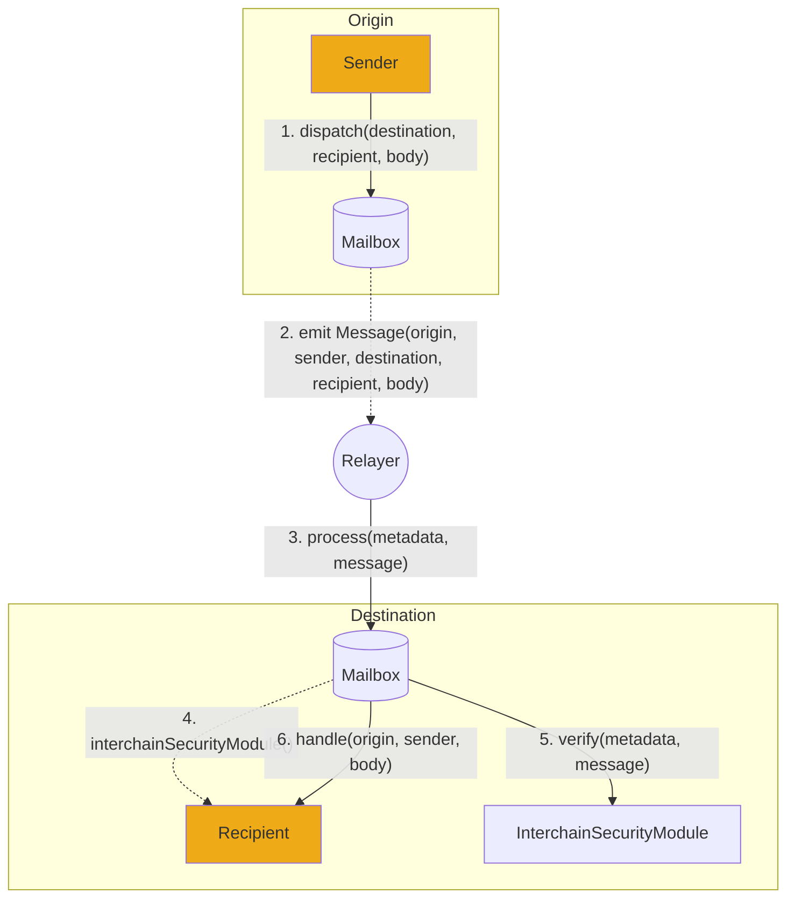

# 协议概览

Hyperlane是第一个[permissionless interoperability](../deploy-hyperlane.mdx) 无需许可互操作层，允许智能合约开发人员在区块链之间发送任意数据。

开发人员可以使用Hyperlane来转移令牌，执行函数调用，以及许多其他允许创建链间应用程序的事情，这些应用程序可以由任何区块链上的用户访问。

用户通过[mailbox](./mailbox.mdx)智能合约与Hyperlane协议交互，智能合约提供链上[messaging interface](../reference/messaging/messaging-interface.mdx)来发送和接收链间消息。

Hyperlane采用模块化的安全方法，允许应用程序从[Interchain Security Modules](../protocol/ISM/modular-security.mdx) (ISMs)(ISMs)中进行配置和选择。应用程序可以指定一个ISM来自定义安全模型，以确保它们与Hyperlane消息传递接口的集成。

