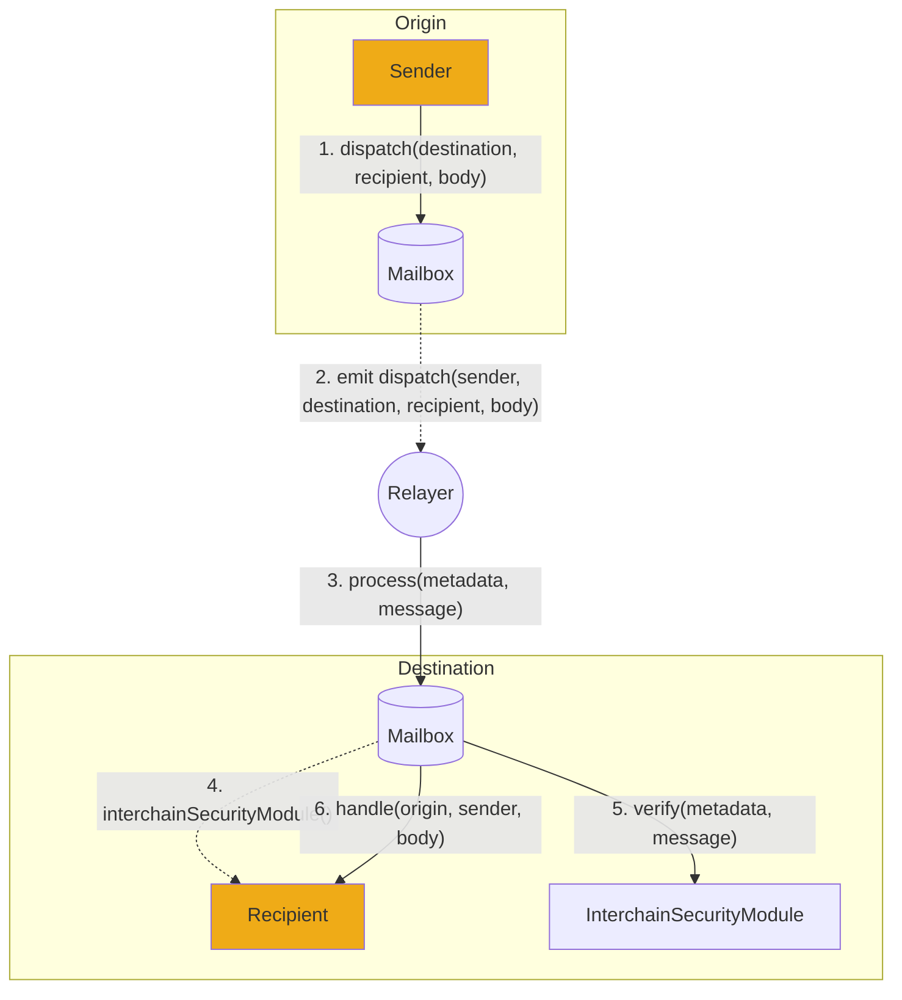

# Protocol Overview

Hyperlane is the first [permissionless interoperability](../deploy-hyperlane.mdx) layer that allows smart contract developers to send arbitrary data between blockchains.

Developers can use Hyperlane to move tokens, execute function calls, and many other things that allow for the creation of interchain applications, apps that can be accessed by users on any blockchain.

Users interface with the Hyperlane protocol via [mailbox](./mailbox.mdx) smart contracts, which provide an on-chain [messaging interface](../reference/messaging/messaging-interface.mdx) to send and receive interchain messages.

Hyperlane takes a modular approach to security, allowing applications to configure and choose from a selection of [Interchain Security Modules](../protocol/ISM/modular-security.mdx) (ISMs). Applications may specify an ISM to customize the security model that secures their integration with the Hyperlane messaging interface.

