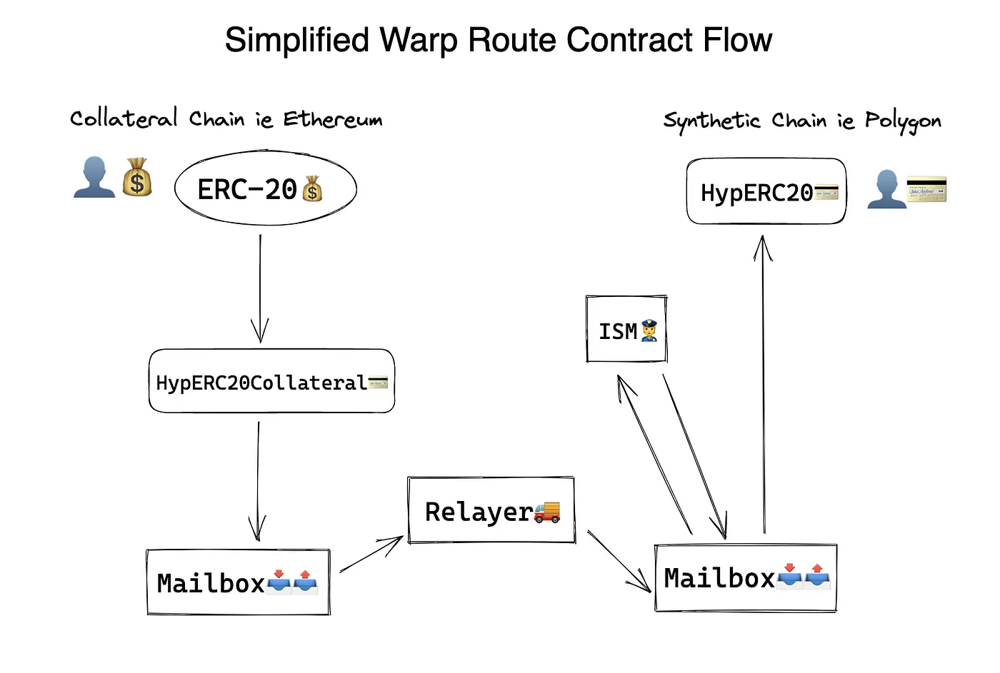

# Warp Routes

:::caution

This protocol overview is from our v2 contract version. 

v3 now includes [post-dispatch hooks](../reference/hooks/overview.mdx), with [interchain gas payments (IGP)](../reference/hooks/interchain-gas.mdx) as one of the required hooks. 

We are working to update it with the relevant content ASAP. In the meantime, see the fully [**updated v3 Reference**](../reference/messaging/messaging-interface.mdx) tab for the latest contract interfaces.

:::

## Overview of Warp Routes

Warp Routes are Hyperlane's take on the concept of token bridging, allowing you to permissionlessly transfer any ERC20 or ERC721-like asset to any chain via Hyperlane.

You can combine Warp Routes with a Hyperlane deployment to create economic trade routes between any chain and others already connected through Hyperlane.

This diagram below illustrates a fairly simplified overview of the flow in creating your Warp Route, and the resulting asset.

## Warp Route Architecture

Warp Route contracts transfer value between chains by locking collateral tokens on the origin chain (aka the collateral chain) and then minting wrapped tokens on the destination chain (the synthetic chain).

Users can redeem their locked tokens at any time by transferring their wrapped tokens back to the collateral chain.

Like all applications built on top of Hyperlane, Warp Routes have customizable security via [Interchain Security Modules](../category/interchain-security-modules). This allows Warp Route deployers to configure and enforce custom rules and constraints that the interchain token must follow.

Warp Routes can be deployed between any set of chains that have Hyperlane deployments. If you would like to create a Warp Route that includes a chain that Hyperlane is not currently deployed on, feel free to [deploy hyperlane](../deploy-hyperlane.mdx) yourself!
