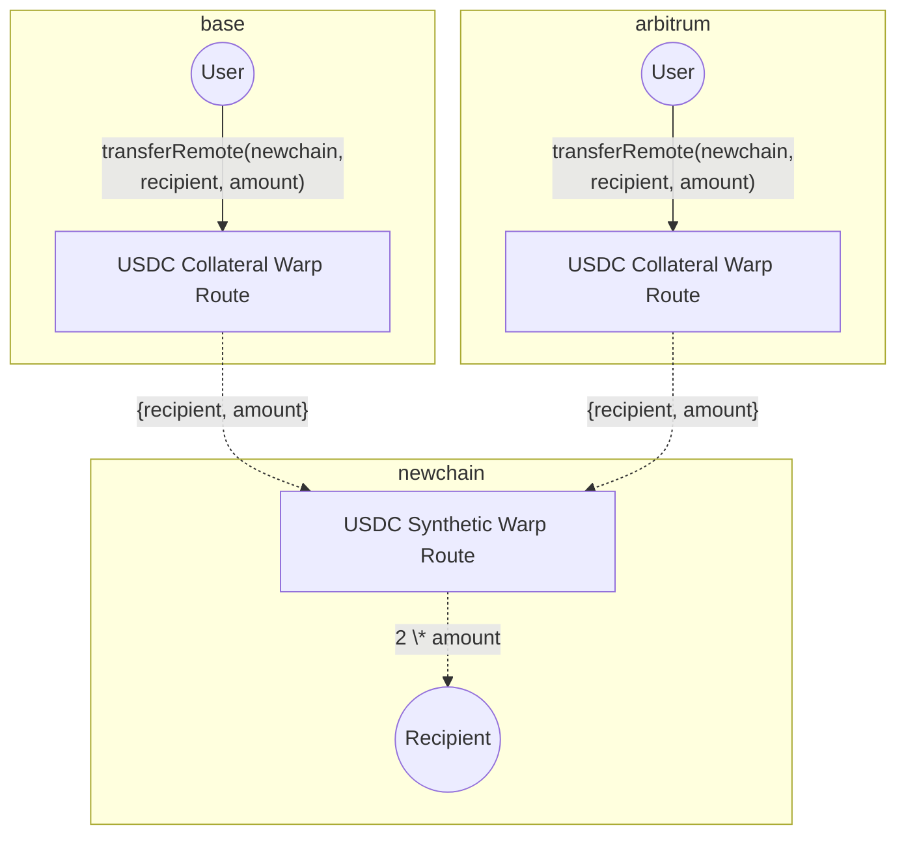

# Deploy Multi-Collateral Warp Routes

This guide walks you through how to use Hyperlane Warp Routes to create multi-collateral token bridges, allowing assets to be sourced from multiple chains instead of a single origin.

## Prerequisites

To complete this walkthrough, you should have the following:

1. Two origin networks and one destination network of your choice, between which you’d like to deploy the multi-collateral warp route. Make sure to have some funds on the chains to cover deployment gas fees.
2. The token(s) to be used as collateral.
3. An installed instance of the [Hyperlane CLI](https://docs.hyperlane.xyz/docs/reference/cli) and a wallet private key set as the `HYP_KEY` env var funded on your origin and destination networks.

## Walkthrough

### Primer: Multi-Collateral Warp Routes

Multi-Collateral Warp Routes are an extension of Hyperlane's Warp Routes, allowing liquidity to be sourced from multiple chains instead of a single source.

In a single-collateral Warp Route, tokens are locked on one source chain.

Example:

- Lock 100 USDC on Ethereum
- Mint 100 USDC on NewChain

A Multi-Collateral Warp Route, on the other hand, allows users to bridge the same asset from multiple collateral chains.

Example:

- Lock 50 USDC on Base
- Lock 50 USDC on Arbitrum
- Mint 100 USDC on NewChain

This setup allows a destination chain to receive assets from multiple sources, making it easier for users to onboard liquidity without depending on a single origin.

### High-level Flowchart

:::warning
Since liquidity can come from multiple sources, balancing collateral across chains is important to ensure a smooth user experience. Currently, teams must rebalance manually. Automated solutions aim to streamline this.
:::

## Deploy your Multi-Collateral Warp Routes

### 1. Create your Warp Route Config

1. Use the Hyperlane CLI to initialize a Warp Route deployment file:

`hyperlane warp init`

This command provides a walkthrough, prompting you for configuration choices directly in the terminal.

Here's how your setup should look like:

- Select three networks: choose `collateral` for the two source networks, and `synthetic` for the destination network.
- Input the token address, proxy admin contracts and select if you'd like to use a trusted ISMs.

Once you've made the selection, the CLI will generate a Warp Route config file at `./configs/warp-route-deployment.yaml`.

### 2. Deploy your Warp Route

Once your configuration is ready, you can initiate the Warp Route deployment with:

`hyperlane warp deploy`

During deployment, the CLI requires access to your private key to sign transactions. You can enter it when prompted or set your private key as `HYP_KEY`. Make sure that your wallet has sufficient funds on all relevant chains to cover the gas costs for the deployment.

### 3. Testing

You can initiate a test transfer with the following command:

`hyperlane warp send --symbol TOKEN`

The CLI will prompt you to:

- Select a matching Warp Route
- Choose the origin and destination chains

It’ll run checks and send the message. You’ll get:

- A transaction link (e.g., BaseScan)
- A message ID and explorer link
- Confirmation once processed

:::success

🎉 **Congrats!** You have successfully deployed a Multi-Collateral Warp Route. Your users can now bridge assets from multiple chains!

:::

👉 Next steps: [Deploy a Bridge UI for Hyperlane Warp Routes](/docs/guides/deploy-warp-route-UI)
