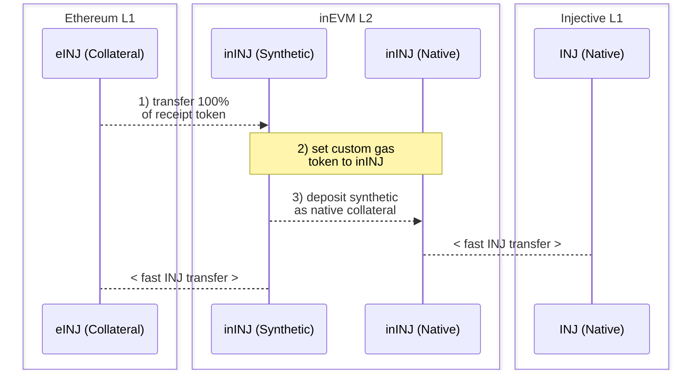

# Warp Routes: Custom Gas Tokens & Fast Native Transfers

## Background

The goal of this guide is to illustrate how Hyperlane warp routes can (1) be used to easily facilitate interoperability between CosmWasm and EVM L1 and L2 networks and (2) circumvent common issues like early rollup liquidity and long settlement times for native transfers.

## Primary Motives

1. Create a custom gas token on your L2 of choice.
2. Use this gas token to enable fast native transfers, instead of waiting days for settlement.
    1. While L1 to L2 transfers are on the scale of minutes, L2 to L1 transfers are typically on the scale of days or weeks while the challenge period is carried out. By using the Hyperlane-enabled strategy below, users can now experience the same fast transfer times to *and* from their L1.
3. Overcome the liquidity cold-start problems of new rollups.

## Pre-Requisites

To complete the following case-study walkthrough, you should have the following available:

1. A L2 network on which you are able to specify a [custom gas token](https://docs.arbitrum.io/launch-orbit-chain/how-tos/use-a-custom-gas-token).
2. One or more L1 networks on which you’d like to enable fast native transfers from your L2.
3. A sole deployer or authorized owner to receive mint of the receipt token (more information on this token below).
4. An installed instance of the [Hyperlane CLI](https://docs.hyperlane.xyz/docs/reference/cli) and a wallet private key sourced as `HYP_KEY`, funded on all networks in question.

## Case-Study Walkthrough: CosmWasm ↔ EVM

The following is a case-study walkthrough on the Hyperlane-supported launch of the [inEVM bridge](https://bridge.inevm.com/), responsible for connecting the [Injective CW (CosmWasm) L1](https://docs.injective.network/) network, [inEVM L2](https://docs.inevm.com/) ([Arbitrum Orbit](https://arbitrum.io/orbit)) network, and Ethereum L1. These warp routes make fast native ↔ native asset transfers possible, along with custom gas token specification on the L2 and the transfer of any other desired asset, e.g. USDC, USDT, etc.

:::info
Take a look at the inEVM bridge to see these warp routes in action: https://bridge.inevm.com/
:::

### Context

- **Injective CW L1**: A Cosmos blockchain supporting CosmWasm smart contracts, with a focus on out-of-the-box DeFi app solutions. It also allows users to [launch their own native token](https://docs.injective.network/develop/guides/token_launch/).
- **inEVM L2**: An EVM-compatible rollup created to facilitate composability between Injective L1 and Ethereum L1. It is built on the Arbitrum Orbit stack with the support of Caldera.
- **Receipt Token**: A (one-time) mintable “dummy” token used to collateralize a warp-route on an L1 network of choice.
- **EvmHypNative**: The Hyperlane representation of an EVM native token.
- **EvmHypCollateral**: The Hyperlane representation of an EVM collateral token, most commonly an ERC20.
- **EvmHypSynthetic**: A Hyperlane deployed EVM synthetic token, most commonly used to represent a network’s native or collateral token on another chain.
- **CwHypNative**: Same as above, but for CosmWasm native token.
- **CwHypCollateral** & **CwHypSynthetic**: Same as above, but for CosmWasm.

### Key

To keep the below steps as clear as possible, the following symbols are used to refer to `INJ` on Injective, inEVM, and Ethereum. In reality, all symbols are just `INJ` for consistency across tokens.

- `INJ` in Injective: `INJ`
- Synthetic `INJ` on inEVM: `inINJ`
- Receipt `INJ` on Ethereum: `eINJ`

### Steps: Fast Native Transfers

1. To begin, deploy a receipt token (see above) to Ethereum to represent Injective’s native token. For this example, we will refer to the receipt token as `eINJ`.
    1. Ensure 100% of the total supply of your `eINJ` receipt token is minted to the deployer or authorized address of choice. This must be a one-time mint event in order to avoid value dilution of the Injective ↔ inEVM native warp route, below.
2. Using the Hyperlane CLI, deploy an Ethereum `eINJ` EvmHypCollateral ↔ inEVM `inINJ` EvmHypSynthetic warp route via `hyperlane warp init && hyperlane warp deploy`.
    1. Use the warp route to transfer 100% of the `eINJ` receipt token from Ethereum to inEVM.
3. Set the custom gas token on inEVM L2 to the newly deployed `inINJ` synthetic.
    1. To find the synthetic’s address, locate the EvmHypSynthetic’s `addressOrDenom` in the newly generated `INJ/ethereum-inevm-config.yaml`
    2. To set the custom gas token: https://docs.arbitrum.io/launch-orbit-chain/how-tos/use-a-custom-gas-token
4. Now, using the Hyperlane CLI, deploy an Injective `INJ` CwHypNative ↔ inEVM `inINJ` EvmHypNative warp route via `hyperlane warp init && hyperlane warp deploy`
    1. Your warp route config should connect the L1 native token (`INJ`) with the (now) L2 native token (`inINJ`)
5. Deposit the inEVM *synthetic* `inINJ` from step 2a as collateral in the inEVM *native* warp route. This pre-populates/collateralizes the native warp route, enabling users to bridge their native assets quickly to and from Ethereum and Injective L1s.

**🎉 Congrats! You have now enabled fast native transfer between your L1s ↔ L2 via a custom gas token on your L2.**

:::warning
Please note that this collateralization strategy takes on certain ISM trust assumptions.
:::

### Steps: Additional Network & Asset Support

Additionally, you may bridge additional assets from other networks of your choice to add to your newly created modular ecosystem.

For the below example, let’s assume you’d like to support USDC transfer between Ethereum L1 and the inEVM L2 network.

1. Using the Hyperlane CLI, deploy an Ethereum `USDC` EvmHypCollateral ↔ inEVM `USDC` EvmHypSynthetic warp route via `hyperlane warp init && hyperlane warp deploy`.
    1. Run `hyperlane warp init` and complete the following flow:
        1. Select `ethereum` and `inevm` using space, and hit enter.
        2. For Ethereum, select `collateral`, accept the mailbox, and enter the Ethereum `USDC` address.
        3. For inEVM, select `synthetic` and accept the mailbox.
    2. Run `hyperlane warp deploy` and confirm the warp deploy config is as expected.

**🎉 Congrats! You have now enabled USDC transfers between your L2 ↔ Ethereum.**

---

Check out some additional information, published by the Hyperlane supporting team & Injective:

→ [inEVM Spotlight: Hyperlane](https://blog.injective.com/en/inevm-spotlight-hyperlane-2/)

→ [Connecting Injective: Hyperlane Opens the inEVM Bridge](https://medium.com/hyperlane/connecting-injective-hyperlane-opens-the-inevm-bridge-6f1d3edf0ff8)

→ [Hyperlane and Injective | Expanding opportunities](https://medium.com/@kobriyyu/hyperlane-and-injective-expanding-opportunities-8ce170b72da7)
