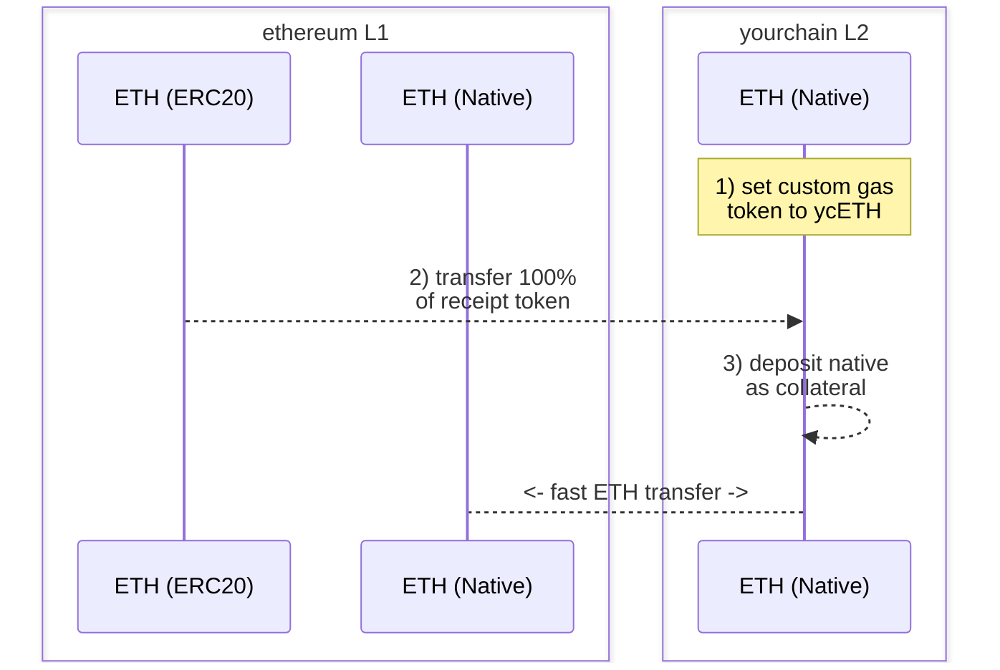

# Warp Routes: Fast Native Transfers via Custom Gas Tokens

This document will walk you through how to use Hyperlane to enable fast native transfers to and from your L2 via a custom gas token.

## Primary Motives

1. Create a custom gas token to use on your L2 of choice.
2. Use this gas token to enable fast native transfers, instead of long wait times for settlement via canonical bridges.

## Pre-Requisites

To complete the following walkthrough, you should have the following available:

1. A L2 network (”yourchain”) on which you are able to specify a [custom gas token](https://docs.arbitrum.io/launch-orbit-chain/how-tos/use-a-custom-gas-token) and would like to enable fast native transfers to and from.
2. A sole deployer or authorized owner to receive mint of the receipt token (more information on this token below).
3. An installed instance of the [Hyperlane CLI](https://docs.hyperlane.xyz/docs/reference/cli) and a wallet private key sourced as `HYP_KEY`, funded on all relevant networks.

## Walkthrough: Fast Native Transfers

:::info

- Note that a “receipt token” below is a (one-time) mintable “dummy” token used to collateralize a warp-route on yourchain's corresponding L1. You will burn the minting rights to the token after creating it.
- Also, depending on your L2, the token symbol of your custom gas token may be assigned the same symbol as your receipt token. If deploying on ethereum, you may want to set your symbol to `ETH`.

:::

### 1) Deploy a Receipt Token

Deploy an `ETH` receipt token to ethereum to become your L2's custom gas token.

1. For example, you may deploy your receipt token via [Remix](https://remix.ethereum.org/) with a funded wallet and a contract similar to below:

   ```solidity
   // SPDX-License-Identifier: MIT
   pragma solidity ^0.8.20;

   import "@openzeppelin/contracts/token/ERC20/ERC20.sol";

   contract YourchainETH is ERC20 {
       constructor() ERC20("YourchainETH", "ETH") {
           _mint(msg.sender, 10000000 * (10 ** 18));
       }
   }
   ```

2. Ensure 100% of the total supply of your `ETH` receipt token is minted to the deployer or authorized address of choice. This must be a one-time mint event in order to avoid value dilution of the ethereum ↔ yourchain native warp route, below.
3. Once deployed, save the address of the contract for use below.

### 2) Set the Custom Gas Token

Set the custom gas token on yourchain to the newly deployed `ETH` ERC20 receipt token.

1. To set a custom gas token using OP stack: https://docs.optimism.io/builders/chain-operators/features/custom-gas-token
2. To set a custom gas token using arbitrum orbit: https://docs.arbitrum.io/launch-orbit-chain/how-tos/use-a-custom-gas-token

### 3) Transfer All Receipt Tokens

Use your L2's canonical bridge to transfer 100% of the `ETH` receipt token from ethereum to yourchain.

1. To transfer using the OP stack standard bridge: https://docs.optimism.io/builders/app-developers/bridging/standard-bridge
2. To transfer using the arbitrum orbit bridge: https://docs.arbitrum.io/launch-orbit-chain/how-tos/add-orbit-chain-to-bridge-ui

### 4) Deploy a Native Warp Route

Using the Hyperlane CLI, deploy an ethereum `ETH` EvmHypCollateral ↔ yourchain `ETH` EvmHypNative warp route:

1. Run `hyperlane warp init` and complete the following flow:
   1. Select `ethereum` and `yourchain` using space, and hit enter.
   2. For ethereum, select `collateral` and accept the mailbox.
   3. For yourchain, select `native` and accept the mailbox.
2. Before executing the deployment, ensure yourchain’s `metadata.yaml` has a `blockExplorers` field defined. This will be needed for contract verification in order to easily collateralize yourchain's warp route.
3. Run `hyperlane warp deploy` and confirm the warp deploy config is as expected.
4. After execution, your `yourchain-ethereum-config.yaml` deployment file will look similar to the following:

   ```solidity
   # yaml-language-server: $schema=../schema.json
   tokens:
     - addressOrDenom: "0x3e5bB1a03fef5DB15A320885E6A0C8Bff8b656bd"
       chainName: yourchain
       connections:
         - token: ethereum|ethereum|0x6d64832bDB4F04721D4F23CCbF17326cb636101e
       decimals: 18
       name: Ether
       standard: EvmHypNative
       symbol: ETH
     - addressOrDenom: "0x6d64832bDB4F04721D4F23CCbF17326cb636101e"
       chainName: ethereum
       connections:
         - token: ethereum|yourchain|0x3e5bB1a03fef5DB15A320885E6A0C8Bff8b656bd
       decimals: 18
       name: Ether
       standard: EvmHypCollateral
       symbol: ETH
   ```

### 5) Collateralize Your Warp Route

Deposit yourchain `ETH` as collateral into yourchain's native warp route via the `receive()` function. If needed, you may use the verified contract to do this via your scanner's UI, or a wallet such as Metamask

This collateralizes the native warp route, enabling users to bridge their native assets quickly to and from yourchain.

### 6) Testing

You can initiate a test transfer of a single wei with the following command:

```bash
hyperlane warp send --relay --symbol ETH
```

The `--relay` flag is optional and will relay the message to the destination chain.

You can also run a relayer that delivers only for your warp route in the background with:

```bash
hyperlane relayer --symbol TOKEN
```

You can test in either direction between where you have the warp route set.

:::info
By Default, your warp core config is found in the local Registry at `$HOME/.hyperlane/deployments/warp_routes` to be used with the `--warp` flag.
:::

:::success
🎉 Congrats! You have now enabled fast native transfer to and from yourchain via a custom gas token on your L2.
:::



:::warning
Please note that this collateralization strategy takes on certain ISM trust assumptions.
:::

## Resources

Take a look at the [inEVM bridge](https://bridge.inevm.com/) to see an example of these warp routes in action.

Check out some additional information, published by the Hyperlane supporting team & Injective:

- [inEVM Spotlight: Hyperlane](https://blog.injective.com/en/inevm-spotlight-hyperlane-2/)
- [Connecting Injective: Hyperlane Opens the inEVM Bridge](https://medium.com/hyperlane/connecting-injective-hyperlane-opens-the-inevm-bridge-6f1d3edf0ff8)
- [Hyperlane and Injective | Expanding opportunities](https://medium.com/@kobriyyu/hyperlane-and-injective-expanding-opportunities-8ce170b72da7)
