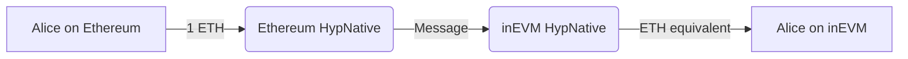
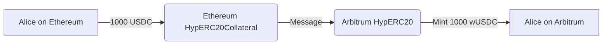

# Warp Routes: Example Usage

This section describes various combinations of warp route types.

## Warp Route Combinations

### 1. Native to Native

This route allows for the transfer of native tokens between chains that both use their own native tokens.

:::info
This type of route should only be used when both networks have native tokens of equivalent value, e.g. inEVM & Ethereum.
:::

**Setup:**

- HypNative contract deployed on both chains.

**Example Flow:**

```
From: Ethereum (ETH)
To: inEVM (ETH)
Amount: 1 ETH
```

**Diagram:**



**Use Case:** Alice wants to quickly move value from Ethereum to inEVM.

---

### 3. Native to Synthetic

This route creates a synthetic representation of a native token on another chain.

**Setup:**

- HypNative contract deployed on native token chain.
- HypERC20 (synthetic) contract deployed on other chain.

**Example Flow:**

```
From: Celo (CELO)
To: Optimism (wCELO)
Amount: 100 CELO
```

**Diagram:**


**Use Case:** A Celo-based project wants to make their native CELO token available for use on Optimism.

---

### 4. Collateral to Synthetic

This route allows for the creation of synthetic tokens based on collateralized ERC20 tokens.

**Setup:**

- HypERC20Collateral contract deployed on ERC20 chain.
- HypERC20 (synthetic) contract deployed on other chain.

**Example Flow:**

```
From: Ethereum (USDC)
To: Arbitrum (wUSDC)
Amount: 1000 USDC
```

**Diagram:**



**Use Case:** Alice wants to use her USDC on Arbitrum without moving actual USDC to Arbitrum or relying on Arbitrum's bridged USDC.
