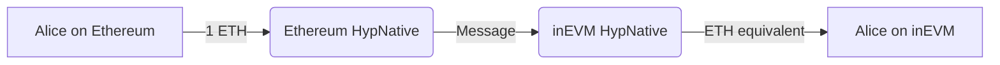
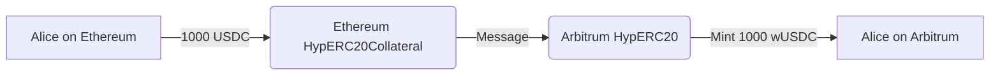

# Warp Routes: Example Usage

Warp Routes define how assets move between chains, whether as native tokens, synthetic representations, or collateral-backed assets. The choice of route depends on the asset type and the desired behavior on the destination chain.

## Warp Route Combinations

### 1. Native to Native

This route allows for the transfer of native tokens between chains that both use their own native tokens.

:::info
This type of route should only be used when both networks have native tokens of equivalent value, e.g. inEVM & Ethereum.
:::

#### Setup

- **HypNative** contract deployed on both chains.

#### Example Flow

```
Transaction Type: Direct Native Transfer
From: Ethereum (ETH)
To: inEVM (ETH)
Amount: 1 ETH
```

#### Diagram



#### Use Case

- Alice wants to quickly move value from Ethereum to inEVM.

### 2. Native to Synthetic

This route creates a synthetic representation of a native token on another chain.

#### Setup

- **HypNative** contract deployed on the origin chain where the native asset exists.
- **HypERC20** contract deployed on the destination chain where the synthetic token is minted.

#### Example Flow

```
Transaction Type: Minting Synthetic Token from Native Token
From: Celo (CELO)
To: Optimism (wCELO)
Amount: 100 CELO
```

#### Diagram


#### Use Case

- A Celo-based project wants to make their native CELO token available for use on Optimism.

### 3. Collateral to Synthetic

This route allows for the creation of synthetic tokens based on collateralized ERC20 tokens.

#### Setup

- **Collateral contract (HypERC20Collateral)** is deployed on the source chain where the original asset exists.
- **Synthetic contract (HypERC20)** is deployed on the destination chain, where the asset is minted.

#### Example Flow

```
Transaction Type: Minting Synthetic Token from Collateral Token
From: Ethereum (USDC - Original Asset) - Collateral Source
To: Arbitrum (wUSDC - Minted Synthetic Asset) - Synthetic Destination
Amount: 1000 USDC
```

#### Diagram



#### Use Case

- Alice wants to use her USDC on Arbitrum without moving actual USDC to Arbitrum or relying on Arbitrum's bridged USDC.
