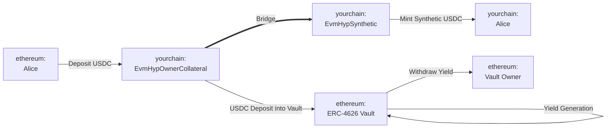
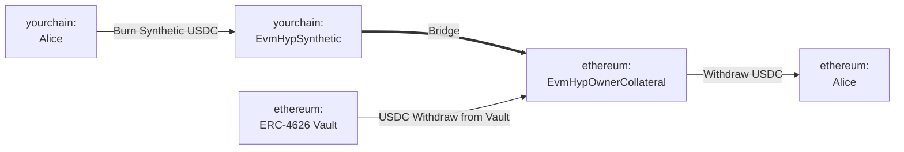

# Deploy Yield Routes

The goal of this guide is to illustrate how you can use Hyperlane warp routes to create yield-generating bridges, ensuring idle bridged assets are productive by compounding yield over time.

## Primary Motives

Enable yield-generating warp routes via yield-bearing collateral vaults.

## Pre-Requisites

To complete the following walkthrough, you should have the following available:

1. An origin and destination network of choice, between which you’d like to deploy the yield route.
2. The address of an [ERC-4626 vault](https://ethereum.org/en/developers/docs/standards/tokens/erc-4626/) on the origin network from which you want yield to be generated. This vault’s underlying asset will be set as the collateral for the warp route (e.g. if vault is USDC funded, the warp route will also support USDC transfer).
3. An installed instance of the [Hyperlane CLI](https://docs.hyperlane.xyz/docs/reference/cli) and a wallet private key set as the `HYP_KEY` env var funded on your origin and destination networks.

## Walkthrough: Create a Yield Route

### Concepts

- **ERC-4626 Vault**: The Ethereum standard for tokenized yield-bearing vaults. Upon deposit, share tokens are minted representing ownership of the underlying asset.
- **Yield Route (EvmHypOwnerCollateral & EvmHypSynthetic)**: The Hyperlane representation of a yield-bearing EVM collateral token. Note that the yield route’s vault’s deposited asset address is used as the warp routes collateral token.

:::info
For the sake of this walkthrough, the “origin” network will refer to the network on which the yield is generated (e.g. ethereum has a USDC lending vault that has claimable yield. A synthetic USDC is minted on the destination chain called yourchain).
:::

Below is the bridging flow between ethereum and yourchain

**Bridge USDC: ethereum → yourchain**

In this example, Alice wants to bridge USDC between ethereum and yourchain. The yield route will transfer her USDC to a yield-bearing ERC-4626 vault, and then mint her synthetic USDC on yourchain. Notice that the yield route owner can claim yields generated from that vault.

**Bridge USDC: yourchain → ethereum**

When Alice wants to bridge back to ethereum, the reverse happens. The yield route will burn her synthetic USDC, withdraw the USDC from the vault on ethereum, and return her USDC.

### Yield Route Deployment Steps

Using the Hyperlane CLI, deploy a USDC EvmHypOwnerCollateral and EvmHypSynthetic tokens on ethereum and yourchain, respectively:
    1. Run `hyperlane warp init` to generate a warp route config:
        1. Select `yourchain` and `ethereum` using space, and hit enter.
        2. For ethereum, select `collateralVault`, accept the mailbox, and enter the USDC vault address on yourchain.
            - Alternatively, you can select `collateralVaultRebase` which is a yield route variant that distribute yields to users by increasing their holding amount.
        3. For yourchain, select `synthetic` and accept the mailbox.
            - If you selected `collateralVaultRebase`, you must pair it with a `syntheticRebase`
    2. Run `hyperlane warp deploy` to deploy the warp route.

For more in-depth details on these steps, follow the [Bridge a Token](/docs/guides/deploy-warp-route) guide.

### Claiming Yield
Depending on the yield route variant, yield can be claimed by either calling `HypERC4626OwnerCollateral.sweep()` or `HypERC4626Collateral.rebase()` on their respective contracts.

**🎉 Congrats! You have now created a new yield route with your vault. Bridged user assets can now earn passive yield while present in the origin warp route.**

:::warning
Please note that this collateralization strategy takes on certain ISM trust assumptions, and there is inherent risk that the underlying [ERC-4626 vault](https://ethereum.org/en/developers/docs/standards/tokens/erc-4626/) becomes under-collateralized.
:::

---

Check out some additional information, published by the Hyperlane supporting team, Cheese Chain, and the Ethereum Foundation:

→ [Hyperlane: Introducing Yield Routes](https://medium.com/hyperlane/introducing-yield-routes-f7e8fd091443)

→ [ERC-4626 Tokenized Vault Standard](https://ethereum.org/en/developers/docs/standards/tokens/erc-4626/)
