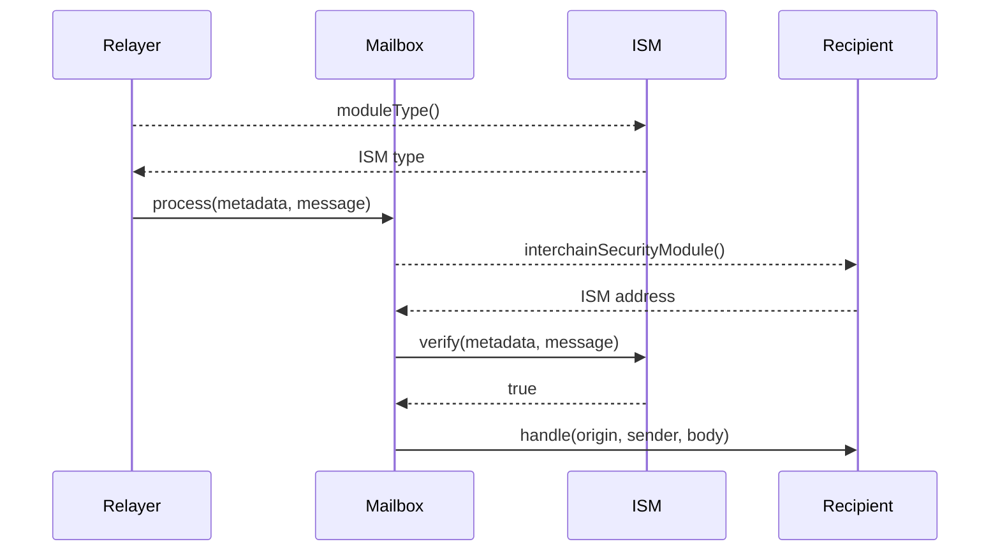

# ISM Interface

Learn about ISMs and customize your security modules.

ISMs must implement the IInterchainSecurityModel() interface. This interface consists of two functions.

```solidity
// SPDX-License-Identifier: MIT OR Apache-2.0
pragma solidity >=0.6.11;

interface IInterchainSecurityModule {
    /**
     * @notice Returns an enum that represents the type of security model
     * encoded by this ISM.
     * @dev Relayers infer how to fetch and format metadata.
     */
    function moduleType() external view returns (uint8);

    /**
     * @notice Defines a security model responsible for verifying interchain
     * messages based on the provided metadata.
     * @param _metadata Off-chain metadata provided by a relayer, specific to
     * the security model encoded by the module (e.g. validator signatures)
     * @param _message Hyperlane encoded interchain message
     * @return True if the message was verified
     */
    function verify(bytes calldata _metadata, bytes calldata _message)
        external
        returns (bool);
}
```

## Verify

The primary function that ISMs must implement is `verify()`. The Mailbox will call `IInterchainSecurityModule.verify()` before delivering a message to its recipient. If `verify()` reverts or returns `false`, the message will not be delivered.

The `verify()` function takes two parameters.

The first, `_metadata`, consists of arbitrary bytes provided by the Relayer. Typically, these bytes are specific to the ISM. For example, for a [Multisig ISM](./multisig-ISM-interface.mdx), `_metadata` must include validator signatures.

The second, `_message`, consists of the Hyperlane message being verified. ISMs can use this to inspect details about the message being verified. For example, a [Multisig ISM](./multisig-ISM-interface.mdx) could change validator sets based on the origin chain of the message.

### Module type

The secondary function that ISMs must implement is `moduleType()`. This is used to signal to the Relayer what to include in `_metadata`. ISMs **must** return one of the supported module types.

## Specifying an ISM

To specify the ISM they would like to use, developers implement the `ISpecifiesInterchainSecurityModule` interface in any contract that receives interchain messages via `handle()`. 

```solidity
interface ISpecifiesInterchainSecurityModule {
    function interchainSecurityModule()
        external
        view
        returns (IInterchainSecurityModule);
}
```
If no ISM is specified, or if the specified ISM is the null address, whatever ISM is configured as the default on the destination chain Mailbox will be used.

:::tip

See [Message.sol](https://github.com/hyperlane-xyz/hyperlane-monorepo/blob/main/solidity/contracts/libs/Message.sol) for more details on Hyperlane message encoding.

:::

## Sequence Diagram

Here is a simplified sequence diagram of an interchain message being verified and delivered on the destination chain.

:::info

If the recipient does not implement `ISpecifiesInterchainSecurityModule` or `recipient.interchainSecurityModule()` returns `address(0)`, the default ISM configured on the Mailbox will be used to verify the message.

This is omitted from the sequence diagram for clarity.

:::

