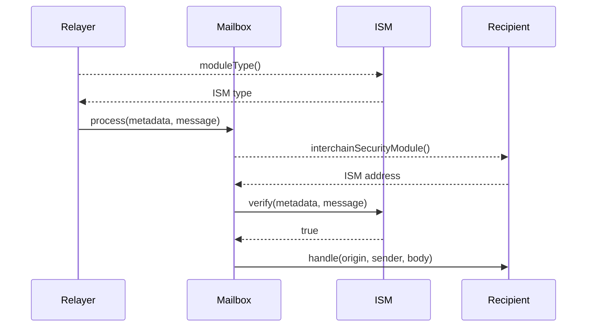

import Tabs from '@theme/Tabs';
import TabItem from '@theme/TabItem';

import IsmDiagram from '@site/src/diagrams/messaging-isms.md';

# Interchain Security Module Interface

Hyperlane modularizes interchain message security through a generic smart contract interface. Implementations are responsible for verifying that messages being delivered on the destination chain were actually sent on the origin chain using some proof metadata.

<IsmDiagram/>

Message recipients can specify custom security constraints by specifying an `InterchainSecurityModule` address. This implementation can be configured, composed, and customized according to the needs of their application.

<details>
<summary>`IInterchainSecurityModule` Interface</summary>

<Tabs groupId="lang">
<TabItem value="sol" label="Solidity">

```solidity file=<rootDir>/node_modules/@hyperlane-xyz/core/contracts/interfaces/IInterchainSecurityModule.sol
```

</TabItem>
</Tabs>
</details>

## Verify

```solidity file=<rootDir>/node_modules/@hyperlane-xyz/core/contracts/interfaces/IInterchainSecurityModule.sol#L31-L33
```

The Mailbox will call `verify` before delivering a message to its recipient. If `verify` reverts or returns `false`, the message will not be delivered.

- `_metadata` consists of arbitrary bytes provided by the Relayer. Typically, these bytes are specific to the ISM. For example, for a [Multisig ISM](./multisig-ISM-interface.mdx), `_metadata` must include validator signatures.

- `_message` consists of the Hyperlane message being verified. ISMs can use this to inspect details about the message being verified. For example, a [Multisig ISM](./multisig-ISM-interface.mdx) could change validator sets based on the origin chain of the message.

### Module Type

```solidity file=<rootDir>/node_modules/@hyperlane-xyz/core/contracts/interfaces/IInterchainSecurityModule.sol#L21
```

This is used to signal to the Relayer how to encode `_metadata`. ISMs **must** return one of the supported module types.

```solidity file=<rootDir>/node_modules/@hyperlane-xyz/core/contracts/interfaces/IInterchainSecurityModule.sol#L5-L14
```

## Specifying an ISM

To specify the ISM they would like to use, developers implement the `ISpecifiesInterchainSecurityModule` interface in any contract that receives interchain messages via `handle()`. 

```solidity
interface ISpecifiesInterchainSecurityModule {
    function interchainSecurityModule()
        external
        view
        returns (IInterchainSecurityModule);
}
```
If no ISM is specified, or if the specified ISM is the null address, whatever ISM is configured as the default on the destination chain Mailbox will be used.

## Sequence Diagram

Here is a detailed sequence diagram of an interchain message being verified and delivered on the destination chain.

:::info

If the recipient does not implement `ISpecifiesInterchainSecurityModule` or `recipient.interchainSecurityModule()` returns `address(0)`, the default ISM configured on the Mailbox will be used to verify the message.

:::

