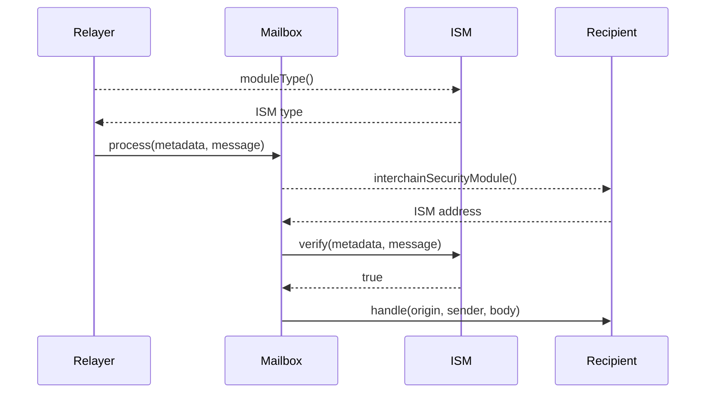

import Tabs from '@theme/Tabs';
import TabItem from '@theme/TabItem';

import IsmDiagram from '@site/src/diagrams/messaging-isms.md';

# 链间安全模块接口

Hyperlane通过通用智能合约接口模块化链间消息安全。实现负责使用一些证明元数据验证在目标链上传递的消息实际上是在源链上发送的。

<IsmDiagram/>

消息接收者可以通过指定`InterchainSecurityModule`地址来指定自定义安全约束。这个实现可以根据应用程序的需要进行配置、组合和定制。

<details>
<summary>`IInterchainSecurityModule` Interface</summary>

<Tabs groupId="lang">
<TabItem value="sol" label="Solidity">

```solidity file=<rootDir>/node_modules/@hyperlane-xyz/core/contracts/interfaces/IInterchainSecurityModule.sol
```

</TabItem>
</Tabs>
</details>

## 验证

```solidity file=<rootDir>/node_modules/@hyperlane-xyz/core/contracts/interfaces/IInterchainSecurityModule.sol#L31-L34
```

在将邮件传递给收件人之前，邮箱将调用`verify`。如果`verify`返回`false`，消息将不会被传递。

- `_metadata`由中继器提供的任意字节组成。通常，这些字节是针对ISM的。例如，对于[Multisig ISM](./multisig-ISM-interface.mdx)，`_metadata`必须包含验证器签名。

_`_message` 由正在验证的Hyperlane消息组成。ISMs可以使用它来检查正在验证的消息的详细信息。例如，[Multisig ISM](./multisig-ISM-interface.mdx) 可以根据消息的原始链更改验证器集。

### 模块类型

```solidity file=<rootDir>/node_modules/@hyperlane-xyz/core/contracts/interfaces/IInterchainSecurityModule.sol#L21
```

这是用来通知中继器如何编码 `_metadata`。ISMs **必须**返回一个支持的模块类型。

```solidity file=<rootDir>/node_modules/@hyperlane-xyz/core/contracts/interfaces/IInterchainSecurityModule.sol#L5-L14
```

## 指定ISM

为了指定他们想要使用的ISM，开发人员在任何通过`handle()`接收链间消息的合约中实现`ISpecifiesInterchainSecurityModule`接口。

```solidity
interface ISpecifiesInterchainSecurityModule {
    function interchainSecurityModule()
        external
        view
        returns (IInterchainSecurityModule);
}
```
如果未指定ISM或指定的ISM为空地址，则将使用目的链上已配置为默认地址的ISM。

## 排序图

下面是在目标链上验证和传递链间消息的详细序列图。

:::info

如果收件人没有实现`ISpecifiesInterchainSecurityModule`或`recipient.interchainSecurityModule()`返回`address(0)`，则使用邮箱上配置的默认ISM来验证消息。
:::

