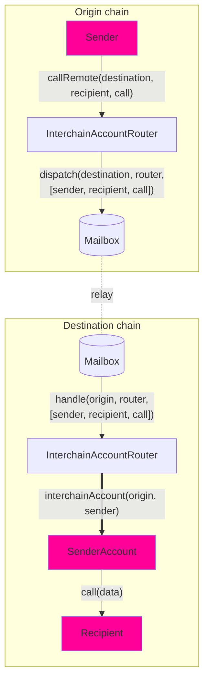

# Interchain Account Interface

Developers can use the **Interchain Account** interface to create and control an account on a remote chain from their local chain.

Unlike general message passing, which requires recipients to implement a specific interface, Interchain Accounts (ICAs) allow developers to interact with _any_ remote contract.

## Overview

### Diagram



Interchain Accounts allow you to make a remote call from **Chain A** to **Chain B** using the router (`InterchainAccountRouter`). Here's how it works:

- We use [CREATE2](https://docs.openzeppelin.com/cli/2.8/deploying-with-create2) to compute the determinstic [OwnableMulticall](https://github.com/hyperlane-xyz/hyperlane-monorepo/blob/main/solidity/contracts/middleware/libs/OwnableMulticall.sol) contract address for you, which serves as a proxy for your cross-chain calls. You can do it yourself too [here](#computing-addresses).

- You can encode your call which includes the to address, call data, and the `msg.value` for each call, batched together in a array.

- You send the encoded call to the **Chain A** router which gets relayed to the **Chain B** router.

- After decoding the calls, the **Chain B** router checks if the computed address is already deployed or not. If not, we deploy the _OwnableMulticall_ contract.

- The router then performs a multicall on the ICA address which in turn makes the desired arbitary call on chainB.

The Interchain Account interface assigns every `(uint32 origin, address owner, address remoteRouter, address remoteISM)` tuple a unique ICA address. The sender owns that ICA on the destination chain, and can direct it to make arbitrary function calls via the `InterchainAccountRouter.callRemote()` endpoint.

On many chains, you are able to use the defaults that are set by the owner of the router contract. See the [#overrides](#overrides) section to see how to make calls to any chain.

### Interface

```solidity
// SPDX-License-Identifier: MIT OR Apache-2.0
pragma solidity >=0.6.11;

import {CallLib} from "../contracts/libs/Call.sol";

interface IInterchainAccountRouter {
    function callRemote(
        uint32 _destinationDomain,
        CallLib.Call[] calldata calls
    ) external returns (bytes32);

    function getRemoteInterchainAccount(uint32 _destination, address _owner)
        external
        view
        returns (address);
}

```

:::tip

Use `InterchainAccountRouter` out of the box - ICA routers have already been deployed to core chains. Please refer to [addresses](../contract-addresses.mdx#interchainaccountrouter). Try using the `callRemote` method to do a call via your wallet's interchain account.

:::

## Example Usage

### Encoding

The `callRemote` function takes as arguments an array of `Call` structs. `Call.data` can be easily encoded with the `abi.encodeCall` function.

```solidity
struct Call {
    bytes32 to; // supporting non EVM targets
    uint256 value;
    bytes data;
}

interface IUniswapV3Pool {
    function swap(
        address recipient,
        bool zeroForOne,
        int256 amountSpecified,
        uint160 sqrtPriceLimitX96,
        bytes calldata data
    ) external returns (int256 amount0, int256 amount1);
}

IUniswapV3Pool pool = IUniswapV3Pool(...);
Call swapCall = Call({
    to: TypeCasts.addressToBytes32(address(pool)),
    data: abi.encodeCall(pool.swap, (...));
    value: 0,
});
uint32 ethereumDomain = 1;
IInterchainAccountRouter(0xabc...).callRemote(ethereumDomain, [swapCall]);
```

### Determine addresses

It may be useful to know the remote address of your ICA before sending a message. For example, you may want to first fund the address with tokens. The `getRemoteInterchainAccount` function can be used to get the address of an ICA given the destination chain and owner address.

An example is included below of a contract precomputing its own Interchain Account address.

```solidity
address myInterchainAccount = IInterchainAccountRouter(...).getRemoteInterchainAccount(
    destination,
    address(this)
);
```

If you are using [#overrides](#overrides) to specify remote chains, pass those overrides when computing the remote ICA address.

```solidity
address myRemoteIca = IInterchainAccountRouter(...).getRemoteInterchainAccount(
    address(this),
    remoteRouterOverride,
    remoteIsmOverride
);
```

## Overrides

Interchain Accounts allow developers to override the default chains and security models configured in the `InterchainAccountRouter`.

This can be useful for developers who wish to:

- Call an ICA on a chain that was not explicitly added by the `InterchainAccountRouter` owner (router not set), or
- Secure their ICA(s) using different ISM than the defaults configured in the `InterchainAccountRouter`

### Interface

The `callRemoteWithOverrides` function looks similar to the `callRemote` function, but takes three additional arguments.

First, developers can override `_router`, the address of the `InterchainAccountRouter` on the remote chain. This allows developers to control an ICA on remote chains that have not been configured on the local `InterchainAccountRouter`.

Second, developers can override `_ism`, the address of the remote interchain security module (ISM) used to secure their ICA. This ISM will be used to verify the interchain messages passed between the local and remote `InterchainAccountRouters`. This allows developers to use a custom security model that best suits their needs.

Third, developers can override `_hookMetadata`, the [StandardHookMetadata](../libraries/hookmetadata.mdx) metadata passed to the message hooks for each ICA call (for example, overridding the gas limit for the IGP payment).

```solidity
    /**
     * @notice Dispatches a sequence of remote calls to be made by an owner's
     * interchain account on the destination domain
     * @dev Recommend using CallLib.build to format the interchain calls
     * @param _destination The remote domain of the chain to make calls on
     * @param _router The remote router address
     * @param _ism The remote ISM address
     * @param _calls The sequence of calls to make
     * @param _hookMetadata The hook metadata to override with for the hook set by the owner
     * @return The Hyperlane message ID
     */
    function callRemoteWithOverrides(
        uint32 _destination,
        bytes32 _router,
        bytes32 _ism,
        CallLib.Call[] calldata _calls,
        bytes memory _hookMetadata
    ) public payable returns (bytes32)

    function getRemoteInterchainAccount(
        address _owner,
        address _router,
        address _ism
    ) public view returns (address)
```
