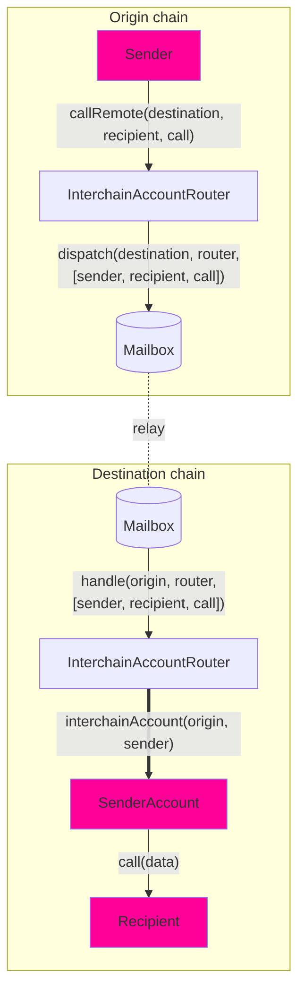

# Interchain Account Interface

开发者可以使用**Interchain Account** 接口，从本地链创建和控制远程链上的账户。

一般的消息传递要求接收者实现特定的接口，而链间账户（ICA）则不同，它允许开发者与_任何_远程合约进行交互。

## 概览



跨链账户允许您使用路由器（`InterchainAccountRouter`）从**链A**远程调用到**链B**。具体操作如下

- 我们使用[CREATE2](https://docs.openzeppelin.com/cli/2.8/deploying-with-create2) 为您计算确定的 [OwnableMulticall](https://github.com/hyperlane-xyz/hyperlane-monorepo/blob/main/solidity/contracts/middleware/libs/OwnableMulticall.sol) 合约地址，作为您跨链调用的代理。您也可以自己计算[here](#computing-addresses)。

- 您可以对调用进行编码，包括每次调用的地址、调用数据和`msg.value` ，并将其集中在一个数组中。

- 您将编码后的调用发送到**链 A** 路由器，再由它转发给**链 B** 路由器。

- 解码调用后，**链 B** 路由器会检查计算出的地址是否已经部署。如果没有，我们就部署_OwnableMulticall_ contract合约。

- 然后，路由器在 ICA 地址上执行多路调用，反过来又在 ** 链 B** 上执行所需的任意调用。

链间账户接口为每个`(uint32 origin, address owner, address remoteRouter, address remoteISM)`元组分配一个唯一的 ICA 地址。发送方拥有目标链上的 ICA，并可通过`InterchainAccountRouter.callRemote()`端点指示它执行任意函数调用。

对于 Hyperlane 支持的核心链，您可以使用路由器合约所有者设置的默认值。请参阅[#overrides](#overrides)部分，了解如何调用_any_ 链。

### Interface

```solidity
// SPDX-License-Identifier: MIT OR Apache-2.0
pragma solidity >=0.6.11;

import {CallLib} from "../contracts/libs/Call.sol";

interface IInterchainAccountRouter {
    function callRemote(
        uint32 _destinationDomain,
        CallLib.Call[] calldata calls
    ) external returns (bytes32);

    function getRemoteInterchainAccount(uint32 _destination, address _owner)
        external
        view
        returns (address);
}

```

:::tip

开箱即用 `InterchainAccountRouter` - ICA 路由器已部署到核心链。请参考[addresses](../contract-addresses.mdx#interchainaccountrouter)。 尝试使用`callRemote`方法通过钱包的链间账户进行调用。

:::

## 用法示例
### Encoding

`callRemote` 函数的参数是一个`Call` 结构数组。可以使用 `abi.encodeCall`  函数轻松对`Call.data`进行编码。

```solidity
struct Call {
    bytes32 to; // supporting non EVM targets
    uint256 value;
    bytes data;
}

interface IUniswapV3Pool {
    function swap(
        address recipient,
        bool zeroForOne,
        int256 amountSpecified,
        uint160 sqrtPriceLimitX96,
        bytes calldata data
    ) external returns (int256 amount0, int256 amount1);
}

IUniswapV3Pool pool = IUniswapV3Pool(...);
Call swapCall = Call({
    to: TypeCasts.addressToBytes32(address(pool)),
    data: abi.encodeCall(pool.swap, (...));
    value: 0,
});
uint32 ethereumDomain = 1;
IInterchainAccountRouter(0xabc...).callRemote(ethereumDomain, [swapCall]);
```

### Determine addresses

在发送消息之前，了解ICA的远程地址可能很有用。例如，您可能希望首先用令牌为地址提供资金。在给定目的链和所有者地址的情况下，可以使用`getRemoteInterchainAccount` 函数来获取ICA的地址。

下面是一个合约预先计算自己的链间账户地址的例子。

```solidity
address myInterchainAccount = IInterchainAccountRouter(...).getRemoteInterchainAccount(
    destination,
    address(this)
);
```

如果您使用[#overrides](#overrides)来指定远程链，那么在计算远程ICA地址时传递这些覆盖。

```solidity
address myRemoteIca = IInterchainAccountRouter(...).getRemoteInterchainAccount(
    address(this),
    remoteRouterOverride,
    remoteIsmOverride
);
```

## Overrides

Interchain Accounts允许开发者覆盖在interchainaccountryouter中配置的默认链和安全模型。

这对于希望实现以下功能的开发人员来说非常有用：

- 调用`InterchainAccountRouter` 所有者未明确添加（路由器未设置）的链上的 ICA，或
- 使用与 `InterchainAccountRouter`中配置的默认值不同的 ISM 确保其 ICA 的安全

### Interface

`callRemoteWithOverrides` 函数与`callRemote` 函数相似，但需要三个额外参数。

首先，开发人员可以覆盖远程链上`InterchainAccountRouter` 的地址`_router`。这样，开发人员就可以控制本地`InterchainAccountRouter`上未配置的远程链上的 ICA。

其次，开发人员可以覆盖`_ism`，即用于保护 ICA 安全的远程链间安全模块（ISM）的地址。该 ISM 将用于验证本地和远程`InterchainAccountRouters`之间传递的链间消息。这允许开发人员使用最适合其需求的自定义安全模型。

第三，开发人员可以覆盖`_hookMetadata`，即为每次 ICA 调用传递给消息钩子的 [StandardHookMetadata](../libraries/hookmetadata.mdx) 元数据（例如，覆盖 IGP 支付的燃料限制）。

```solidity
    /**
     * @notice Dispatches a sequence of remote calls to be made by an owner's
     * interchain account on the destination domain
     * @dev Recommend using CallLib.build to format the interchain calls
     * @param _destination The remote domain of the chain to make calls on
     * @param _router The remote router address
     * @param _ism The remote ISM address
     * @param _calls The sequence of calls to make
     * @param _hookMetadata The hook metadata to override with for the hook set by the owner
     * @return The Hyperlane message ID
     */
    function callRemoteWithOverrides(
        uint32 _destination,
        bytes32 _router,
        bytes32 _ism,
        CallLib.Call[] calldata _calls,
        bytes memory _hookMetadata
    ) public payable returns (bytes32)

    function getRemoteInterchainAccount(
        address _owner,
        address _router,
        address _ism
    ) public view returns (address)
```
