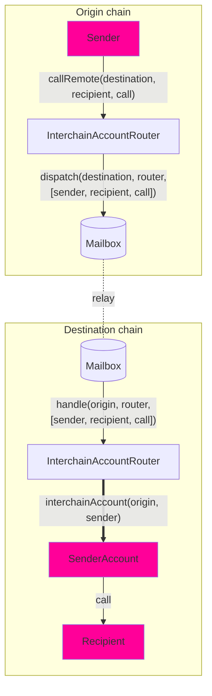

# Interchain Account Interface

Interchain Accounts (ICAs) allow a contract on an origin chain to make authenticated calls to any contract on a remote chain. Unlike general message passing, ICAs interact with arbitrary contracts without requiring a specific recipient interface. Each ICA address is deterministic, based on `(origin, sender, router, ISM)`, giving each originating contract a unique corresponding account on the destination chain for executing calls. ICAs are currently supported on EVM chains.

## Overview



ICAs use the `InterchainAccountRouter` to make remote calls. [CREATE2](https://docs.openzeppelin.com/cli/2.8/deploying-with-create2) computes a deterministic [OwnableMulticall](https://github.com/hyperlane-xyz/hyperlane-monorepo/blob/main/solidity/contracts/middleware/libs/OwnableMulticall.sol) contract address, which acts as a proxy for cross-chain calls.

How it works:
- Encode your calls (target address, call data, `msg.value`) into an array.
- Send this to the origin chain's router, which relays it to the destination chain's router.
- The destination router decodes the calls. If the computed `OwnableMulticall` ICA is not yet deployed, it deploys it.
- The router then multicalls the ICA, which executes the desired calls on the destination chain.

The interface assigns every `(uint32 origin, address owner, address remoteRouter, address remoteISM)` tuple a unique ICA address. The sender owns this ICA and directs it via `InterchainAccountRouter.callRemote()`.

For Hyperlane-supported core chains, defaults are set by the router owner. See [#overrides](#overrides) to call any chain.

### Interface

```solidity
// SPDX-License-Identifier: MIT OR Apache-2.0
pragma solidity >=0.6.11;

import {CallLib} from "../contracts/libs/Call.sol";

interface IInterchainAccountRouter {
    function callRemote(
        uint32 _destinationDomain,
        CallLib.Call[] calldata calls
    ) external returns (bytes32);

    function getRemoteInterchainAccount(uint32 _destination, address _owner)
        external
        view
        returns (address);

    // For creating namespaced/user-specific ICAs
    function getRemoteInterchainAccount(
        uint32 _destination,
        address _owner,
        bytes32 _userSalt
    ) external view returns (address);
}
```

:::tip
Use `InterchainAccountRouter` out-of-the-box; routers are deployed on core chains. See [addresses](../contract-addresses.mdx#interchainaccountrouter). Try `callRemote` via your wallet's ICA.
:::

## Example Usage

### Encoding

`callRemote` requires `Call` structs: `to` (target address as `bytes32`), `value` (native tokens), and `data` (encoded function call via `abi.encodeCall`).

```solidity
struct Call {
    bytes32 to; // supporting non EVM targets
    uint256 value;
    bytes data;
}

interface IUniswapV3Pool {
    function swap(
        address recipient,
        bool zeroForOne,
        int256 amountSpecified,
        uint160 sqrtPriceLimitX96,
        bytes calldata data
    ) external returns (int256 amount0, int256 amount1);
}

IUniswapV3Pool pool = IUniswapV3Pool(...);
CallLib.Call memory swapCall = CallLib.Call({
    to: TypeCasts.addressToBytes32(address(pool)),
    data: abi.encodeCall(pool.swap, (...)),
    value: 0
});
uint32 ethereumDomain = 1;
IInterchainAccountRouter(0xabc...).callRemote(ethereumDomain, [swapCall]);
```

### Typescript Usage

Use Typescript tooling to deploy ICAs and call `callRemote`:

```typescript
const localChain = 'ethereum';
const signer = <YOUR_SIGNER>;
const localRouter: InterchainAccountRouter = InterchainAccountRouter__factory.connect(<ICA_ROUTER_ADDRESS>, signer);
const recipientAddress = <EXAMPLE_ADDRESS>; // use your own address here
const recipientF = new TestRecipient__factory.connect(recipientAddress, signer); // use your own contract here
const fooMessage = "Test";
const data = recipient.interface.encodeFunctionData("fooBar", [1, fooMessage]);

const call = {
  to: recipientAddress,
  data,
  value: BigNumber.from("0"),
};
const quote = await local["quoteGasPayment(uint32)"](
  multiProvider.getDomainId(remoteChain)
);

const config: AccountConfig = {
  origin: localChain,
  owner: signer.address,
  localRouter: localRouter.address,
};
await localRouter.callRemote(localChain, remoteChain, [call], config);
```

### Determine ICA Addresses

You might need an ICA's address beforehand (e.g., for pre-funding). See [Transfer and Call Pattern](/docs/guides/transfer-and-call).

Use `getRemoteInterchainAccount(destination, owner)` for the basic ICA address. For user-specific or namespaced ICAs, see the next section.

A contract precomputing its own default ICA:
```solidity
address myInterchainAccount = IInterchainAccountRouter(...).getRemoteInterchainAccount(
    destination,
    address(this)
);
```

### Using `_userSalt` for Namespaced ICAs

For contracts managing operations for multiple users, a `_userSalt` with `getRemoteInterchainAccount` creates a unique ICA on the destination chain per user. This is vital for isolating funds and simplifying recovery if operations fail (e.g., stuck assets from a failed stake). Without it, all users' funds share one ICA, complicating returns.

1.  **Derive User-Specific ICA Address:**
    Create a unique salt from the user's address to get their ICA address.

    ```solidity
    // Assume 'userAddress' is the end-user's address.
    bytes32 userSpecificSalt = bytes32(uint256(uint160(userAddress)));
    // 'destinationDomain', 'icaRouterAddress', 'thisContractAddress' (owner) as defined before.
    address userIcaOnDestination = IInterchainAccountRouter(icaRouterAddress).getRemoteInterchainAccount(
        destinationDomain,
        thisContractAddress,
        userSpecificSalt
    );
    // 'userIcaOnDestination' is unique to 'userAddress'.
    ```
    If using router/ISM overrides with `getRemoteInterchainAccount`, pass them with the `_userSalt`.

2.  **Dispatch Calls to the User-Specific ICA:**
    When calling this ICA, provide the same `_userSalt` using an overload of `callRemoteWithOverrides`.
    You'll need `destinationDomain`, `userSpecificSalt`, `CallLib.Call[] memory calls`, and optionally `bytes32 _router` and `bytes32 _ism` overrides, and `bytes memory _hookMetadata`.

    ```solidity
    import {TypeCasts} from "../libs/TypeCasts.sol";
    import {CallLib} from "../contracts/libs/Call.sol";

    // ... Inside contract, after preparing variables ...
    // IInterchainAccountRouter icaRouter = IInterchainAccountRouter(icaRouterAddress);
    // Example: bytes32 remoteRouterBytes = TypeCasts.addressToBytes32(remoteRouterAddress);

    icaRouter.callRemoteWithOverrides{value: msg.value}(
        destinationDomain,
        remoteRouterBytes, // Or your bytes32 router override
        remoteIsmBytes,    // Or your bytes32 ISM override
        calls,
        hookMetadata,
        userSpecificSalt
    );
    ```
    **Notes:** `_router`/`_ism` in `callRemoteWithOverrides` are `bytes32`. Cast addresses with `TypeCasts.addressToBytes32()`. Check `InterchainAccountRouter.sol` for exact signatures, as overloads exist.

## Overrides

Override default chains and security models in `InterchainAccountRouter` for:
- Calling ICAs on chains not configured in the local router.
- Using different ISMs.
- Adjusting gas limits for IGP payments, etc.

### Interface

The `callRemoteWithOverrides` function is similar to `callRemote` but adds `_router` (remote `InterchainAccountRouter` address), `_ism` (remote ISM address), and `_hookMetadata` ([StandardHookMetadata](../libraries/hookmetadata.mdx)). You can also include a `_userSalt` if calling a namespaced ICA.

```solidity
    // SPDX-License-Identifier: MIT OR Apache-2.0
    pragma solidity >=0.6.11;

    import {CallLib} from "../contracts/libs/Call.sol";
    import {IPostDispatchHook} from "../interfaces/hooks/IPostDispatchHook.sol";

    interface IInterchainAccountRouterWithOverrides {
        function callRemoteWithOverrides(
            uint32 _destination,
            bytes32 _router,
            bytes32 _ism,
            CallLib.Call[] calldata _calls,
            bytes memory _hookMetadata
        ) public payable returns (bytes32);

        function callRemoteWithOverrides(
            uint32 _destination,
            bytes32 _router,
            bytes32 _ism,
            CallLib.Call[] calldata _calls,
            bytes memory _hookMetadata,
            bytes32 _userSalt // For namespaced ICAs
        ) public payable returns (bytes32);

        // Get ICA address when using overrides for derivation
        function getRemoteInterchainAccount(
            address _owner,
            address _router, // address type for getRemoteInterchainAccount
            address _ism,    // address type for getRemoteInterchainAccount
            bytes32 _userSalt
        ) public view returns (address);
    }
```

If you are using overrides to specify remote chains and ISMs when *deriving* an ICA address, pass those override addresses (as `address` type) along with any `_userSalt` to `getRemoteInterchainAccount`:
```solidity
// Note: _router and _ism here are 'address' type for getRemoteInterchainAccount.
address myRemoteIcaWithSalt = IInterchainAccountRouter(...).getRemoteInterchainAccount(
    address(this),          // _owner
    remoteRouterOverrideAddress,   // _router (address)
    remoteIsmOverrideAddress,      // _ism (address)
    myCustomSalt            // _userSalt
);
```

## Commit-Reveal Calls

The Interchain Account Router supports a commit-reveal scheme. First, send a commitment (hash of intended transactions), then reveal the actual transaction data. This can enhance privacy or mitigate front-running.

### Overview

1.  **Commit Phase:**
    *   Dispatch a *commitment* using `callRemoteCommitReveal` with a hash of calls, destination, router, ISM, and optional salt.
    *   The origin router sends this to the destination chain router.
    *   The destination router stores the commitment in the target ICA.

2.  **Reveal Phase:**
    *   Dispatch a *reveal* message (also via `callRemoteCommitReveal` or an ISM like `CCIP_READ_ISM`) with the actual call data.
    *   The destination router (often with an ISM like `CCIP_READ_ISM` for off-chain data) verifies revealed data against the stored commitment.
    *   If successful, the ICA executes the calls.

`callRemoteCommitReveal` sends two Hyperlane messages (commit and reveal) and splits `msg.value` considering `COMMIT_TX_GAS_USAGE` for the commitment message gas cost.

### Interface and Usage

`InterchainAccountRouter` offers overloaded `callRemoteCommitReveal` versions for different scenarios (overrides for remote router, ISM, hook metadata, user salt).

```solidity
// SPDX-License-Identifier: MIT OR Apache-2.0
pragma solidity >=0.8.13;

import {IPostDispatchHook} from "../interfaces/hooks/IPostDispatchHook.sol";

interface IInterchainAccountRouterCommitReveal {
    // Simplified example of one of the callRemoteCommitReveal signatures
    function callRemoteCommitReveal(
        uint32 _destination,
        bytes32 _router, // Remote router address (or default if zero)
        bytes32 _ism,    // Remote ISM address (or default if zero)
        bytes32 _ccipReadIsm, // Optional: ISM for CCIP read during reveal
        bytes memory _hookMetadata,
        IPostDispatchHook _hook,
        bytes32 _salt,         // User-provided salt for ICA derivation
        bytes32 _commitment    // The commitment hash of the calls
    ) external payable returns (bytes32 _commitmentMsgId, bytes32 _revealMsgId);

    function callRemoteCommitReveal(
        uint32 _destination,
        bytes32 _commitment,
        uint _gasLimit // Gas limit for the hook metadata of the reveal message
    ) external payable returns (bytes32 _commitmentMsgId, bytes32 _revealMsgId);
}
```

### Example: Sending a Commit-Reveal Call

```solidity
import {InterchainAccountMessage} from "./libs/InterchainAccountMessage.sol";
import {CallLib} from "./libs/Call.sol";
import {StandardHookMetadata} from "../hooks/libs/StandardHookMetadata.sol";

// Assume 'icaRouter' is an instance of IInterchainAccountRouter
// Assume 'destinationDomain' and 'targetContract' are defined
// Assume 'myCallData' is the abi.encodeCall(...) for the desired remote call

// 1. Prepare the calls and the commitment
CallLib.Call[] memory calls = new CallLib.Call[](1);
calls[0] = CallLib.Call({
    to: TypeCasts.addressToBytes32(targetContract),
    value: 0,
    data: myCallData
});

// The commitment is a hash of various elements, see contract source for exact details.
// For simplicity, let's represent it as a pre-computed hash.
// The contract's `InterchainAccountMessage.encodeCommitment` shows the structure.
bytes32 callCommitment = keccak256(abi.encodePacked(calls[0].to, calls[0].value, calls[0].data)); // Simplified commitment

uint32 destinationDomain = 123; // Example destination domain
uint gasLimitForReveal = 200000; // Estimated gas for the reveal and execution

// 2. Dispatch the commit and reveal messages
// Using a simpler version (uses default router, ISM, hook, and empty salt)
(bytes32 commitmentMsgId, bytes32 revealMsgId) = icaRouter.callRemoteCommitReveal{value: igp.quoteGasPayment(...).total}(
    destinationDomain,
    callCommitment,
    gasLimitForReveal
);

// To use overrides:
// bytes32 remoteRouterOverride = ...;
// bytes32 remoteIsmOverride = ...;
// bytes32 ccipIsmForReveal = addressToBytes32(address(myCcipReadIsm)); // If using CCIP Read for reveal
// bytes memory hookMetadata = StandardHookMetadata.overrideGasLimit(gasLimitForReveal);
// IPostDispatchHook customHook = myHook;
// bytes32 userSalt = keccak256("my-app-salt");

// (bytes32 commitmentMsgId, bytes32 revealMsgId) = icaRouter.callRemoteCommitReveal{value: payment}(
//     destinationDomain,
//     remoteRouterOverride,
//     remoteIsmOverride,
//     ccipIsmForReveal, // Can be bytes32(0) if not using a specific CCIP Read ISM for reveal
//     hookMetadata,
//     customHook,
//     userSalt,
//     callCommitment
// );

```
**Note on Commitment Calculation:** The exact structure of `_commitment` depends on the `InterchainAccountRouter`'s `handle` function and the chosen ISM. The `InterchainAccountMessage.encodeCommitment` function in `InterchainAccountMessage.sol` library shows: `abi.encode(_owner, _ism, _commitment, _userSalt)`. The `_commitment` argument within this is the hash of the secret data (e.g., `keccak256(abi.encodePacked(calls))`).

When `handle` on the destination processes a `COMMITMENT` message, it calls `ica.setCommitment(_commitment)`. The reveal must then provide data that validates against this stored commitment via the ISM.
