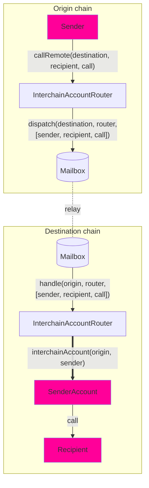

# Interchain Account Interface

Interchain Accounts (ICAs) enable a contract on the origin chain to make authenticated calls to contracts on a remote chain. Unlike general message passing, which requires the recipient to implement a specific interface, ICAs allow interaction with _any_ contract on the destination chain.

Developers can use ICAs for cross-chain execution, enabling contracts to trigger function calls on remote chains. Each ICA on a destination chain corresponds to a unique sender on the origin chain, and the account is deterministic based on `(origin, sender, router, ISM)`. This means that for every contract making interchain calls, there is a corresponding account on the destination chain that executes those calls.

ICA is currently supported only on EVM chains.

## Overview



Interchain Accounts allow you to make a remote call from **Chain A** to **Chain B** using the router (`InterchainAccountRouter`). Here's how it works:

1. We use [CREATE2](https://docs.openzeppelin.com/cli/2.8/deploying-with-create2) to compute the deterministic [OwnableMulticall](https://github.com/hyperlane-xyz/hyperlane-monorepo/blob/main/solidity/contracts/middleware/libs/OwnableMulticall.sol) contract address for you, which serves as a proxy for your cross-chain calls. You can explore this [here](#example-usage).
2. You can encode your call which includes the to address, call data, and the `msg.value` for each call, batched together in an array.
3. You send the encoded call to the **Chain A** router which gets relayed to the **Chain B** router.
4. After decoding the calls, the **Chain B** router checks if the computed address is already deployed or not. If not, we deploy the _OwnableMulticall_ contract.
5. The router then performs a multicall on the ICA address, which in turn makes the desired arbitrary call on **Chain B**.

The Interchain Account interface assigns every `(uint32 origin, address owner, address remoteRouter, address remoteISM)` tuple a unique ICA address. The sender owns that ICA on the destination chain, and can direct it to make arbitrary function calls via the `InterchainAccountRouter.callRemote()` endpoint.

For core chains supported by Hyperlane, you are able to use the defaults that are set by the owner of the router contract. See the [#overrides](#overrides) section to see how to make calls to _any_ chain.

### Interface

```solidity
// SPDX-License-Identifier: MIT OR Apache-2.0
pragma solidity >=0.6.11;

import {CallLib} from "../contracts/libs/Call.sol";

interface IInterchainAccountRouter {
    function callRemote(
        uint32 _destinationDomain,
        CallLib.Call[] calldata calls
    ) external returns (bytes32);

    function getRemoteInterchainAccount(uint32 _destination, address _owner)
        external
        view
        returns (address);
}

```

:::tip

- Use `InterchainAccountRouter` out of the box - ICA routers have already been deployed to core chains. Please refer to [addresses](../contract-addresses.mdx#interchainaccountrouter). Try using the `callRemote` method to do a call via your wallet's interchain account.

:::

## Example Usage

### Encoding

When calling remote contracts using `callRemote`, the function parameters must be encoded into an array of `Call` structs.

Each `Call` struct contains:

- `to`: The target contract address (converted to bytes32).
- `value`: The ETH or native token amount to send with the call.
- `data`: The function call data, which can be encoded using abi.encodeCall.

`Call.data` can be easily encoded with the `abi.encodeCall` function.

```solidity
struct Call {
    bytes32 to; // supporting non EVM targets
    uint256 value;
    bytes data;
}

interface IUniswapV3Pool {
    function swap(
        address recipient,
        bool zeroForOne,
        int256 amountSpecified,
        uint160 sqrtPriceLimitX96,
        bytes calldata data
    ) external returns (int256 amount0, int256 amount1);
}

IUniswapV3Pool pool = IUniswapV3Pool(...);
Call swapCall = Call({
    to: TypeCasts.addressToBytes32(address(pool)),
    data: abi.encodeCall(pool.swap, (...));
    value: 0,
});
uint32 ethereumDomain = 1;
IInterchainAccountRouter(0xabc...).callRemote(ethereumDomain, [swapCall]);
```

### Typescript Usage

We also have Typescript tooling to easily deploy ICA accounts and call `callRemote` on the origin chain:

```typescript
const localChain = 'ethereum';
const signer = <YOUR_SIGNER>;
const localRouter: InterchainAccountRouter = InterchainAccountRouter__factory.connect(<ICA_ROUTER_ADDRESS>, signer);
const recipientAddress = <EXAMPLE_ADDRESS>; // use your own address here
const recipientF = new TestRecipient__factory.connect(recipientAddress, signer); // use your own contract here
const fooMessage = "Test";
const data = recipient.interface.encodeFunctionData("fooBar", [1, fooMessage]);

const call = {
  to: recipientAddress,
  data,
  value: BigNumber.from("0"),
};
const quote = await local["quoteGasPayment(uint32)"](
  multiProvider.getDomainId(remoteChain)
);

const config: AccountConfig = {
  origin: localChain,
  owner: signer.address,
  localRouter: localRouter.address,
};
await localRouter.callRemote(localChain, remoteChain, [call], config);
```

### Determine addresses

In some cases, you may need to compute the ICA address on a remote chain before making a call. For example, if your ICA needs funding before executing transactions, you can retrieve its address and transfer assets to it in advance.

The `getRemoteInterchainAccount` function can be used to get the address of an ICA given the destination chain and owner address.

An example is included below of a contract precomputing its own Interchain Account address.

```solidity
address myInterchainAccount = IInterchainAccountRouter(...).getRemoteInterchainAccount(
    destination,
    address(this)
);
```

If you are using [#overrides](#overrides) to specify remote chains, pass those overrides when computing the remote ICA address.

```solidity
address myRemoteIca = IInterchainAccountRouter(...).getRemoteInterchainAccount(
    address(this),
    remoteRouterOverride,
    remoteIsmOverride
);
```

## Overrides

Interchain Accounts allow developers to override the default chains and security models configured in the `InterchainAccountRouter`.

These are useful for:

- Calling an ICA on chains not configured in `InterchainAccountRouter`.
- Using different ISM than the defaults configured in the `InterchainAccountRouter`
- Adjusting the gas limit for IGP payments or setting other parameters.

### Interface

The `callRemoteWithOverrides` function looks similar to the `callRemote` function, but takes three additional arguments.

First, developers can override `_router`, the address of the `InterchainAccountRouter` on the remote chain. This allows developers to control an ICA on remote chains that have not been configured on the local `InterchainAccountRouter`.

Second, developers can override `_ism`, the address of the remote interchain security module (ISM) used to secure their ICA. This ISM will be used to verify the interchain messages passed between the local and remote `InterchainAccountRouters`. This allows developers to use a custom security model that best suits their needs.

Third, developers can override `_hookMetadata`, the [StandardHookMetadata](../libraries/hookmetadata.mdx) metadata passed to the message hooks for each ICA call (for example, overriding the gas limit for the IGP payment).

```solidity
    /**
     * @notice Dispatches a sequence of remote calls to be made by an owner's
     * interchain account on the destination domain
     * @dev Recommend using CallLib.build to format the interchain calls
     * @param _destination The remote domain of the chain to make calls on
     * @param _router The remote router address
     * @param _ism The remote ISM address
     * @param _calls The sequence of calls to make
     * @param _hookMetadata The hook metadata to override with for the hook set by the owner
     * @return The Hyperlane message ID
     */
    function callRemoteWithOverrides(
        uint32 _destination,
        bytes32 _router,
        bytes32 _ism,
        CallLib.Call[] calldata _calls,
        bytes memory _hookMetadata
    ) public payable returns (bytes32)

    function getRemoteInterchainAccount(
        address _owner,
        address _router,
        address _ism
    ) public view returns (address)
```
