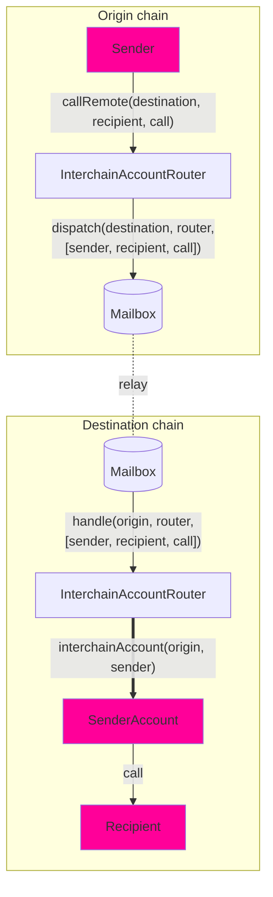

# Interchain Account Interface

Interchain Accounts (ICAs) enable a contract on the origin chain to make authenticated calls to contracts on a remote chain. Unlike general message passing, which requires the recipient to implement a specific interface, ICAs allow interaction with _any_ contract on the destination chain.

Developers can use ICAs for cross-chain execution, enabling contracts to trigger function calls on remote chains. Each ICA on a destination chain corresponds to a unique sender on the origin chain, and the account is deterministic based on `(origin, sender, router, ISM)`. This means that for every contract making interchain calls, there is a corresponding account on the destination chain that executes those calls.

ICA is currently supported only on EVM chains.

## Overview



Interchain Accounts allow you to make a remote call from **Chain A** to **Chain B** using the router (`InterchainAccountRouter`). We use [CREATE2](https://docs.openzeppelin.com/cli/2.8/deploying-with-create2) to compute the deterministic [OwnableMulticall](https://github.com/hyperlane-xyz/hyperlane-monorepo/blob/main/solidity/contracts/middleware/libs/OwnableMulticall.sol) contract address for you, which serves as a proxy for your cross-chain calls. You can explore this [here](#example-usage).

Here's how it works:

- You can encode your call which includes the to address, call data, and the `msg.value` for each call, batched together in an array.
- You send the encoded call to the **Chain A** router which gets relayed to the **Chain B** router.
- After decoding the calls, the **Chain B** router checks if the computed address is already deployed or not. If not, we deploy the _OwnableMulticall_ contract.
- The router then performs a multicall on the ICA address, which in turn makes the desired arbitrary call on **Chain B**.

The Interchain Account interface assigns every `(uint32 origin, address owner, address remoteRouter, address remoteISM)` tuple a unique ICA address. The sender owns that ICA on the destination chain, and can direct it to make arbitrary function calls via the `InterchainAccountRouter.callRemote()` endpoint.

For core chains supported by Hyperlane, you are able to use the defaults that are set by the owner of the router contract. See the [#overrides](#overrides) section to see how to make calls to _any_ chain.

### Interface

```solidity
// SPDX-License-Identifier: MIT OR Apache-2.0
pragma solidity >=0.6.11;

import {CallLib} from "../contracts/libs/Call.sol";

interface IInterchainAccountRouter {
    function callRemote(
        uint32 _destinationDomain,
        CallLib.Call[] calldata calls
    ) external returns (bytes32);

    function getRemoteInterchainAccount(uint32 _destination, address _owner)
        external
        view
        returns (address);
}

```

:::tip

- Use `InterchainAccountRouter` out of the box - ICA routers have already been deployed to core chains. Please refer to [addresses](../contract-addresses.mdx#interchainaccountrouter). Try using the `callRemote` method to do a call via your wallet's interchain account.

:::

## Example Usage

### Encoding

When calling remote contracts using `callRemote`, the function parameters must be encoded into an array of `Call` structs.

Each `Call` struct contains:

- `to`: The target contract address (converted to bytes32).
- `value`: The ETH or native token amount to send with the call.
- `data`: The function call data, which can be encoded using abi.encodeCall.

`Call.data` can be easily encoded with the `abi.encodeCall` function.

```solidity
struct Call {
    bytes32 to; // supporting non EVM targets
    uint256 value;
    bytes data;
}

interface IUniswapV3Pool {
    function swap(
        address recipient,
        bool zeroForOne,
        int256 amountSpecified,
        uint160 sqrtPriceLimitX96,
        bytes calldata data
    ) external returns (int256 amount0, int256 amount1);
}

IUniswapV3Pool pool = IUniswapV3Pool(...);
Call swapCall = Call({
    to: TypeCasts.addressToBytes32(address(pool)),
    data: abi.encodeCall(pool.swap, (...));
    value: 0,
});
uint32 ethereumDomain = 1;
IInterchainAccountRouter(0xabc...).callRemote(ethereumDomain, [swapCall]);
```

### Typescript Usage

We also have Typescript tooling to easily deploy ICA accounts and call `callRemote` on the origin chain:

```typescript
const localChain = 'ethereum';
const signer = <YOUR_SIGNER>;
const localRouter: InterchainAccountRouter = InterchainAccountRouter__factory.connect(<ICA_ROUTER_ADDRESS>, signer);
const recipientAddress = <EXAMPLE_ADDRESS>; // use your own address here
const recipientF = new TestRecipient__factory.connect(recipientAddress, signer); // use your own contract here
const fooMessage = "Test";
const data = recipient.interface.encodeFunctionData("fooBar", [1, fooMessage]);

const call = {
  to: recipientAddress,
  data,
  value: BigNumber.from("0"),
};
const quote = await local["quoteGasPayment(uint32)"](
  multiProvider.getDomainId(remoteChain)
);

const config: AccountConfig = {
  origin: localChain,
  owner: signer.address,
  localRouter: localRouter.address,
};
await localRouter.callRemote(localChain, remoteChain, [call], config);
```

### Determine addresses

In some cases, you may need to compute the ICA address on a remote chain before making a call. For example, if your ICA needs funding before executing transactions, you can retrieve its address and transfer assets to it in advance. See the [Transfer and Call Pattern](/docs/guides/transfer-and-call) section for more information.

The `getRemoteInterchainAccount` function can be used to get the address of an ICA given the destination chain and owner address. You can optionally provide a `_userSalt` to influence the derived address, allowing for namespacing or creating multiple distinct ICAs for the same owner. If no salt is provided, a default empty salt is used.

An example is included below of a contract precomputing its own Interchain Account address.

```solidity
address myInterchainAccount = IInterchainAccountRouter(...).getRemoteInterchainAccount(
    destination,
    address(this)
);

// Using a custom salt for namespacing
bytes32 myCustomSalt = keccak256(abi.encodePacked("my-unique-namespace"));
address myNamespacedInterchainAccount = IInterchainAccountRouter(...).getRemoteInterchainAccount(
    destination,
    address(this),
    myCustomSalt
);
```

If you are using [#overrides](#overrides) to specify remote chains and ISMs, pass those overrides when computing the remote ICA address. You can also provide a `_userSalt` in this scenario:

```solidity
address myRemoteIcaWithSalt = IInterchainAccountRouter(...).getRemoteInterchainAccount(
    address(this),
    remoteRouterOverride,
    remoteIsmOverride,
    myCustomSalt
);
```

## Overrides

Interchain Accounts allow developers to override the default chains and security models configured in the `InterchainAccountRouter`.

These are useful for:

- Calling an ICA on chains not configured in `InterchainAccountRouter`.
- Using different ISM than the defaults configured in the `InterchainAccountRouter`
- Adjusting the gas limit for IGP payments or setting other parameters.

### Interface

The `callRemoteWithOverrides` function looks similar to the `callRemote` function, but takes three additional arguments.

First, developers can override `_router`, the address of the `InterchainAccountRouter` on the remote chain. This allows developers to control an ICA on remote chains that have not been configured on the local `InterchainAccountRouter`.

Second, developers can override `_ism`, the address of the remote interchain security module (ISM) used to secure their ICA. This ISM will be used to verify the interchain messages passed between the local and remote `InterchainAccountRouters`. This allows developers to use a custom security model that best suits their needs.

Third, developers can override `_hookMetadata`, the [StandardHookMetadata](../libraries/hookmetadata.mdx) metadata passed to the message hooks for each ICA call (for example, overriding the gas limit for the IGP payment).

```solidity
    /**
     * @notice Dispatches a sequence of remote calls to be made by an owner's
     * interchain account on the destination domain
     * @dev Recommend using CallLib.build to format the interchain calls
     * @param _destination The remote domain of the chain to make calls on
     * @param _router The remote router address
     * @param _ism The remote ISM address
     * @param _calls The sequence of calls to make
     * @param _hookMetadata The hook metadata to override with for the hook set by the owner
     * @return The Hyperlane message ID
     */
    function callRemoteWithOverrides(
        uint32 _destination,
        bytes32 _router,
        bytes32 _ism,
        CallLib.Call[] calldata _calls,
        bytes memory _hookMetadata
    ) public payable returns (bytes32)

    function getRemoteInterchainAccount(
        address _owner,
        address _router,
        address _ism
    ) public view returns (address)
```

## Commit-Reveal Calls

The Interchain Account Router supports a commit-reveal scheme for dispatching calls. This mechanism allows you to first send a commitment (a hash) of your intended transaction(s) and then, in a separate message, reveal the actual transaction data. This two-step process can be beneficial for use cases requiring privacy or seeking to mitigate front-running, as the transaction details are not publicly visible until the reveal phase.

### Overview

1.  **Commit Phase:**
    *   You dispatch a *commitment* message using `callRemoteCommitReveal`. This message contains a hash of the calls you intend to make, along with other necessary parameters like the destination, router, ISM, and an optional salt.
    *   The `InterchainAccountRouter` on the origin chain sends this commitment to the destination chain.
    *   On the destination chain, the `InterchainAccountRouter` receives this commitment and stores it within the target Interchain Account (ICA).

2.  **Reveal Phase:**
    *   You dispatch a *reveal* message, also using `callRemoteCommitReveal` (or it's triggered by an ISM like `CCIP_READ_ISM`). This message contains the actual call data that corresponds to the previously sent commitment.
    *   The `InterchainAccountRouter` on the destination chain, often in conjunction with a specialized ISM (like `CCIP_READ_ISM` for off-chain data retrieval), verifies that the revealed data matches the stored commitment.
    *   If the verification is successful, the ICA executes the revealed calls.

The `callRemoteCommitReveal` function facilitates this by sending two distinct Hyperlane messages: one for the commitment and one for the reveal. It also handles the division of `msg.value` between these two messages, considering the `COMMIT_TX_GAS_USAGE` constant defined in the router for the gas cost of processing the commitment message.

### Interface and Usage

The `InterchainAccountRouter` provides several overloaded versions of `callRemoteCommitReveal` to accommodate different scenarios, including overrides for the remote router, ISM, hook metadata, and the user-provided salt.

```solidity
// SPDX-License-Identifier: MIT OR Apache-2.0
pragma solidity >=0.8.13;

import {IPostDispatchHook} from "../interfaces/hooks/IPostDispatchHook.sol";

interface IInterchainAccountRouterCommitReveal {
    // Simplified example of one of the callRemoteCommitReveal signatures
    function callRemoteCommitReveal(
        uint32 _destination,
        bytes32 _router, // Remote router address (or default if zero)
        bytes32 _ism,    // Remote ISM address (or default if zero)
        bytes32 _ccipReadIsm, // Optional: ISM for CCIP read during reveal
        bytes memory _hookMetadata,
        IPostDispatchHook _hook,
        bytes32 _salt,         // User-provided salt for ICA derivation
        bytes32 _commitment    // The commitment hash of the calls
    ) external payable returns (bytes32 _commitmentMsgId, bytes32 _revealMsgId);

    function callRemoteCommitReveal(
        uint32 _destination,
        bytes32 _commitment,
        uint _gasLimit // Gas limit for the hook metadata of the reveal message
    ) external payable returns (bytes32 _commitmentMsgId, bytes32 _revealMsgId);
}
```

### Example: Sending a Commit-Reveal Call

```solidity
import {InterchainAccountMessage} from "./libs/InterchainAccountMessage.sol";
import {CallLib} from "./libs/Call.sol";
import {StandardHookMetadata} from "../hooks/libs/StandardHookMetadata.sol";

// Assume 'icaRouter' is an instance of IInterchainAccountRouter
// Assume 'destinationDomain' and 'targetContract' are defined
// Assume 'myCallData' is the abi.encodeCall(...) for the desired remote call

// 1. Prepare the calls and the commitment
CallLib.Call[] memory calls = new CallLib.Call[](1);
calls[0] = CallLib.Call({
    to: TypeCasts.addressToBytes32(targetContract),
    value: 0,
    data: myCallData
});

// The commitment is a hash of the owner, local ISM, calls, and user salt.
// This needs to be computed off-chain or carefully on-chain.
// For simplicity, let's represent it as a pre-computed hash.
// In a real scenario, you'd use InterchainAccountMessage.encode to get the message
// body that would be sent IF it were a direct call, and then hash that.
// Or, more accurately, the commitment is defined by how the ICA's setCommitment
// and the ISM's verification logic expect it.
// The contract's `InterchainAccountMessage.encodeCommitment` shows the structure.
// For the ICA itself, `ica.setCommitment(_commitment)` takes a `bytes32`.
// The `_commitment` in `callRemoteCommitReveal` is this `bytes32` value.

// Example: let's say this is the commitment we derived
bytes32 callCommitment = keccak256(abi.encodePacked(calls[0].to, calls[0].value, calls[0].data)); // Simplified commitment

uint32 destinationDomain = 123; // Example destination domain
uint gasLimitForReveal = 200000; // Estimated gas for the reveal and execution

// 2. Dispatch the commit and reveal messages
// Using the simpler version that uses default router, ISM, hook, and empty salt
(bytes32 commitmentMsgId, bytes32 revealMsgId) = icaRouter.callRemoteCommitReveal{value: igp.quoteGasPayment(...).total}(
    destinationDomain,
    callCommitment,
    gasLimitForReveal
);

// To use overrides:
// bytes32 remoteRouterOverride = ...;
// bytes32 remoteIsmOverride = ...;
// bytes32 ccipIsmForReveal = addressToBytes32(address(myCcipReadIsm)); // If using CCIP Read for reveal
// bytes memory hookMetadata = StandardHookMetadata.overrideGasLimit(gasLimitForReveal);
// IPostDispatchHook customHook = myHook;
// bytes32 userSalt = keccak256("my-app-salt");

// (bytes32 commitmentMsgId, bytes32 revealMsgId) = icaRouter.callRemoteCommitReveal{value: payment}(
//     destinationDomain,
//     remoteRouterOverride,
//     remoteIsmOverride,
//     ccipIsmForReveal, // Can be bytes32(0) if not using a specific CCIP Read ISM for reveal
//     hookMetadata,
//     customHook,
//     userSalt,
//     callCommitment
// );

```
**Note on Commitment Calculation:** The exact structure of the `_commitment` depends on what the `InterchainAccountRouter`'s `handle` function and the chosen ISM (especially a `CCIP_READ_ISM`) expect. The `InterchainAccountMessage.encodeCommitment` function in `InterchainAccountMessage.sol` library provides the structure for the commitment message body: `abi.encode(_owner, _ism, _commitment, _userSalt)`. The `_commitment` argument within this structure is the actual hash of the secret data (e.g., `keccak256(abi.encodePacked(calls))`).

When the `handle` function on the destination chain processes a message of type `COMMITMENT`, it calls `ica.setCommitment(_commitment)` where `_commitment` is extracted from the message. The reveal process must then provide data that, when processed by the ISM, ultimately validates against this stored commitment.