# Arbitrum L2 to L1 Hook

Arbitrum's Outbox system allows for arbitrary L2 to L1 contract calls after the optimistic challenge period, i.e., messages initiated on the L2 chain which eventually resolve in execution on L1. See more details about [here](https://docs.arbitrum.io/how-arbitrum-works/arbos/l2-l1-messaging). Hyperlane can wrap around the Outbox system to leverage the optimistic security of Arbitrum L2 (with a 7-day withdrawal period and operational fraud proofs) to secure L2 to L1 messages from any Arbitrum Nitro rollups. We've implemented the [ArbL2ToL1Hook](https://github.com/hyperlane-xyz/hyperlane-monorepo/blob/main/solidity/contracts/hooks/ArbL2ToL1Hook.sol) and [ArbL2ToL1Ism](https://github.com/hyperlane-xyz/hyperlane-monorepo/blob/main/solidity/contracts/isms/hook/ArbL2ToL1Ism.sol).

## How it works

:::note

Outgoing messages from L2 cannot provide in-protocol automatic L1 execution because Ethereum doesn't offer scheduled execution affordances through the L1 node.

:::

The `ArbL2ToL1Hook` sends the encoded function call with the `messageId` to the `ArbSys` precompile on the L2. After waiting for the withdrawal period, you can the `getOutboxProof()` on the L2 to get a merkle proof of the message. From here, you have two options:

- **Option A.** You can call the `ArbL2ToL1Ism`'s verify function via the `mailbox.process()` call with the proof and the other encoded data which in turn calls the `outbox.executeTransaction()` checking for the message sender and message data validity.
- **Option B.** You can directly call the `outbox.executeTransaction()` with the proof and the other encoded data. However, you'll need to make a second call to the `ArbL2ToL1Ism`'s verify function to deliver the message. This option also you delivery of message values to the recipient contract.

### Option A

```mermaid
flowchart TB
    subgraph Origin L2
      Sender
      M_O[(Mailbox)]
      Hook[ArbL2ToL1Hook]
      L_2[(ArbSys)]

      Sender -- "dispatch(...)" --> M_O
      M_O -- "postDispatch(message)" --> Hook
      Hook -- "sendMessage(messageId)" --> L_2
    end

    M_O -. "process (relayer)
    after 7 days" .-> M_D
    L_2 -. "exeuteTransaction(3rd party relayer)
    after 7 days" .-> L_1

    subgraph Destination L1
      Recipient
      M_D[(Mailbox)]
      ISM{ArbL2ToL1Ism}
      L_1[(ArbOutbox)]

      M_D -- "verify(..., message)" --> ISM
      M_D -- "handle(...)" --> Recipient
      ISM -. "interchainSecurityModule()" .- Recipient

      L_1 -- "verifyMessageId(messageId)" --> ISM
    end

    style L_1 fill: #162c4f
    style L_2 fill: #162c4f
```

### Option B

Note: here, the relayer is responsible for encoding the message proof from `arbSys.getOutboxProof()` and calling the `outbox.executeTransaction()` function.

```mermaid
flowchart TB
    subgraph Origin L2
      Sender
      M_O[(Mailbox)]
      Hook[ArbL2ToL1Hook]
      L_2[(ArbSys)]

      Sender -- "dispatch(...)" --> M_O
      M_O -- "postDispatch(message)" --> Hook
      Hook -- "sendMessage(messageId)" --> L_2
    end

    M_O -. "process(relayer)
    after 7 days" .-> M_D
    M_O -. "getOutboxProof()" .-> L_2

    subgraph Destination L1
      Recipient
      M_D[(Mailbox)]
      ISM{ArbL2ToL1Ism}
      L_1[(ArbOutbox)]

      M_D -- "verify(..., message)" --> ISM
      M_D -- "handle(...)" --> Recipient
      ISM -. "interchainSecurityModule()" .- Recipient

      L_1 -- "verifyMessageId(messageId)" --> ISM
    end

    style L_1 fill: #162c4f
    style L_2 fill: #162c4f
```

