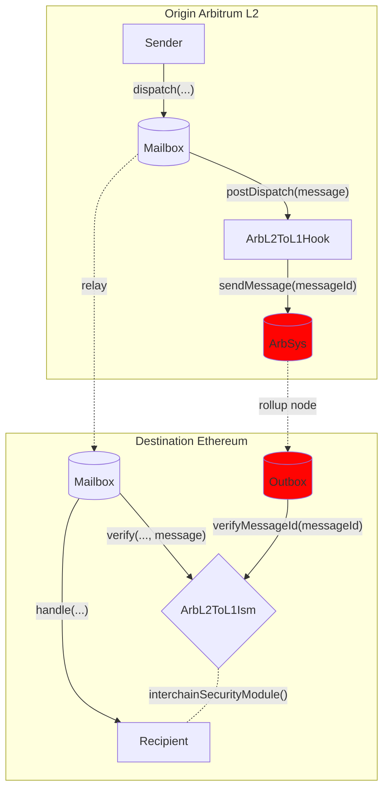

# Arbitrum L2 to L1 Hook

Arbitrum has its own interface for passing messages from L2 to L1 called `ArbSys` which benefits from the security of the Arbitrum rollup. To provide this security as an option in Hyperlane, we created a Hook and ISM combo that can be transparently configured to reuse the native Arbitrum interface.

See the [addresses](../contract-addresses.mdx) page for Hook and ISM addresses.

## How it works

