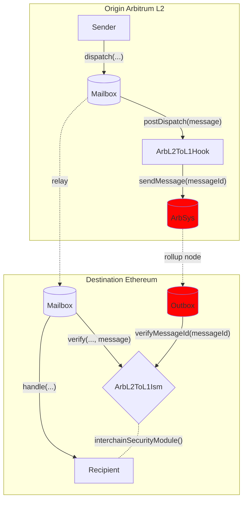

# Arbitrum L2 to L1 Hook

Arbitrum's Outbox system allows for arbitrary L2 to L1 contract calls after the optimistic challenge period, i.e., messages initiated on the L2 chain which eventually resolve in execution on L1. See more details about [here](https://docs.arbitrum.io/how-arbitrum-works/arbos/l2-l1-messaging). Hyperlane can wrap around the Outbox system to leverage the optimistic security of Arbitrum L2 (with a 7 day withdrawal period and operational fraud proofs) to secure L2 to L1 messages from any Abritrum Nitro rollups. We've implemented the [ArbL2ToL1Hook](https://github.com/hyperlane-xyz/hyperlane-monorepo/blob/main/solidity/contracts/hooks/ArbL2ToL1Hook.sol) and [ArbL2ToL1Ism](https://github.com/hyperlane-xyz/hyperlane-monorepo/blob/main/solidity/contracts/isms/hook/ArbL2ToL1Ism.sol).

## How it works

