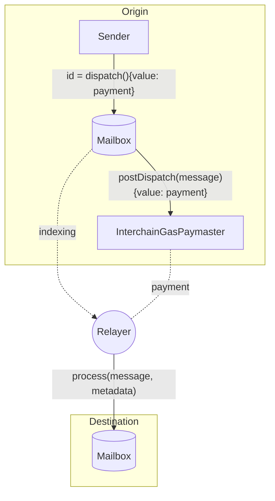

import Tabs from '@theme/Tabs';
import TabItem from '@theme/TabItem';

# Interchain Gas Payment

To [receive](../messaging/receive.mdx) a message, a transaction must be included on the destination chain that calls the Mailbox `process` function with the encoded message and ISM metadata. After verifying the message, the Mailbox will call the `handle` function on the message recipient.

## Relaying

For convenience, [relayers](../../operate/run-relayer.mdx) watch for dispatched messages and will submit process transactions on behalf of the message sender if they receive sufficient payment on the origin chain. We refer to this as *interchain gas payment*.




The relayer's costs for submitting process transactions are a function of the `tx.gasPrice` and `tx.gasLimit`. Because Hyperlane message processing can cause arbitrarily large traces, the message sender must specify a `gasLimit` with which to meter the `handle` call. Additionally, the destination chain's `gasPrice` is volatile. Furthermore, the destination gas is denominated in a different asset than the origin gas, so the relayer must be compensated for the difference in exchange rates and market making risk.

## Paying For Gas

When the `InterchainGasPaymaster` contract is configured as the default hook, the `dispatch` function will automatically forward interchain gas payment. For convenience, this contract oraclizes the gas price and exchange rates between supported origin and destination chains. During the post-dispatch hook, the contract will revert if the payment is insufficient to cover the relayer's costs.

By default, the `gasLimit` for metering the resultant `handle` call used in this calculation is `50_000`. This is a reasonable default for most use cases, but can be [overridden](#default-overrides).

## Topping Up and Retries

Docs coming soon!

## Refunds

Message senders may pay more than the contract quotes. When this happens, the contract refunds the difference to the sender, or some [overriden](#default-overrides) refund address. This allows senders to skip explicit `quoteDispatch` calls.

For example, if you are paying for 1M gas and pass 0.1 ETH to the IGP contract, but `quoteGasPayment` quotes a payment of 0.08 ETH, the `_refundAddress` will be refunded `0.02` ETH.

Note that refunds are only made if what is paid was greater than what was quoted. Refunds are **not** made if delivery of a message on the destination chain winds up requiring less gas than what was paid for.

### Reentrancy Risk

Note that refunding overpayment involves the IGP contract calling the `_refundAddress`, which can present a risk of [reentrancy](https://www.certik.com/resources/blog/3K7ZUAKpOr1GW75J2i0VHh-what-is-a-reentracy-attack) for your application. Special care should be made by callers to ensure they are not vulnerable to reentrancy exploits.

If a refund is unsuccessful, the `payForGas` call will revert.

## Default Overrides

The `InterchainGasPaymaster` contract expects metadata from the Mailbox to be shaped with the [`StandardHookMetadata` library](../libraries/hookmetadata.mdx).

:::tip
See the [dispatch overloads](../messaging/send.mdx#overriding-default-hook-metadata) to pass this metadata through the Mailbox.
:::

<Tabs groupId="lang">
<TabItem value="sol" label="Solidity">

```solidity file=<rootDir>/static/contracts/hooks/libs/StandardHookMetadata.sol#L153-L156
```

</TabItem>
</Tabs>
