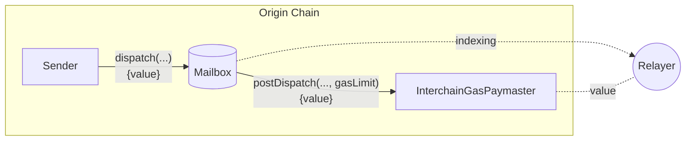
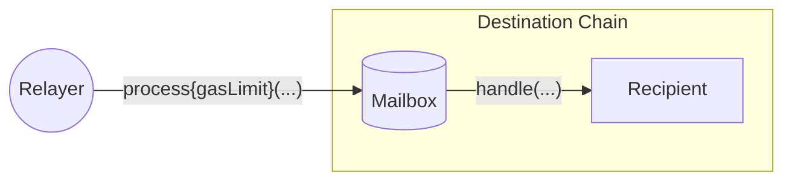

import Tabs from '@theme/Tabs';
import TabItem from '@theme/TabItem';

# Interchain Gas Payment

To [deliver a message](../messaging/receive.mdx), a transaction must be included on the destination chain that calls the Mailbox `process` function with the encoded message and ISM metadata. 



For convenience, [relayers](../../operate/relayer/run-relayer.mdx) watch for dispatched messages and will submit process transactions on behalf of the message sender if they receive sufficient payment on the origin chain. We refer to this as **interchain gas payment**. 



Because messages can trigger arbitrary code execution, the relayer must meter the [`handle` call](../messaging/receive.mdx#handle) with a `gasLimit` to charge appropriately at message dispatch time.

$$
txCost = gasPrice * gasLimit
\\[10pt]
exchangeRate = \frac{originGasTokenPrice}{destinationGasTokenPrice}
\\[10pt]
originFee = exchangeRate * txCost
$$

## Post Dispatch

During the post-dispatch hook, the contract will revert if payment is insufficient to cover the relayer's anticipated costs.

### Metadata

This hook expects metadata from the Mailbox to be empty, or a **packed encoding** of `StandardHookMetadata`. See the Mailbox [dispatch overloads](../messaging/send.mdx#overriding-default-hook-metadata) to pass metadata overrides.

<Tabs groupId="lang">
<TabItem value="sol" label="Solidity">

```solidity file=<rootDir>/static/contracts/hooks/libs/StandardHookMetadata.sol#L34-L39
```

For now, the variant should always be `1`. In future, we may support multiple variants and this is reserved as a discriminator.

```solidity file=<rootDir>/static/contracts/hooks/libs/StandardHookMetadata.sol#L32
```

</TabItem>
</Tabs>

### Gas Limit

When metadata is empty, the `gasLimit` for metering the `handle` call used in this calculation is `50_000`. 

:::tip
We recommend developers benchmark their [`handle` implementations](../messaging/receive.mdx#handle) in unit tests to determine a reasonable `gasLimit` to use.
:::

If you expect the `handle` function to consume more than this default, you should override the default `gasLimit` in metadata.

### Refunds

Message senders may pay more than the relayer quotes. When this happens, the contract refunds the difference to the sender [by default](###default-overrides). This allows senders to skip explicit `quoteDispatch` calls.

:::info
Refunds are only made if payment is greater than the quote. Refunds **are not** made if delivery requires less gas than what was paid.
:::

If a refund is unsuccessful, the `payForGas` call will revert. 

:::danger
Refunds can present a risk of [reentrancy](https://www.certik.com/resources/blog/3K7ZUAKpOr1GW75J2i0VHh-what-is-a-reentracy-attack). Special care should be made by callers to ensure they are not vulnerable to reentrancy exploits.
:::

### Gas Oracles

The interchain gas payment requirement is calculated using oraclized gas price and exchange rates between supported origin and destination chains.

:::info
Exchange rates and gas prices are up to the relayer to decide. A spread may be charged to account for drift and operating costs.
:::

<Tabs groupId="lang">
<TabItem value="sol" label="Solidity">

```solidity file=<rootDir>/static/contracts/hooks/igp/InterchainGasPaymaster.sol#L224-L228
```

**Parameters**

- `destinationDomain`: The message's destination domain

**Returns**
- `tokenExchangeRate`: The exchange rate between the origin and destination chain's gas tokens
- `gasPrice`: The gas price for the destination chain

</TabItem>
</Tabs>

 The `quoteGasPayment` function calculates fees for the relayer's anticipated costs.

<Tabs groupId="lang">
<TabItem value="sol" label="Solidity">

```solidity file=<rootDir>/static/contracts/hooks/igp/InterchainGasPaymaster.sol#L195-L200
```

**Parameters**
- `destinationDomain`: The message's destination domain
- `gasLimit`: The gas limit to meter the `handle` call with

**Returns**
- `fee`: The payment required for the `postDispatch` to succeed

</TabItem>
</Tabs>

## Retrying

If the `handle` call consumes more gas than quoted, the relayer will not submit a process transaction. In this case, additional gas can be paid for with the `payForGas` function.

<Tabs groupId="lang">
<TabItem value="sol" label="Solidity">

```solidity file=<rootDir>/static/contracts/interfaces/IInterchainGasPaymaster.sol#L24-L29
```

**Parameters**
- `messageId`: The message identifier returned from `dispatch` call
- `destinationDomain`: The message's destination domain
- `gasAmount`: The additional gas amount to pay for
- `refundAddress`: The address to refund excess payment to

</TabItem>
</Tabs>
